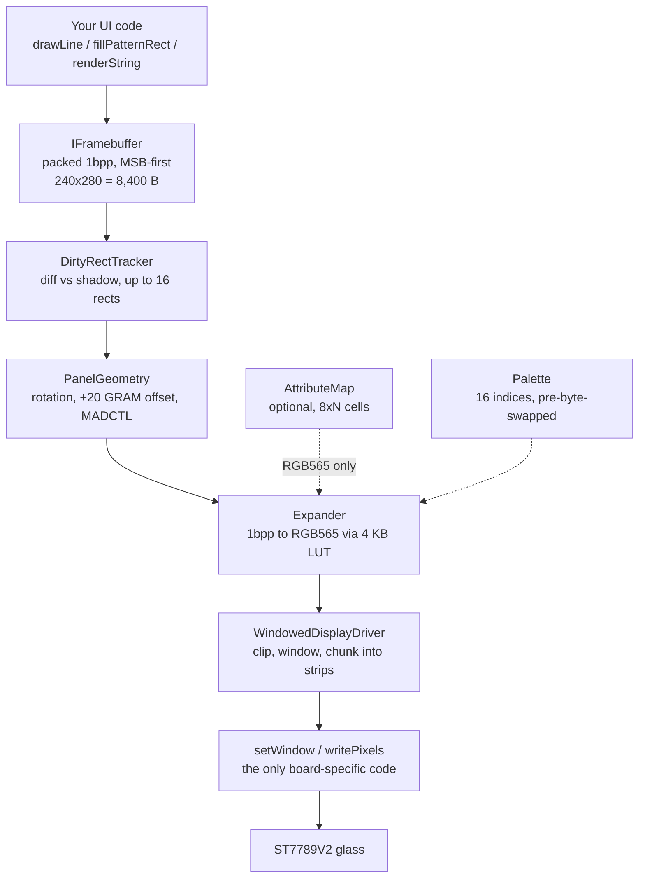

# The graphics library

Reference for building the `h0urg1ass` timer UI on top of **`onebit`**, the 1-bit graphics
library vendored as a git submodule at `third_party/1bit-display`. It assumes a competent
embedded engineer who has never seen this board or this library.

This is not an API dump. The library exposes roughly two hundred public symbols; this document
answers a narrower question — *building a timer UI on a 240 × 280 one-bit panel: what does this
library provide, what does it not, and how is it driven?* Symbols that a timer will never touch
(the VT100 terminal emulator, the flip-dot simulation, the Bezier brush engine) are named once
in §12 and otherwise ignored.

**Path convention.** Paths beginning `include/`, `src/`, `tests/`, `demo/`, `tools/` or
`platform/` are relative to `third_party/1bit-display/`. Everything else is relative to the
repository root. Line numbers refer to the pinned submodule revision (§1.4).

**Citations.** `[S#]` tags resolve in [Sources](#sources). Every `[S#]` is a primary artifact —
a datasheet, the board schematic, a vendor archive or a vendor wiki page. Claims about the
library itself cite the header or source file that carries them, with a line number.

---

## 1. What the library is

### 1.1 Shape and conventions

A portable C++17 graphics library for 1-bit monochrome displays, built as headers plus a
compiled `src/` tree. It has no external dependencies beyond the C++17 standard library, does
not use exceptions or RTTI on the embedded path, and allocates through a single replaceable
hook. It builds for the host (with an optional SDL2 viewer), for ESP-IDF and for pico-sdk; the
last is this project's target.

| | |
|---|---|
| Namespace | `onebit` — everything. Bitmap font data lives in `onebit::fonts` |
| Include form | `#include <1bit/core/framebuffer.hpp>` — always the `1bit/…` prefix, angle or quoted |
| Language | C++17. `GCC 7+`, `Clang 5+`, `MSVC 2017+` |
| Allocation | Every buffer goes through `onebit::alloc` / `onebit::free` (`include/1bit/core/allocator.hpp`) |
| Tests | 643 `TEST_CASE` blocks under `tests/` at the pinned revision. The library README states 613; the README figure is stale |

The allocator hook is worth knowing about before you write any startup code:

```cpp
// include/1bit/core/allocator.hpp:7-17
struct Allocator {
    void* (*alloc)(size_t size, void* ctx);
    void  (*free)(void* ptr, void* ctx);
    void* ctx;
};

Allocator default_allocator();
void init();
void init(const Allocator& alloc);
void* alloc(size_t size);
void  free(void* ptr);
```

`onebit::init()` is **optional, not a prerequisite**. `src/core/allocator.cpp:15` statically
initialises the allocator to `malloc`/`free`, and `alloc()` (`src/core/allocator.cpp:29-31`)
simply forwards to whatever is installed. Framebuffers constructed without ever calling `init()`
allocate correctly. The no-argument `init()` only *resets* the hook to the default; the
one-argument `init(const Allocator&)` is the form you would actually call, and only if you want
the library allocating out of a pool rather than the heap. On the RP2350 with ~506 kB free SRAM
[S9] there is no reason to bother.

### 1.2 The one architectural fact

**The 1-bit framebuffer is the source of truth, and everything else is downstream of it.**

Every drawing call in the library writes packed 1-bit pixels, MSB-first, row-major, and nothing
else. Colour is not a pixel property — it is a separate, optional plane resolved at push time.
The panel's RGB565 wire format is not a pixel property either — it is produced by an *expander*
that walks the 1-bit buffer on the way out. The governing invariant, enforced by a test in the
library's own suite:

> For any drawing sequence, the 1-bit framebuffer's bytes are identical whether or not colour
> was in use. (`include/1bit/render/README.md`, *Colour*)

The practical consequences for this project are large:

- A frame is **8,400 bytes**, not 134,400. It fits in cache, diffs cheaply, and can be dumped
  over a UART as text (§11).
- Any drawing routine you write is testable on a laptop with no panel attached, because the
  thing it produces is the deliverable, not an intermediate.
- Colour is a decoration you can add or remove without touching a single drawing call — and it
  can silently do nothing, which is the sharp edge in §9.



### 1.3 The project rule

> **The UI stays inside this library's capabilities. Anything genuinely missing gets added to
> the library upstream, not worked around locally.**

The reason is not purity. It is that a workaround written against the private internals of a
1-bit renderer — a hand-rolled arc that pokes `fb.buffer()` directly, a bespoke glyph blitter
that assumes `bytesPerRow() == width()/8` — is invisible to the library's golden-image tests,
survives no refactor, and has to be rediscovered by whoever touches the UI next. A primitive
added upstream arrives with a test, a demo-page swatch and a braille baseline, and the whole
project gets it.

Four categories are **exempt** and stay local by definition, because they are board firmware,
not graphics:

1. **The board display driver.** The four-method `WindowedDisplayDriver` subclass that talks
   SPI1 to the ST7789V2 (§10.4). Transport is per-board by design.
2. **Input.** Touch, the power key, the IMU. The library has no input abstraction at all (§12,
   G12).
3. **Timekeeping.** The library has no clock and deliberately so (§12, G13).
4. **Persistence.** Flash/NVS storage of the last-used duration (§12, G25).

Everything else — a ring primitive, a rounded-corner mask, larger digits, text metrics — is
upstream work. §12 classifies each known gap.

### 1.4 Pinned revision, and two features that are not in it

The submodule is pinned at **`9294b78`** (recorded in the parent repo's tree as
`160000 commit 9294b78b0efc3b335b1059482970b1b2c4f05aac third_party/1bit-display`). Every
signature, line number and behaviour in this document was read out of that revision.

**Upstream `main` is ten commits ahead of the pin, and two of those commits matter here.** The
pinned revision does **not** contain:

| Feature | Symbols | Status at the pin |
|---|---|---|
| Composable rect clipping on `IFramebuffer` | `setClip`, `pushClip`, `clearClip`, `clip()`, `ClipScope` | **Absent.** `grep` over `include/` and `src/` returns nothing |
| The blit module | `include/1bit/render/blit.hpp`: `BitmapView`, `BitmapView::tight` / `::strided`, `RasterOp::{Copy,Or,And,Xor,AndNot}`, `blit(...)`, `viewOf(fb)` | **Absent.** The header does not exist |
| `Rect` intersection helper | `Rect::intersect` | **Absent** |

This is a genuine conflict between two documents in this repository: `docs/visual-language.md`
§4.1 lists clipping and `blit` under *"Already exists — use these exact symbols"*. That table
was written against upstream `main`, not against the pin. **The pinned header is the authority
for what compiles today.** Until the submodule pin is advanced, clipping must be emulated with a
`MaskBuffer` (§4.4) and there is no raster-op blit at all.

Advancing the pin is cheap and should happen before UI work starts; it is listed as G21 in §12.
The rest of this document describes the pinned revision, and flags anything that changes when
the pin moves.

---

## 2. Getting a framebuffer

### 2.1 `IFramebuffer` — the type every drawing function takes

```cpp
// include/1bit/core/framebuffer.hpp:13-27
class IFramebuffer {
public:
    virtual void setPixel(int16_t x, int16_t y, Color c) = 0;
    virtual void setPixelDirect(int16_t x, int16_t y, Color c) = 0;
    virtual Color getPixel(int16_t x, int16_t y) const = 0;
    virtual void clear(Color c = WHITE) = 0;
    virtual void fillSpan(int16_t y, int16_t xStart, int16_t xEnd, Color c) = 0;
    virtual int16_t width() const = 0;
    virtual int16_t height() const = 0;
    virtual uint8_t* buffer() = 0;
    virtual const uint8_t* buffer() const = 0;
    virtual size_t bufferSize() const = 0;
    virtual void setMask(IFramebuffer* mask) = 0;
    virtual IFramebuffer* getMask() const = 0;
    virtual ~IFramebuffer() = default;
```

plus three non-pure members on the same class:

```cpp
// include/1bit/core/framebuffer.hpp:32-39
    int16_t bytesPerRow() const {
        return static_cast<int16_t>((width() + 7) / 8);
    }

    virtual bool isValid() const { return buffer() != nullptr; }
```

and the colour hooks covered in §9.

**Write every drawing function in this repository against `IFramebuffer&`.** Not against
`Framebuffer<240,280>&`, not against a template parameter. Doing so means the same function
works with the compile-time framebuffer, the dynamic one, a `MaskBuffer` used as a stencil
scratchpad, and a smaller off-screen buffer in a host test. Every free function the library
ships already does this; match it.

`Color` is `bool`, and the polarity is easy to get backwards:

```cpp
// include/1bit/core/types.hpp:93-95
using Color = bool;
constexpr Color BLACK = true;
constexpr Color WHITE = false;
```

`BLACK == true == ink`. A set bit is ink. This matters for the braille encoder (§11), for mask
semantics (§4.4), and for the panel's `INVON` polarity (§10.6).

### 2.2 Compile-time versus dynamic

Two canvas implementations:

```cpp
// include/1bit/core/framebuffer.hpp:83-87
template<int16_t WIDTH, int16_t HEIGHT>
class Framebuffer : public IFramebuffer {
public:
    static constexpr int16_t BYTES_PER_ROW = (WIDTH + 7) / 8;
    static constexpr size_t BUFFER_SIZE = static_cast<size_t>(BYTES_PER_ROW) * HEIGHT;
```

```cpp
// include/1bit/core/framebuffer.hpp:309-311
class DynamicFramebuffer : public IFramebuffer {
public:
    DynamicFramebuffer(int16_t width, int16_t height);
```

Both **heap-allocate** through `onebit::alloc` — the template form does not put pixels in `.bss`,
it only makes the dimensions and the size arithmetic compile-time constants
(`include/1bit/core/framebuffer.hpp:89-94`). Both are non-copyable and movable. Both `clear(WHITE)`
on construction if the allocation succeeded.

**Use `Framebuffer<240, 280>`.** The panel size is fixed and known at compile time, the bounds
checks in `setPixel` become comparisons against literals, and `byteIndex()` multiplies by a
constant 30 instead of loading a member. `DynamicFramebuffer` earns its keep only in host tests
that want to render a page at several geometries from one loop.

### 2.3 Memory cost at 240 × 280 — the actual numbers

240 is a multiple of 8, so **`bytesPerRow()` is exactly 30 with no padding bits**. That removes
an entire bug class the library's own HAL reference warns about: on a 172- or 222-wide panel the
last byte of each row holds bits past the visible width and `clear()` sets them, so a naive
expander paints phantom pixels (`include/1bit/hal/README.md:107-109`). At 240 wide there is no
partial last byte to get wrong.

```
Framebuffer<240,280>::BYTES_PER_ROW == 30
Framebuffer<240,280>::BUFFER_SIZE   == 30 * 280 == 8,400 bytes
```

Every other buffer you may attach, computed from the constructors in `src/`:

| Buffer | Constructor | Bytes at 240 × 280 | Source |
|---|---|---:|---|
| Framebuffer | `Framebuffer<240,280>` | **8,400** | `include/1bit/core/framebuffer.hpp:86-87` |
| Dirty-tracker shadow | `DirtyRectTracker(240, 280)` | **8,400** | `src/render/dirty_rect.cpp` — `rowBytes_ * height_` |
| Attribute map, 8 × 8 cells | `AttributeMap(240, 280, 8)` | **1,050** | 30 cols × 35 rows, `src/core/attribute_map.cpp` |
| Attribute map, 8 × 1 cells | `AttributeMap(240, 280, 1)` | **8,400** | 30 cols × 280 rows |
| Full-panel mask | `MaskBuffer<240,280>` | **8,400** | `include/1bit/render/mask_buffer.hpp:18-19` |
| RGB565 expansion LUT | built by `Expander` | **4,096** | `src/hal/expand.cpp:11` — `256 * 8 * 2` |
| DMA strip buffer, 40 rows | driver-supplied | **19,200** | 240 × 40 × 2 B |
| Ping-pong second strip | driver-supplied | **19,200** | required for correctness at speed, §10.5 |

Two realistic totals:

- **Timer baseline** (framebuffer + dirty tracker + LUT + ping-pong strips, no colour, no mask):
  8,400 + 8,400 + 4,096 + 38,400 = **59,296 B ≈ 57.9 kB**.
- **Everything on** (add an 8 × 1 attribute map and a full-panel mask):
  **76,096 B ≈ 74.3 kB**.

Against the RP2350A's 520 kB SRAM [S9] both are comfortable; `docs/hardware.md` §7 projects
≈ 506 kB free heap with the framebuffer and both strips allocated (a projection — no unit of this
board has been powered up). On a smaller part the
aggregate would matter, and nothing in the library warns you about it — the sizes above are
derived here, not printed anywhere upstream.

### 2.4 `isValid()` — check it once, at startup

An allocation failure does not throw and does not crash. Every write is silently discarded, and
a framebuffer in that state is indistinguishable from a working one nobody drew to. The header
says so in as many words (`include/1bit/core/framebuffer.hpp:36-39`). The same applies to
`DirtyRectTracker::isValid()` (`include/1bit/render/dirty_rect.hpp:53`) and
`AttributeMap::isValid()` (`include/1bit/core/attribute_map.hpp:72`) — though an invalid tracker
degrades safely, reporting the whole frame dirty every update rather than dropping flushes.

Check all three once during bring-up and refuse to continue. Do not check per frame.

### 2.5 Clipping

**There is no clip rectangle in the pinned revision** (§1.4). The API exists upstream and will
arrive when the pin is advanced:

```cpp
// upstream main, not in the pin — include/1bit/core/framebuffer.hpp
void setClip(const Rect& r);    ///< replaces the current clip
void pushClip(const Rect& r);   ///< narrows the current clip
void clearClip();
Rect clip() const;
class ClipScope { ClipScope(IFramebuffer& fb, const Rect& r); /* RAII restore */ };
```

Until then, the two ways to confine drawing to a zone are:

1. **Draw within the zone by construction** — pass the zone's origin into your draw function and
   keep the arithmetic honest. Adequate for rectangular panels of a timer UI, and free.
2. **A `MaskBuffer`** (§4.4). Correct for arbitrary shapes, costs 8,400 B for a full-panel mask,
   and forces the per-pixel path in `fillSpan` (`include/1bit/core/framebuffer.hpp:216-230`) —
   which is a real slowdown on large solid fills.

Note for later: when clipping does land, both `clear()` and `setPixelDirect()` bypass it, exactly
as they bypass the mask today.

---

## 3. Drawing primitives

### 3.1 What exists

Everything in `include/1bit/render/primitives.hpp`, verbatim:

```cpp
// include/1bit/render/primitives.hpp:9-37
void drawLine(IFramebuffer& fb, int16_t x0, int16_t y0, int16_t x1, int16_t y1, Color color);
void drawLine(IFramebuffer& fb, Point p0, Point p1, Color color);

void drawThickLine(IFramebuffer& fb, int16_t x0, int16_t y0, int16_t x1, int16_t y1,
                   int16_t width, Color color);
void drawThickLine(IFramebuffer& fb, Point p0, Point p1, int16_t width, Color color);

void drawPolygon(IFramebuffer& fb, const Point pts[], int16_t count, Color color);

void fillPolygon(IFramebuffer& fb, const Point pts[], int16_t count, Color color);

void drawRect(IFramebuffer& fb, int16_t x, int16_t y, int16_t w, int16_t h, Color color);
void drawRect(IFramebuffer& fb, const Rect& rect, Color color);

void fillRect(IFramebuffer& fb, int16_t x, int16_t y, int16_t w, int16_t h, Color color);
void fillRect(IFramebuffer& fb, const Rect& rect, Color color);

void drawCircle(IFramebuffer& fb, int16_t cx, int16_t cy, int16_t r, Color color);
void drawCircle(IFramebuffer& fb, Point center, int16_t r, Color color);

void fillCircle(IFramebuffer& fb, int16_t cx, int16_t cy, int16_t r, Color color);
void fillCircle(IFramebuffer& fb, Point center, int16_t r, Color color);
```

Lines are Bresenham; circles are midpoint; polygon fill is scanline with the **even-odd** rule.
`fillPolygon` takes a `Point` array and a count, so a tessellated shape is a first-class citizen.

Plus two composites that exist specifically because 1-bit has no grey to separate figure from
ground:

```cpp
// include/1bit/render/primitives.hpp:46-63
void drawDropShadow(IFramebuffer& fb, Rect fg, int16_t dx, int16_t dy,
                    const Pattern& pattern, int16_t halo_px = 1);

void drawVectorTextShadow(IFramebuffer& fb, int16_t x, int16_t y,
                          const char* text,
                          int16_t char_w, int16_t char_h,
                          int16_t spacing, int16_t stroke_width,
                          int16_t dx, int16_t dy, const Pattern& pattern);
```

`drawDropShadow` fills the offset rect with a pattern *and* clears a `halo_px`-wide white band
around the foreground rect, so black-on-black-pattern still reads. `drawVectorTextShadow` does
the same following glyph outlines: it renders the run into a temporary `DynamicMaskBuffer` with
stroke-width padding on every side, then ORs it in at the offset using the pattern as the fill
source. Its own doc comment budgets **≤ 4 kB typical, ~12 kB worst case at the largest headline
scale** (`include/1bit/render/primitives.hpp:57-58`) — a transient allocation on the drawing
path, which is worth knowing before you call it once per second.

### 3.2 `drawThickLine` is the stroke engine, and it has a shape

```cpp
// src/render/primitives.cpp
float halfWidth = (width - 1) / 2.0f;
for (float offset = -halfWidth; offset <= halfWidth; offset += 1.0f) {
    int16_t ox = static_cast<int16_t>(std::round(offset * px));
    int16_t oy = static_cast<int16_t>(std::round(offset * py));
    drawLine(fb, x0 + ox, y0 + oy, x1 + ox, y1 + oy, color);
}
```

Three consequences:

- The stroke is **centred** on the line: a stroke of width *W* spills `(W-1)/2` pixels either
  side. This is how a vector glyph's ink extends past its nominal box (§5.4).
- It is a parallel-Bresenham construction, not a polygon. At large widths on shallow diagonals
  the parallel copies can leave hairline gaps. At the stroke widths a hero clock wants (6–10 px)
  this is visible on inspection but not obviously wrong; verify against a braille baseline (§11)
  before committing to a large `strokeWidth`.
- `width <= 1` degrades to `drawLine`; a degenerate zero-length line becomes
  `fillCircle(x0, y0, width/2)`. It uses `sqrtf` and `roundf`, so it is on the float path (§7.3).

### 3.3 What does **not** exist

Verified by `grep` across `include/` and `src/` at the pinned revision:

| Missing | Detail |
|---|---|
| **Arc / pie / ring segment** | No `drawArc`, `fillArc`, `drawPie`, `fillRing`, or anything equivalent. The only occurrences of "arc" in the tree are comments on the vector glyphs for `m` and `n` |
| **Ellipse / oval** | `drawCircle` and `fillCircle` take a single radius. There is no `rx`/`ry` variant |
| **Rounded rectangle** | No `drawRoundRect`, no `fillRoundRect`. The only "rounded" hits are a comment on the `FLAP` `'0'` glyph and one in `src/render/pattern_tiles.cpp` |
| **Rounded-corner mask** | Nothing models the panel's physical corner radius. See §12 G2 |
| **Anti-aliasing** | Nothing anywhere. Every primitive is hard-edged. There is no grey-level or subpixel text path; the dithering machinery is the only tone tool and it does not apply to glyph edges |
| **Triangle helper** | Use `fillPolygon` with three points |

**The arc is the one that hurts.** A circular progress ring is the canonical countdown visual and
the library cannot draw one. Two workarounds are available today, both of which are code you
write rather than a call you make:

1. **Tessellate the wedge** into a `Point` array and call `fillPolygon` or `fillPatternPolygon`.
   Integer trig is already exported for exactly this purpose:
   ```cpp
   // include/1bit/render/pattern_tiles.hpp:29-30
   int8_t sinQ7(int16_t deg);
   int8_t cosQ7(int16_t deg);
   ```
   Q7 fixed point, degrees in, `[-127, 127]` out, no float. A 96-segment ring at r = 100 is
   visually smooth and costs 192 points.
2. **Disc subtraction:** `fillCircle(cx, cy, r_outer, BLACK)`, then
   `fillCircle(cx, cy, r_inner, WHITE)` to hollow it, then knock out the unfilled sweep with a
   `fillPolygon(..., WHITE)`. Fewer points, but three full-disc passes per frame and the sweep
   edge is a polygon anyway.

Either is a stopgap. The right answer is an upstream `fillRing(fb, cx, cy, r_outer, r_inner,
start_deg, sweep_deg, Color)` plus a `fillPatternRing` sibling — see §12 G1.

---

## 4. Text

Two entirely separate systems, with different capabilities and different failure modes. A
countdown clock uses the second one.

### 4.1 Bitmap fonts — fixed size, cannot scale

```cpp
// include/1bit/render/bitmap_font.hpp:9-31
struct BitmapGlyph {
    uint8_t width;
    uint8_t height;
    const uint8_t* data;  // packed 1-bit rows, MSB first
};

struct BitmapFont {
    uint8_t glyph_width;   // fixed width (0 if proportional)
    uint8_t glyph_height;
    uint8_t first_char;
    uint8_t last_char;
    const BitmapGlyph* glyphs;
};

void drawBitmapText(IFramebuffer& fb, const BitmapFont& font,
                    int16_t x, int16_t y, const char* text,
                    Color c = BLACK, int16_t char_spacing = 1);

int16_t getBitmapTextWidth(const BitmapFont& font, const char* text,
                           int16_t char_spacing = 1);
```

**There is no scale parameter, and there is no scaled blit.** `src/render/bitmap_font.cpp` copies
glyph pixels 1:1. Whatever a font's `glyph_height` says is the only size you can get from it.

The six fonts that ship, read from their headers:

| Constant | Header | Cell (w × h) | Char range | Notes |
|---|---|---|---|---|
| `fonts::TERM_5X7` | `1bit/fonts/term_5x7.hpp` | 5 × 7 | `0x20`–`0x7E` | Full printable ASCII, plus `TERM_5X7_BOX_DRAWING` |
| `fonts::TERM_6X9` | `1bit/fonts/term_6x9.hpp` | 6 × 9 | `0x20`–`0x7E` | Full printable ASCII + box drawing |
| `fonts::TERM_8X12` | `1bit/fonts/term_8x12.hpp` | 8 × 12 | `0x20`–`0x7E` | Full printable ASCII + box drawing |
| `fonts::VMS_5X7` | `1bit/fonts/vms_5x7.hpp` | 5 × 7 | `' '`–`'Z'` | Highway-sign style. **Uppercase only** |
| `fonts::TRANSIT_7X12` | `1bit/fonts/transit_7x12.hpp` | 7 × 12 | `' '`–`'Z'` | **Uppercase only** |
| `fonts::FLAP_13X26` | `1bit/fonts/flap_13x26.hpp` | **13 × 26** | `' '`–`'Z'` | Split-flap, Gill Sans Bold-inspired. **Uppercase only.** 13 bits packed into 2 bytes per row |

**The largest bitmap text this library can render today is `FLAP_13X26` at 26 pixels tall.**
`fonts::FLAP_13X26` is declared at `include/1bit/fonts/flap_13x26.hpp:538` as
`{13, 26, ' ', 'Z', FLAP_GLYPHS}`; the digit glyphs and the colon are real, not stubs. On a
280-row panel, 26 px is **9.3 % of the screen height**. That is a label, not a hero countdown.

### 4.2 The vector font — stroke-based, arbitrarily scalable

```cpp
// include/1bit/render/vector_font.hpp:10-50
struct GlyphStroke {
    const uint8_t* points;  ///< Packed x,y pairs (0-100 coordinate space)
    uint8_t pointCount;     ///< Number of points in the stroke
};

struct Glyph {
    const GlyphStroke* strokes;
    uint8_t strokeCount;
};

const Glyph* getGlyph(char c);

float getCharWidthMultiplier(char c);

void renderChar(IFramebuffer& fb, char c, int16_t x, int16_t y,
                int16_t width, int16_t height, int16_t strokeWidth = 2, Color color = BLACK);

void renderString(IFramebuffer& fb, const char* text, int16_t x, int16_t y,
                  int16_t charWidth, int16_t charHeight, int16_t spacing = 4,
                  int16_t strokeWidth = 2, Color color = BLACK);

int16_t getStringWidth(const char* text, int16_t charWidth, int16_t spacing = 4);

void renderStringRight(IFramebuffer& fb, const char* text, int16_t rightX, int16_t y,
                       int16_t charWidth, int16_t charHeight, int16_t spacing = 4,
                       int16_t strokeWidth = 2, Color color = BLACK);

void renderStringWithHalo(IFramebuffer& fb, const char* text, int16_t x, int16_t y,
                          int16_t charWidth, int16_t charHeight, int16_t spacing,
                          int16_t strokeWidth, Color textColor, Color haloColor);
```

Glyphs are packed polylines in a 0–100 coordinate space, mapped to the destination by

```cpp
// src/render/vector_font.cpp:459-463
static void scalePoint(uint8_t sx, uint8_t sy, int16_t destX, int16_t destY,
                       int16_t width, int16_t height, int16_t& outX, int16_t& outY) {
    outX = destX + (sx * width) / 100;
    outY = destY + (sy * height) / 100;
}
```

and drawn with `drawThickLine` at the caller's `strokeWidth`. **There is no upper bound on size
short of the panel.** `strokeWidth` is the bolding axis, independent of `charWidth`/`charHeight`.

**Coverage:** `0-9`, `A-Z`, `a-z`, and exactly `: - . / %` plus `0xB0` (degree)
(`src/render/vector_font.cpp`, `getGlyph`). Digits and colon — precisely what a countdown needs.
`getGlyph(' ')` returns `nullptr`; `renderString` still advances the cursor for a space so
spacing works, but `renderChar(' ', …)` draws nothing. Absent from the big-text path: `+`, `,`,
parentheses, and any arrow or bullet.

### 4.3 So: the largest text available today

**Vector-font text at whatever size you ask for.** That is the answer, and it is not a hedge —
it is a stroke font, so the scale is a parameter rather than an asset.

For the countdown this is the recommended path, and it matches the typographic direction already
set in `docs/visual-language.md` (R15: headlines use the vector font, `strokeWidth` as the
bolding axis).

### 4.4 Vector-font metrics — measured, because the library does not report them

There is no `getStringHeight`, no baseline, no ascent/descent and no bounding-box query. The
numbers below were measured directly from the glyph point tables in `src/render/vector_font.cpp`
and are what you need to lay out a clock.

**Digit extents within the 0–100 box** (all ten digits):

| Glyph | x range | y range | Inked width as fraction of the advance box |
|---|---|---|---|
| `0` | 5 – 95 | 10 – 90 | 0.90 |
| `1` | 30 – 70 | 10 – 90 | 0.40 |
| `2`–`9` | 10 – 90 | 10 – 90 | 0.80 |
| `:` | 42 – 58 | 25 – 75 | 0.16 of a half-width box |
| `-` | 15 – 85 | 50 – 50 | 0.70, zero height |
| `.` | 42 – 58 | 80 – 90 | 0.16 |

Two facts fall straight out of that table:

- **Every digit's ink spans y 10–90.** So the drawn cap height is
  **`0.80 × charHeight + (strokeWidth − 1)`** — the stroke is centred (§3.2), so it spills
  `(strokeWidth−1)/2` above the top of the glyph and the same below. To get a 120 px-tall
  numeral with a 6 px stroke, ask for `charHeight = 144`.
- **Every digit is horizontally centred in its advance box** (margins of 5 % or 10 % on both
  sides; `1` is 30 % / 30 %). So centring a digit run on `getStringWidth` is optically correct.
  The `1` inks only 40 % of its box and will read light next to a `0` at 90 % — that is a design
  problem, not a layout bug.

**Advance and the jitter question.** `renderString` advances by

```cpp
// src/render/vector_font.cpp
float widthMult = getCharWidthMultiplier(c);
int16_t actualWidth = static_cast<int16_t>(charWidth * widthMult);
...
currentX += actualWidth + spacing;
```

and `getCharWidthMultiplier` (`src/render/vector_font.cpp`) returns:

| Char | Multiplier |
|---|---|
| `0`–`9`, `A`–`Z`, most lowercase | `1.0` (the `default:` case) |
| `:` , `/` , `' '` , `t` , `f` | `0.5` |
| `.` , `0xB0` | `0.33` |
| `-` | `0.67` |
| `i` , `j` | `0.4` |
| `l` | `0.35` |
| `r` | `0.6` |

**All ten digits carry multiplier 1.0, so a fixed-format `"MM:SS"` string advances identically
whatever the digits are.** A countdown rendered with one `renderString` call per tick does *not*
jitter. The layout only moves when the string's *length or composition* changes — `"9:59"` to
`"10:00"`, or dropping the hours field. Handle that by fixing the format (always `MM:SS`,
zero-padded) rather than by rendering each digit separately.

Per-digit `renderChar` at hand-computed x positions remains the right tool if you want an
animation that moves one digit independently — a flip, a roll, a fade on the seconds field only
— because it also gives you a tight dirty rect (§8).

`getStringWidth` applies the same multipliers and adds `spacing` between characters but not after
the last one, so it returns the true advance width of the run.

### 4.5 A worked hero clock for 240 × 280

The recommended UI safe area on this panel is **(16, 16, 208, 248)** — `docs/hardware.md` §6,
derived from the ~44 px corner radius [S13]. A `"MM:SS"` run must fit 208 px wide.

```
advance("MM:SS") = 4 x charWidth        (four digits, multiplier 1.0)
                 + 0.5 x charWidth      (the colon)
                 + 4 x spacing
                 = 4.5 x charWidth + 4 x spacing
```

With `charWidth = 40` and `spacing = 6`: `4.5 × 40 + 4 × 6 = 204 px`. Four pixels of slack in a
208 px safe area.

```cpp
#include <1bit/render/vector_font.hpp>

// 204 px wide, ~93 px of ink tall, centred in the 208 px safe area.
constexpr int16_t CW = 40, CH = 110, SP = 6, SW = 6;
const int16_t w = onebit::getStringWidth("00:00", CW, SP);   // 204
onebit::renderString(fb, "05:23", int16_t(16 + (208 - w) / 2), 90,
                     CW, CH, SP, SW, onebit::BLACK);
```

Drawn numeral height: `0.80 × 110 + 5 = 93 px`, or **33 % of the panel height**. Pushing
`charHeight` to 150 gives 125 px of ink (45 % of the panel) and still fits the 248 px safe
height with room for a label above and a progress element below.

For legibility over a dithered background use `renderStringWithHalo(...)` with
`haloColor = WHITE`; for a pattern-filled shadow behind the digits use
`drawVectorTextShadow(...)` — but budget its transient mask allocation (§3.1), which at hero
scale is the ~12 kB worst case.

### 4.6 Options for bigger or different digits

| Option | What it costs | What you get | Verdict |
|---|---|---|---|
| **Vector font at a larger `charWidth`/`charHeight`** | Nothing. Two integer arguments | Any size. Stroke weight independently controllable. Consistent with the project's typographic direction | **Default choice.** Stroked, geometric, visibly hand-drawn; stair-stepped diagonals at hero scale because there is no AA (§3.3) |
| **Author a new bitmap font** with `tools/generate_font.py` (BDF → C++ header, `--warn-blank` on by default) | One-off asset work, plus flash. A digits-only 60 × 100 font at 1 bpp is 10 glyphs × 8 bytes/row × 100 rows ≈ 8 kB | Crisp pixel-perfect glyphs with real curves and consistent optical weight. Renders through the existing `drawBitmapText` with no library change | **Best visual result** if the design wants a solid-filled numeral rather than a stroked one. The tool already exists; only the asset is missing |
| **Integer-scaled bitmap blit** (2×/3× nearest-neighbour of `FLAP_13X26`) | New library code — `drawBitmapText` has no scale argument, and the pinned revision has no `blit` at all (§1.4) | 26 → 52 or 78 px from an existing asset, with the chunky pixel-doubled look that reads as deliberate on a 1-bit panel | **Requires upstream work** (§12 G5). Cheap to implement, and the pixel-doubled aesthetic is a legitimate style choice rather than a compromise |
| **Seven-segment / LCD-style digits** | Entirely new. No primitive exists | The other canonical timer idiom | Draw as `fillPolygon` segments locally first; promote upstream if it earns its place (§12 G14) |

---

## 5. Patterns and dithering

### 5.1 The model

Every pattern is a per-pixel predicate `bool f(x, y)` packed into a 24-byte POD:

```cpp
// include/1bit/render/pattern.hpp:27-56
struct PatternTransform {
    int16_t  offset_x    = 0;
    int16_t  offset_y    = 0;
    uint8_t  scale_shift = 0;
    uint16_t rotate_deg  = 0;  // 0, 90, 180, 270 only in v1
};

struct Pattern {
    PatternKind kind;
    uint8_t density;
    PatternTransform xform;
    union Params { /* kind-specific */ } params;
};
```

with `static_assert(sizeof(Pattern) <= 24)` on 32-bit targets
(`include/1bit/render/pattern.hpp:60`). The transform is a coordinate mutation applied *before*
the predicate, all integer: offsets scroll, `scale_shift` pixel-doubles by powers of two,
`rotate_deg` does axis-aligned quarter turns. Scrolling a pattern per frame is therefore free —
mutate `offset_x` and refill.

### 5.2 The sixteen builders

```cpp
// include/1bit/render/pattern.hpp:66-82
Pattern solid(bool black);
Pattern bayer(uint8_t density, uint8_t tile_size = 8);
Pattern blueNoise(uint8_t density);
Pattern clusteredDot(uint8_t density);
Pattern benDay(uint8_t density, uint8_t spacing = 4, uint8_t radius = 1);
Pattern halftone(uint8_t density, uint8_t cell_size = 6);
Pattern lineScreen(uint8_t density, int16_t angle_deg, uint8_t spacing);
Pattern hatch(int16_t angle_deg, uint8_t spacing, uint8_t thickness = 1);
Pattern crosshatch(int16_t a_deg, int16_t b_deg, uint8_t spacing, uint8_t thickness = 1);
Pattern stripes(uint8_t on, uint8_t off, bool vertical = false);
Pattern checker(uint8_t cell_size);
Pattern noise(uint32_t seed, uint8_t density);
Pattern blueNoiseAnim(uint8_t density, uint32_t frame);
Pattern scanlineNoise(uint32_t seed, uint8_t density, uint8_t band_height);
Pattern xorTexture(uint8_t mask);
Pattern userTile(const uint8_t* data, uint8_t w, uint8_t h,
                 uint8_t density, uint8_t bits_per_cell = 8);
```

`bayer`'s `tile_size` must be 4, 8 or 16. `blueNoise` is a void-and-cluster 128 × 128 field,
seamless at mid-density, regenerable with `tools/gen_blue_noise.py`. `blueNoiseAnim` is
documented upstream as *"scrolling blue-noise (not STBN)"* — it is a crawl generator, useful for
deliberate static, and wrong for stabilising an animated dither.

### 5.3 Applying a pattern to a fill

Four entry points, plus the raw predicate:

```cpp
// include/1bit/render/pattern.hpp:86-92
bool patternTest(int16_t x, int16_t y, const Pattern& p);

void fillPattern(IFramebuffer& fb, Rect r, const Pattern& p);
void fillPatternRect(IFramebuffer& fb, int16_t x, int16_t y, int16_t w, int16_t h, const Pattern& p);
void fillPatternCircle(IFramebuffer& fb, int16_t cx, int16_t cy, int16_t r, const Pattern& p);
void fillPatternPolygon(IFramebuffer& fb, const Point pts[], int16_t count, const Pattern& p);
```

**Pattern fills write only `BLACK`.** Verified in `src/render/pattern.cpp` — every write is
`fb.fillSpan(..., BLACK)` (lines 347, 368, 425) or `fb.setPixel(..., BLACK)` (lines 354, 375,
432). They never clear the off-pixels to white. So:

- A patterned fill **composites additively** over whatever is already in the region. It cannot
  overwrite existing ink.
- **Clear first if you want a clean fill:** `fillRect(fb, r, WHITE)` then `fillPattern(fb, r, p)`.
  There is no "opaque pattern fill" option and no two-colour pattern fill.
- This is also the mechanism that makes colour tinting work (§9.4): a Bayer fill inside a cell
  whose ink is green mixes that cell's ink and paper, giving intermediate tones with no per-pixel
  colour.

**Cost.** The `fillSpan` byte-aligned fast path is taken **only for `Solid`**; every other kind
writes per-pixel. The upstream per-pixel budget, measured on an ESP32 at 240 MHz
(`include/1bit/render/README.md:89-106`), transfers as a relative ranking:

| Kind | Cost per pixel |
|---|---|
| Solid (via `fillSpan`) | ~1 cycle/byte |
| Bayer, BlueNoise, ClusteredDot | 1 branch + 1 LUT + 1 compare |
| Ben-Day, Halftone | 2 mults + 1 compare |
| Hatch, LineScreen | 1 mult + 1 LUT + 1 mod |
| Crosshatch | 2 × Hatch — **do not use full-screen at 60 fps** |
| Noise, ScanlineNoise | 2 mults + 2 xors |
| XorTexture, Checker, Stripes | 1–2 integer ops |
| UserTile | 1 deref + 1 compare (`bits_per_cell` 8) |

### 5.4 Transitions

Stateless crossfades between two patterns, driven by a caller-owned `uint8_t t`:

```cpp
// include/1bit/render/pattern_transitions.hpp:7-29
enum class TransitionKind : uint8_t {
    Crossfade,
    Wipe,
    Morph,
    DensityRamp,
};

struct Transition {
    TransitionKind kind;
    Pattern        a;
    Pattern        b;
    uint8_t        t = 0;
    PatternKind    threshold_source = PatternKind::BlueNoise;
    int16_t        wipe_angle_deg   = 0;
    uint8_t        wipe_softness    = 32;
};

bool transitionTest(int16_t x, int16_t y, const Transition& tr);

void fillTransition(IFramebuffer& fb, Rect r, const Transition& tr);
void fillTransitionRect(IFramebuffer& fb, int16_t x, int16_t y, int16_t w, int16_t h, const Transition& tr);
void fillTransitionCircle(IFramebuffer& fb, int16_t cx, int16_t cy, int16_t r, const Transition& tr);
```

**`kind`, `a` and `b` carry no default initialiser, and `kind` is the one you can forget** — `a`
and `b` are the obvious inputs. Default-construct a `Transition`, set `a`/`b`/`t` and leave `kind`
alone and you have read an indeterminate value. Always brace-initialise with the kind first:

```cpp
onebit::Transition tr{onebit::TransitionKind::Wipe, patA, patB};
tr.t = 128;
tr.wipe_angle_deg = 90;
```

`Wipe` gives a directional sweep with a pattern-dithered soft edge; `Morph` interpolates
same-kind parameters and falls back to `Crossfade` otherwise. The caller owns the timer — pair
with `AnimationTimer` (§7).

### 5.5 Image dithering

```cpp
// include/1bit/render/image_dither.hpp:8-35
enum class ImageDitherAlgorithm : uint8_t {
    Threshold, Ordered, FloydSteinberg, Atkinson, SierraLite,
};

struct ImageDitherOptions {
    int8_t  brightness = 0;
    uint8_t contrast   = 128;
    bool    invert     = false;
};

void ditherImage(IFramebuffer& dst, int16_t dst_x, int16_t dst_y,
                 const uint8_t* src_gray, int16_t src_w, int16_t src_h,
                 ImageDitherAlgorithm alg);

void ditherImageOrdered(IFramebuffer& dst, int16_t dst_x, int16_t dst_y,
                        const uint8_t* src_gray, int16_t src_w, int16_t src_h,
                        const Pattern& threshold_pattern);

void ditherImageWithOptions(IFramebuffer& dst, int16_t dst_x, int16_t dst_y,
                            const uint8_t* src_gray, int16_t src_w, int16_t src_h,
                            ImageDitherAlgorithm alg, const ImageDitherOptions& opts);
```

**One-shot only.** Error diffusion allocates a 2–3 row scratch through `onebit::alloc` for the
duration of the call and traverses left-to-right top-to-bottom; the upstream reference states
plainly *"don't call error diffusion per frame"* (`include/1bit/render/README.md:105-106`). For a
timer this is a build-time or startup-time tool for a splash image, not part of the render loop.

---

## 6. Masks

```cpp
// include/1bit/render/mask_buffer.hpp:12-19
/// Mask buffer for clipping operations
/// BLACK (true) = drawing allowed, WHITE (false) = drawing blocked
/// No mask support on the mask itself (it IS the mask)
template<int16_t WIDTH, int16_t HEIGHT>
class MaskBuffer : public IFramebuffer {
public:
    static constexpr int16_t BYTES_PER_ROW = (WIDTH + 7) / 8;
    static constexpr size_t BUFFER_SIZE = static_cast<size_t>(BYTES_PER_ROW) * HEIGHT;
```

```cpp
// include/1bit/render/mask_buffer.hpp:132-134
class DynamicMaskBuffer : public IFramebuffer {
public:
    DynamicMaskBuffer(int16_t width, int16_t height);
```

A mask is itself an `IFramebuffer`, so you draw the allowed region into it with the ordinary
primitives. Attach with `fb.setMask(&mask)`; detach with `fb.setMask(nullptr)`.

Four things to know:

- **`BLACK` in the mask means drawing is allowed.** A freshly constructed `MaskBuffer` clears to
  `WHITE`, i.e. **nothing visible** (`include/1bit/render/mask_buffer.hpp:24`). Draw the permitted
  area in `BLACK` before use.
- **`setPixelDirect()` bypasses the mask** (`include/1bit/core/framebuffer.hpp:170-186`), and so
  does `clear()`. Use `setPixel()` when masking matters.
- **An attached mask forces the per-pixel path in `fillSpan`**
  (`include/1bit/core/framebuffer.hpp:216-230`), losing the byte-aligned fast path. Attach a mask
  for the draws that need it and detach immediately.
- Masks ignore the pen and have no colour concept.

Until clipping arrives (§2.5), a mask is the only general way to confine drawing to a non-rect
shape — including the panel's rounded corners (§12 G2).

---

## 7. Animation and easing

### 7.1 What ships

All of `include/1bit/render/animation.hpp` is header-only and inline except `wigglePoints` (two
overloads) and `transitionPoints`:

```cpp
// include/1bit/render/animation.hpp:11-109 (signatures)
inline float lerp(float a, float b, float t);
inline float clamp(float v, float min, float max);
inline float clamp01(float t);
inline float easeIn(float t);          // t^2
inline float easeOut(float t);         // t(2-t)
inline float easeInOut(float t);       // 3t^2 - 2t^3
inline float easeInOutSine(float t);   // (1 - cos(pi*t)) / 2
inline float easeOutBounce(float t);
inline float breathingScale(float t, float minScale = 0.95f, float maxScale = 1.05f, float period = 3.0f);
inline float breathingScaleWithPhase(float t, float minScale, float maxScale,
                                      float period, float phase);
inline float breathingOffset(float t, float amplitude = 2.0f, float period = 3.0f);
inline uint32_t hash(uint32_t x);
```

```cpp
// include/1bit/render/animation.hpp:149-164
void wigglePoints(const PointF* points, size_t count, PointF* outPoints,
                  float amplitude, float frequency, float t, uint32_t seed = 0);

void wigglePoints(const Point* points, size_t count, Point* outPoints,
                  float amplitude, float frequency, float t, uint32_t seed = 0);

void transitionPoints(const PointF* pointsA, const PointF* pointsB, size_t count,
                      PointF* outPoints, float t, float (*easing)(float) = nullptr);
```

Every easing function clamps its input to `[0,1]` first, so feeding a raw `t()` from a looping
timer is safe.

### 7.2 `AnimationTimer` — delta-driven, and you supply the delta

```cpp
// include/1bit/render/animation.hpp:112-133
class AnimationTimer {
public:
    AnimationTimer(uint32_t duration_ms, bool looping = false)
        : duration_ms_(duration_ms), looping_(looping), elapsed_ms_(0) {}

    void update(uint32_t delta_ms) {
        elapsed_ms_ += delta_ms;
        if (looping_ && elapsed_ms_ >= duration_ms_)
            elapsed_ms_ %= duration_ms_;
    }

    void reset() { elapsed_ms_ = 0; }

    float t() const { /* elapsed / duration, clamped unless looping */ }

    bool isComplete() const { return !looping_ && elapsed_ms_ >= duration_ms_; }
```

**The library has no clock.** `grep` across `include/` finds no `millis()`, no `now()`, no
`std::chrono`, no RTC or uptime abstraction. `AnimationTimer::update(delta_ms)` requires you to
measure the delta yourself — on this board, from the RP2350 timer for animation and from the
PCF85063A at `0x51` for wall-clock [S3]. This is a deliberate boundary, not an omission: a
graphics library that owned a clock would be unportable. It does mean the entire timekeeping core
of a timer app lives in this repository (§12 G13).

Note also that the library has **no `printf`/`snprintf` dependency**, so formatting a duration as
`"MM:SS"` is your integer-to-string code if you want to stay freestanding.

### 7.3 The float path is the platform-divergence exposure

`AnimationTimer::t()`, every easing function, `breathing*`, `wigglePoints`, `transitionPoints`,
`drawThickLine` and therefore the whole vector-font path are float. The library's own golden-test
notes flag exactly these as the paths where a baseline could diverge on one platform and not
another, and prescribe marking such a baseline canonical-platform-only with a written reason
rather than loosening the comparison (library `README.md`, *Visual regression*). If a host-side
golden for a hero clock ever disagrees with hardware, this is the first place to look.

---

## 8. Dirty-rect tracking

### 8.1 Why it dominates everything else on this panel

A full frame is 240 × 280 × 2 = **134,400 bytes** over one SPI data lane. At the ST7789V2's rated
62.5 MHz ceiling (`TSCYCW` = 16 ns minimum [S8]) that is 17.20 ms of wire time, or **18.9 ms
including the 91 % bus efficiency measured on the sibling board** (`docs/hardware.md` §7). The
panel's own refresh is **~52.8 Hz = 18.94 ms** (FRCTRL2 `0x13` → 53 Hz [S8]).

**A full frame costs approximately one panel refresh.** Full-frame pushes can free-run at panel
rate and no faster; 60 fps with full frames is arithmetically impossible.

Against that, from the same budget:

| Update | Bytes | Cost @ 62.5 MHz |
|---|---:|---:|
| Full frame, RGB565 | 134,400 | **18.9 ms** |
| One 24 px text line (240 × 24) | 11,520 | 1.6 ms |
| One 16 px row band (240 × 16) | 7,680 | **1.1 ms** |
| 48 × 48 dirty rect | 4,608 | **0.685 ms** (measured on the sibling) |
| One 8 × 12 glyph cell | 192 | ~0.12 ms |

**A narrow strip costs about a millisecond.** That is a 17× difference, and it is the single most
valuable thing this library gives a once-per-second timer UI. Back-solving the measured figures
gives a fixed per-window overhead of ~70–95 µs (CASET + RASET + RAMWR, GPIO toggles, DMA
reconfiguration), which is why an 8 × 12 glyph costs ~5× its wire time and why CS must be held
across a multi-rect flush.

### 8.2 The API

```cpp
// include/1bit/render/dirty_rect.hpp:19-24
struct DirtyRectList {
    static constexpr int MAX_RECTS = 16;
    Rect rects[MAX_RECTS];
    int16_t count = 0;
    bool overflowed = false;
};
```

```cpp
// include/1bit/render/dirty_rect.hpp:40-73
class DirtyRectTracker {
public:
    DirtyRectTracker(int16_t width, int16_t height);
    ~DirtyRectTracker();

    DirtyRectTracker(const DirtyRectTracker&) = delete;
    DirtyRectTracker& operator=(const DirtyRectTracker&) = delete;
    DirtyRectTracker(DirtyRectTracker&& other) noexcept;
    DirtyRectTracker& operator=(DirtyRectTracker&& other) noexcept;

    bool isValid() const { return shadow_ != nullptr; }

    int16_t width() const { return width_; }
    int16_t height() const { return height_; }

    DirtyRectList update(const IFramebuffer& fb, AttributeMap* attrs = nullptr);

    bool isClean(const IFramebuffer& fb) const;

    void markAllDirty() { forceFull_ = true; }
```

The tracker owns its 8,400-byte shadow buffer. `update()` diffs against the shadow, refreshes it,
and returns the rects. **X extents are snapped outward to byte boundaries** — natural for a packed
1-bit buffer, costs at most 7 pixels per edge, and avoids sub-byte shifting on the push path. A
newly constructed tracker reports the whole frame once, because the panel's contents are unknown
until something has been pushed (`forceFull_` is initialised `true`).

The list feeds the driver directly:

```cpp
// src/hal/display.cpp
void DisplayDriver::pushDirty(const IFramebuffer& fb, const DirtyRectList& list) {
    if (list.count <= 0) return;
    if (!caps().partialUpdate) { push(fb); return; }
    beginFrame();
    for (int16_t i = 0; i < list.count; ++i) writeRegion(fb, list.rects[i]);
    endFrame();
}
```

One `beginFrame`/`endFrame` bracket around all the rects, and a clean fallback for a driver that
cannot do partial updates.

The render loop that follows is:

```cpp
tracker.update(fb, attrsOrNull);   // -> DirtyRectList
driver.pushDirty(fb, list);
```

### 8.3 Four sharp edges

1. **The cap is 16 rects, with no coalescing knob.** On overflow the list sets `overflowed` and
   `rects[0]` becomes the whole frame — correct, but at 18.9 ms. This is a deliberate improvement
   over the previous row-band tracker, which silently dropped regions past its limit
   (`include/1bit/render/dirty_rect.hpp:12-18`). **Design the layout so a tick touches few zones.**
   A seconds field, a minutes field and a progress element is three; a per-pixel particle effect
   is not.
2. **Pass the `AttributeMap*` if you use colour.** A recolour changes no pixels, so it is
   invisible to a pixel diff and the panel would stay stale. `update(fb, &attrs)` merges the map's
   dirty region in. The parameter is on `update()` rather than a separate call precisely so it
   cannot be forgotten.
3. **`AttributeMap::consumeDirty()` clears on read and is single-consumer.**
   `DirtyRectTracker::update(fb, attrs)` already consumes it. Call it yourself as well and
   whichever caller runs second sees a clean map and silently drops a repaint.
4. **A palette change dirties nothing.** Changing only the `Palette` alters no attribute bytes, so
   the tracker correctly reports clean and the panel keeps the old colours. Call
   `tracker.markAllDirty()` after any palette change; nothing will do it for you and nothing will
   warn.

---

## 9. Colour: the `AttributeMap` model

### 9.1 The model

Colour is a **separate plane**. The 1-bit framebuffer stays authoritative; an `AttributeMap` holds
one ink/paper index pair per **8-pixel-wide × N-tall cell** and the expander colourises at push
time. Discard the map and you still have a correct picture.

```cpp
// include/1bit/core/attribute_map.hpp:18-49
enum class ColorIndex : uint8_t {
    Paper = 0,
    Ink   = 1,
    Red = 2, Green = 3, Blue = 4, Yellow = 5, Cyan = 6, Magenta = 7,
    // 8..15 are free for the application.
};

struct Attribute {
    uint8_t packed = 0x01;

    static constexpr Attribute make(ColorIndex ink, ColorIndex paper);
    constexpr ColorIndex ink() const;
    constexpr ColorIndex paper() const;
};

constexpr Attribute DEFAULT_ATTRIBUTE =
    Attribute::make(ColorIndex::Ink, ColorIndex::Paper);
```

`ColorIndex` is a scoped enum on purpose: `Color` is `bool` with `BLACK == true`, so a plain
integer index would let `Attribute::make(Cyan, BLACK)` silently compile with paper = 1. This makes
it a compile error.

```cpp
// include/1bit/core/attribute_map.hpp:59-93
class AttributeMap {
public:
    static constexpr int16_t CELL_WIDTH = 8;

    AttributeMap(int16_t pixelWidth, int16_t pixelHeight, int16_t cellHeight = 8);
    ~AttributeMap();

    bool isValid() const { return cells_ != nullptr; }

    int16_t cellHeight() const;
    int16_t cols() const;
    int16_t rows() const;

    Attribute at(int16_t col, int16_t row) const;
    void set(int16_t col, int16_t row, Attribute a);

    Attribute atPixel(int16_t x, int16_t y) const;
    void stampPixel(int16_t x, int16_t y, Attribute a);
    void stampSpan(int16_t y, int16_t x0, int16_t x1, Attribute a);

    void fillCells(const Rect& pixelRect, Attribute a);
    void clear(Attribute a = DEFAULT_ATTRIBUTE);

    bool isDirty() const;
    Rect consumeDirty();
```

### 9.2 Two ways to attach colour

**Pen** — stamped as you draw, through every primitive, font and pattern, with no per-primitive
work:

```cpp
fb.setAttributeMap(&attrs);
fb.setPen(onebit::Attribute::make(onebit::ColorIndex::Red, onebit::ColorIndex::Paper));
onebit::drawCircle(fb, 60, 190, 28, onebit::BLACK);   // same 1-bit output; cells reddened
fb.clearPen();
```

The hooks are on `IFramebuffer` itself (`include/1bit/core/framebuffer.hpp:56-62`):
`setAttributeMap`, `attributeMap`, `setPen`, `clearPen`, `penActive`. Stamping happens only after
the bounds and mask checks pass — a rejected pixel deposits no ink, so it deposits no colour
either (`include/1bit/core/framebuffer.hpp:156-158`).

**Region painting** — recolours without redrawing:

```cpp
attrs.fillCells(onebit::Rect{8, 224, 216, 16},
                onebit::Attribute::make(onebit::ColorIndex::Cyan, onebit::ColorIndex::Paper));
```

**Pen stamping is not free.** Measured on an RP2350 at 250 MHz and reported in
`include/1bit/render/README.md:196-199`: drawing a full test card costs **+28.8 %** with a pen
active, and a full-frame push **+11.2 %**. Cheap for what it buys, but budget for it rather than
assuming it is negligible.

### 9.3 The sharp edge: attribute colour is carried **only** for RGB565

```cpp
// src/hal/expand.cpp — Expander::expandRectWithAttributes
switch (fmt_.kind) {
    case PixelFormatKind::Mono1:
    case PixelFormatKind::RGB444:
        return expandRect(fb, rect, dst);
    case PixelFormatKind::RGB565:
        break;
}
```

**`Mono1` and `RGB444` silently fall back to plain monochrome expansion.** No warning, no error
return, no `caps()` flag. If you configure the panel as `PixelFormat::rgb444()` to take the free
25 % wire cut — 100,800 bytes instead of 134,400, a full frame at 14.2 ms instead of 18.9 —
**every `AttributeMap` cell you set is quietly discarded** and the UI renders as pure black and
white. The header documents the behaviour (`include/1bit/hal/expand.hpp:71-78`) but nothing
enforces it at runtime.

If this project uses colour at all, check `driver.format().kind == PixelFormatKind::RGB565` at
startup and assert. Choosing RGB444 for the wire saving is a decision to have no colour.

### 9.4 Coarse and horizontally fixed

`AttributeMap::CELL_WIDTH` is a hard-coded `constexpr int16_t` **8**
(`include/1bit/core/attribute_map.hpp:61`); only cell *height* is configurable. On a 240-wide
panel that is **30 colour columns**, and a colour boundary can only land on an 8-pixel horizontal
boundary. A two-tone countdown digit, or any colour change mid-glyph, is not expressible.
Dropping to `cellHeight = 1` fixes the vertical axis only (at 8,400 B, §2.3); the horizontal 8 px
clash is structural.

The compensating trick is real, though: because pattern fills write only `BLACK` (§5.3), a
Bayer-dithered fill inside a cell whose ink is green mixes that cell's ink and paper. The existing
dither machinery becomes a **tinting** tool for free, giving intermediate tones inside a single
colour cell.

### 9.5 `Palette` and one documentation trap

```cpp
// include/1bit/hal/palette.hpp:17-37
class Palette {
public:
    static constexpr int SIZE = 16;

    explicit Palette(const PixelFormat& fmt);
    static Palette monochrome(const PixelFormat& fmt);

    void set(ColorIndex i, uint8_t r, uint8_t g, uint8_t b);
    void setRaw(ColorIndex i, uint32_t value);

    const uint8_t* wireBytes(ColorIndex i) const;
    const PixelFormat& format() const;
```

Entries are stored **pre-byte-swapped** for the format's byte order — the RP2350 backend ships
16-bit SPI frames from little-endian memory while the ESP32-S3 uses big-endian, so a raw
`uint16_t` palette is wrong on one of them, and presents as wrong colours rather than as an
obvious byte-order bug.

**`include/1bit/hal/README.md:111-113` names a method that does not exist.** It describes
attaching colour with `WindowedDisplayDriver::setAttributeSource(attrs, palette)`. `grep` across
every header, source and test at the pinned revision finds that symbol nowhere outside that one
README sentence. The real API is:

- `WindowedDisplayDriver::setPalette(Palette)` on the driver
  (`include/1bit/hal/display.hpp:110`), and
- `IFramebuffer::setAttributeMap(AttributeMap*)` on the framebuffer
  (`include/1bit/core/framebuffer.hpp:56`).

The map is read off the framebuffer being pushed — deliberately only one place to attach it. The
header is the authority; the HAL README is wrong here.

---

## 10. The HAL

### 10.1 What it is for

The renderer produces packed 1bpp. Almost no panel accepts that. The HAL is the thin waist
between the two, and it exists because everything the colour boards need — expansion, address
windowing, GRAM offsets, strip chunking — is *identical* across them and differs only in init
sequence and pin map. That shared work lives above the SDK boundary and is host-tested.

### 10.2 `DisplayDriver` — the contract

```cpp
// include/1bit/hal/display.hpp:23-28
struct DisplayCaps {
    bool partialUpdate = false; ///< windowed writes are honoured
    bool backlight = false;     ///< setBacklight does something
    bool lowPower = false;      ///< setLowPower does something
    bool tearingSignal = false; ///< a TE line is wired and observed
};
```

```cpp
// include/1bit/hal/display.hpp:42-74
class DisplayDriver {
public:
    virtual ~DisplayDriver() = default;

    virtual int16_t width() const = 0;
    virtual int16_t height() const = 0;

    virtual DisplayCaps caps() const { return DisplayCaps{}; }

    virtual void beginFrame() {}
    virtual void endFrame() {}

    /// Write one rectangle of `fb` to the panel. The primary path.
    virtual void writeRegion(const IFramebuffer& fb, const Rect& region) = 0;

    /// Write the whole framebuffer, bracketed as one frame.
    virtual void push(const IFramebuffer& fb);

    /// Write only what a dirty tracker reported, as a single frame.
    /// An overflowed list is pushed in full -- see DirtyRectList.
    void pushDirty(const IFramebuffer& fb, const DirtyRectList& list);

    virtual void clear(Color c = WHITE) = 0;

    virtual bool setBacklight(uint8_t /*level*/) { return false; }
    virtual bool setLowPower(bool /*on*/) { return false; }
};
```

The design inversion is the point: **the windowed write is the primitive and the full-frame push
is derived.** A driver that genuinely cannot do partial updates implements `writeRegion` by
writing the whole frame and reports `partialUpdate = false`, so callers can skip computing dirty
rects they cannot exploit.

Capabilities are **queried, not probed** — plain data rather than `dynamic_cast`, because embedded
builds routinely disable RTTI.

**On the full-frame cost figure, two library documents disagree.** The class comment at
`include/1bit/hal/display.hpp:34` says *"A full frame costs 22-51 ms on these panels"*;
`include/1bit/hal/README.md:120` says *"15–51 ms on these panels"*. Neither is measured on this
panel. The number that matters here is the one computed for 240 × 280 at the controller's rated
ceiling — **18.9 ms at 62.5 MHz**, **31.5 ms at the stock-clock 37.5 MHz** (`docs/hardware.md`
§7, from [S8] timings). Use those.

### 10.3 `WindowedDisplayDriver` — what you get for free

```cpp
// include/1bit/hal/display.hpp:87-110
class WindowedDisplayDriver : public DisplayDriver {
public:
    WindowedDisplayDriver(const PanelGeometry& geom, const PixelFormat& fmt,
                          Rotation rot = Rotation::Rot0);

    int16_t width() const override { return geom_.width(rot_); }
    int16_t height() const override { return geom_.height(rot_); }

    DisplayCaps caps() const override {
        DisplayCaps c;
        c.partialUpdate = true;
        return c;
    }

    void writeRegion(const IFramebuffer& fb, const Rect& region) override;

    const PanelGeometry& geometry() const { return geom_; }
    const PixelFormat& format() const { return expander_.format(); }
    Rotation rotation() const { return rot_; }

    void setPalette(Palette pal) { palette_ = pal; }
```

It does **clipping, GRAM offsets, rotation, 1bpp expansion and strip chunking**. Expansion is done
a strip at a time rather than a frame at a time because none of the target boards can spare a full
native-format shadow — an RGB565 frame is 150 kB on a 240 × 320 panel.

Note the base `caps()` sets **only** `partialUpdate`. It does not set `backlight`, and it does not
override `setBacklight`. See §12 G11.

### 10.4 The exact four methods a board driver must implement

Three protected pure virtuals on `WindowedDisplayDriver`:

```cpp
// include/1bit/hal/display.hpp:112-129
protected:
    /// Issue CASET / RASET / RAMWR for this window.
    virtual void setWindow(const Window& w) = 0;

    /// Ship `len` expanded pixel bytes to the panel.
    virtual void writePixels(const uint8_t* data, size_t len) = 0;

    /// Scratch for expansion. Drivers should return DMA-capable memory; ...
    virtual uint8_t* stripBuffer(size_t& capacityBytes) = 0;
```

plus one inherited pure virtual from `DisplayDriver`:

```cpp
// include/1bit/hal/display.hpp:67
    virtual void clear(Color c = WHITE) = 0;
```

That is the whole board-specific surface. `include/1bit/hal/README.md:53-64` shows the skeleton;
`platform/pico-example/main/st7789_pico.hpp` is a complete worked implementation on pico-sdk, for
the sibling 2.8″ board.

### 10.5 The strip-buffer contract — get this wrong and you will chase the wrong bug

> **`stripBuffer()` is called once per chunk, and what it returns must be safe to overwrite
> immediately.** (`include/1bit/hal/display.hpp:124-128`)

This is a correctness requirement, not a hint. `writePixels` is asynchronous on any DMA transport,
so returning the same buffer without waiting lets the expander overwrite bytes the previous
transfer has not yet read. **The result is sparse static across the frame that does not change
when you halve the SPI clock**, so it reads as signal-integrity noise and sends you hunting a
hardware problem that is not there.

Two valid implementations:

- **One buffer** — block in `stripBuffer()` until the previous transfer drains. Correct, but
  serialises expansion against DMA.
- **Ping-pong** — hand back alternating buffers, waiting only on the one being reused. Expansion
  of chunk *n+1* overlaps DMA of chunk *n*.

The sibling-board measurement in `include/1bit/hal/README.md:90-93`: ping-pong took a full
240 × 320 frame from 90 % to **96 % of the wire-time limit** (17.00 → 16.00 ms at 80 MHz) for one
extra strip buffer. Size strips to whole rows; 40 rows was the knee on that board and larger
bought nothing. **280 divides by 40 exactly**, so 40 rows × 240 px × 2 B = 19,200 B per strip,
38,400 B for the pair.

The buffer must be DMA-capable. If it cannot hold even one row, the driver splits the region into
column bands rather than failing.

### 10.6 Panel geometry — the preset for this exact panel already exists

```cpp
// include/1bit/hal/panel_geometry.hpp:8-18
enum class Rotation : uint8_t { Rot0 = 0, Rot90 = 1, Rot180 = 2, Rot270 = 3 };

struct Window {
    uint16_t colStart;
    uint16_t colEnd;
    uint16_t rowStart;
    uint16_t rowEnd;
    bool valid; ///< false when the requested rect lies entirely off-panel
};
```

```cpp
// include/1bit/hal/panel_geometry.hpp:32-53
struct PanelGeometry {
    int16_t nativeWidth;   ///< glass width at Rot0
    int16_t nativeHeight;  ///< glass height at Rot0
    int16_t colOffset[4];  ///< added to column addresses, indexed by Rotation
    int16_t rowOffset[4];  ///< added to row addresses, indexed by Rotation
    uint8_t madctl[4];     ///< MADCTL (0x36) value per rotation
    bool invert;           ///< panel requires INVON (0x21)

    constexpr int16_t width(Rotation r) const;
    constexpr int16_t height(Rotation r) const;
    constexpr uint8_t madctlFor(Rotation r) const;

    /// Map a logical rect to a controller address window, clipped to the panel.
    Window window(const Rect& rect, Rotation rot) const;
```

And the preset, verbatim:

```cpp
// include/1bit/hal/panel_geometry.hpp:70-79
    /// Waveshare RP2350-Touch-LCD-1.69. 240x280 in a 240x320 GRAM.
    /// (320-280)/2 = 20 on the row axis upright, migrating to the column axis
    /// on the quarter turns.
    /// NOTE: the two vendor demos disagree on the landscape MADCTL (0x78 vs
    /// 0xA0) and the LVGL landscape path looks double-rotated. Portrait is the
    /// sourced, self-consistent case; treat Rot90/Rot270 as unverified.
    static constexpr PanelGeometry st7789_240x280_1in69() {
        return PanelGeometry{240, 280, {0, 20, 0, 20}, {20, 0, 20, 0},
                             {0x00, 0x60, 0xC0, 0xA0}, true};
    }
```

**`PanelGeometry::st7789_240x280_1in69()` already encodes this project's panel**: 240 × 280 in a
240 × 320 GRAM, `(320−280)/2 = 20` on the row axis in portrait, migrating to the column axis on
the quarter turns, `invert = true` for the unconditional `INVON` (0x21) that every vendor driver
sends [S4][S7]. Offset migration on rotation is the single most commonly re-debugged bug across
vendor drivers, which is why it lives here as data with a test matrix.

**Rot90 and Rot270 are unverified for this panel, and the header says so.** The two vendor demos
disagree on the landscape MADCTL — the basic demo uses `0x78` [S4], the LVGL demo uses `0xA0`
[S6] — and the LVGL landscape path looks double-rotated. Only portrait is sourced and
self-consistent. That is fine for this project: 240 × 280 portrait is the natural timer
orientation. A landscape layout is unproven territory and would need bench verification first.

Windows use **inclusive** end addresses, the form CASET (0x2A) and RASET (0x2B) actually take
[S8].

### 10.7 Pixel format and expansion

```cpp
// include/1bit/hal/pixel_format.hpp:13-23
enum class PixelFormatKind : uint8_t {
    Mono1,   ///< 1 bpp packed, MSB-first -- the framebuffer's own format
    RGB565,  ///< 16 bpp, the default wire format of every ST7789/ST7796 board
    RGB444,  ///< 12 bpp; two pixels share three bytes. A free 25% wire cut,
             ///< lossless for pure black and white (0x000 / 0xFFF).
};

enum class ByteOrder : uint8_t { BigEndian, LittleEndian };
```

```cpp
// include/1bit/hal/pixel_format.hpp:48-63
    static constexpr PixelFormat mono1();
    static constexpr PixelFormat rgb565(uint32_t inkValue = 0x0000,
                                        uint32_t paperValue = 0xFFFF,
                                        ByteOrder byteOrder = ByteOrder::BigEndian);
    static constexpr PixelFormat rgb444(uint32_t inkValue = 0x000,
                                        uint32_t paperValue = 0xFFF);
```

`ink` is the value emitted for a `BLACK` framebuffer pixel and `paper` for a `WHITE` one, both
caller-chosen — so panel inversion, BGR channel order and themed colour schemes are data rather
than per-driver code. **A polarity mistake and an ink/paper swap look identical on a bench**, so
there is exactly one place to get it wrong.

`Expander` (`include/1bit/hal/expand.hpp`) builds its 4,096-byte LUT only for RGB565
(`src/hal/expand.cpp:19-23`); if the allocation fails it silently uses an equivalent scalar path
and the tests assert the results are identical. Expansion is not the bottleneck: for this panel
`docs/hardware.md` §7 puts 1bpp→RGB565 for a full frame at ~1.17 ms at 150 MHz sys and ~0.69 ms at
250 MHz — **3.7 % of push time**.

### 10.8 What the library does *not* give you for this board

**There is no ST7789 driver in the library proper.** `grep -rl st7789 include/ src/` returns only
`panel_geometry.hpp` (the geometry presets), `pixel_format.hpp` (a doc comment) and
`hal/README.md`. The only ST7789 transport code in the tree is
`platform/pico-example/main/st7789_pico.{hpp,cpp}` — an *example*, targeting the
RP2350-Touch-LCD-**2.8** (240 × 320, different pin map: SCK 10 / MOSI 11 / CS 13 / DC 14 / RST 15
/ BL 16). This board is SCK 10 / MOSI 11 / **DC 8 / CS 9 / RST 13 / BL 25** [S3].

That example is nonetheless the reference to copy: it demonstrates ping-pong strips, 16-bit SPI
frames with little-endian RGB565, a `waitIdle()` that blocks until DMA drains and the shift
register empties, an `actualBaud()` accessor (the PL022 divides `clk_peri` by an integer prescale
× postdiv, so the requested baud is rarely the achieved one), and a real PWM `setBacklight`
override. Writing `St7789H0urg1ass` against it is §12 G10 and is firmware work, not library work.

---

## 11. Host-side testing

### 11.1 The braille encoder

```cpp
// include/1bit/io/braille.hpp:28-51
using TextSink = void (*)(const char* data, size_t len, void* ctx);

constexpr size_t brailleRowBytes(int16_t width);
constexpr int16_t brailleRows(int16_t height);

size_t encodeBrailleRow(const IFramebuffer& fb, int16_t cellRow,
                        char* out, size_t cap);

void encodeBraille(const IFramebuffer& fb, TextSink sink, void* ctx);
```

Unicode braille (U+2800–U+28FF) is a **lossless 2 × 4 bit packing**: 256 cells, 256 byte values,
bijective with the framebuffer bits. The output is not a rendering of the framebuffer — **it is
the framebuffer re-spelled**. A diff of two encodings is therefore a real visual regression test,
not an approximation of one.

At 240 × 280 an encoded frame is `brailleRows(280) = 70` lines of `brailleRowBytes(240) = 360`
bytes (120 braille characters × 3 UTF-8 bytes each).

Polarity: a set bit is `BLACK` is a raised dot. On a dark terminal, ink renders as *lit* dots,
which reads inverted if you are thinking about a reflective panel. That is expected
(`include/1bit/io/braille.hpp:21-24`).

The module is **freestanding** — no stdio, no allocation, a function-pointer sink rather than
`std::function` — so it works from firmware over a UART as well as in host tests:

```cpp
#include <1bit/io/braille.hpp>

onebit::encodeBraille(fb, [](const char* s, size_t n, void*) {
    uart_write_blocking(uart0, reinterpret_cast<const uint8_t*>(s), n);
}, nullptr);
```

That single call separates *"the renderer is wrong"* from *"the transport is wrong"*, which is
otherwise an expensive thing to determine on a bench — and on this board it is the only way,
because **MISO is not wired**: the FPC carries no data-out line, so the controller cannot be read
back and there is no init verification [S3].

### 11.2 Golden images

```cpp
// tests/golden/golden.hpp:11
/// Compare `fb` against tests/golden/<name>.txt, reporting through doctest.
/// `name` may contain a subdirectory, e.g. "pages/primitives@400x300".
///
/// With ONEBIT_UPDATE_GOLDENS=1 in the environment, rewrites the baseline
/// instead of comparing. A missing baseline is always a failure, never a
/// silent create -- otherwise the first broken render becomes the reference.
void checkGolden(const onebit::IFramebuffer& fb, const char* name);
```

Baselines live in `tests/golden/` as braille art. Because the baseline *is* the framebuffer, a
regression is legible in the diff:

```
- ⠿⠿⡿⢿⠿⠿⣿⣿⡿⢿⠿⠿⣿⣿
+ ⠿⠿⡿⢿⠿⠟⣿⣿⡿⢿⠿⠿⣿⣿
```

Comparison is **exact** — there is no pixel tolerance, by design. When a rendering change is
intentional:

```bash
ONEBIT_UPDATE_GOLDENS=1 ctest        # or: cmake --build . --target update-goldens
```

Regenerating is deliberate and **the diff is the review**.

### 11.3 Why this matters for this project

The board has not been powered up. `docs/hardware.md` marks everything panel-specific to it —
280 rows, the +20 GRAM offset, the rounded corners, the CST816 touch controller — as **unverified
on hardware**. A UI developed only against real glass would be blocked on bring-up and unreviewable
afterwards.

The braille loop removes that dependency almost entirely:

```bash
mkdir build && cd build
cmake .. -DONEBIT_BUILD_TESTS=ON
cmake --build . --parallel
ctest
```

Render a timer frame into a `Framebuffer<240,280>` on the host, `checkGolden(fb, "…")`, and the
resulting text file is both the test and the design artifact. Layout, safe-area compliance, dither
choice and glyph legibility are all reviewable in a pull request. What it cannot tell you: panel
polarity, MADCTL correctness, GRAM offset, timing, tearing, and how a dither pattern actually
looks on IPS glass at 423 cd/m² [S10].

Optionally, the SDL viewer gives an interactive host preview:

```bash
cmake .. -DONEBIT_BUILD_DESKTOP=ON -DONEBIT_BUILD_TESTS=ON
cmake --build . --parallel
./desktop/onebit_viewer
```

**One gap in the harness:** the shipped baselines cover 240 × 320 and 400 × 300 (see
`tests/golden/pages/`), plus geometry-independent catalogs for patterns, dithers, transitions and
each font. **There is no 240 × 280 baseline set.** Adding this geometry to the golden page matrix
is small upstream work and should happen alongside the first UI page (§12 G22).

Relevant CMake options (`CMakeLists.txt:37-41`): `ONEBIT_BUILD_TESTS` (ON), `ONEBIT_BUILD_DESKTOP`
(OFF), `ONEBIT_WARNINGS` (ON), `ONEBIT_WARNINGS_AS_ERRORS` (OFF), `ONEBIT_SANITIZE` (OFF).

---

## 12. Gaps

What this timer needs that the library does not have at the pinned revision, and where each fix
belongs. "Upstream" means a change to `1bit-display`; "local" means firmware in this repository.
Per the project rule (§1.3), the default is upstream, and local is reserved for board transport,
input, timekeeping and persistence.

| # | Gap | Verified | Fix belongs |
|---|---|---|---|
| **G1** | **No arc / pie / ring-segment primitive.** No `drawArc`, `fillArc`, `drawPie` or ring function anywhere. A circular progress ring is the canonical countdown visual | `grep` over `include/`, `src/` | **Upstream.** `fillRing(fb, cx, cy, rOuter, rInner, startDeg, sweepDeg, Color)` + a `fillPatternRing` sibling, integer-only via `sinQ7`/`cosQ7`. Interim: tessellate + `fillPolygon` (§3.3) |
| **G2** | **No rounded-corner mask.** Nothing models the panel's ~44 px physical corner radius [S13]. Content in the 44 × 44 corner boxes is *partially* clipped, which reads as a rendering bug | `grep` — only hits are a `FLAP` glyph comment and one in `pattern_tiles.cpp` | **Upstream.** Preferred: a per-row `[xmin, xmax]` table (280 rows × 2 B = **560 B**) consumed by `writeRegion`. Alternative: a `roundedCornerMask()` builder returning a `MaskBuffer<240,280>` (8,400 B, and silently inapplicable to `setPixelDirect`). Ship a `SAFE_RECT` constant with it |
| **G3** | **No rounded rectangle.** Compose from four `fillCircle` plus two `fillRect`, or a mask | `grep` | **Upstream.** `fillRoundRect` / `drawRoundRect` fall out of G1's arc work |
| **G4** | **No ellipse / oval.** `drawCircle`/`fillCircle` take a single radius | `include/1bit/render/primitives.hpp:32-37` | **Upstream**, low priority. Nothing in this UI needs one |
| **G5** | **No large bitmap font and no scaled blit.** `drawBitmapText` has no scale parameter; largest asset is `FLAP_13X26` at 26 px, uppercase-only | `include/1bit/render/bitmap_font.hpp:25-27`; `src/render/bitmap_font.cpp` | **Upstream** for an integer-scale argument on `drawBitmapText` (or a scaled blit). **Local asset** for a digits-only large font via `tools/generate_font.py`. Neither is needed if the vector font is used (§4.6) |
| **G6** | **No vertical text metrics.** No `getStringHeight`, no baseline, ascent, descent or bounding box for the vector font. Vertical centring must be done by hand | `include/1bit/render/vector_font.hpp` | **Upstream.** `Rect vectorTextBounds(text, cw, ch, spacing, strokeWidth)`. The measured constants in §4.4 are the interim answer |
| **G7** | **No text alignment or layout helpers beyond `renderStringRight`.** No centre-align, no multi-line, no word wrap, no line height, no text-in-rect fitting. The demo's `L.pad`/`L.row` helpers live in `demo/demo_pages.hpp` and are **not** public API | `include/1bit/render/vector_font.hpp` | **Upstream** for `renderStringCentered`. Local for anything project-specific |
| **G8** | **Vector font is proportional, not monospaced.** No monospace flag | `src/render/vector_font.cpp`, `getCharWidthMultiplier` | **Upstream**, *low priority*. Verified: all ten digits return `1.0`, so a fixed-format `"MM:SS"` does **not** jitter (§4.4). Only relevant if letters enter the hero line |
| **G9** | **Vector glyph coverage is narrow.** `0-9 A-Z a-z : - . / %` and `0xB0` only. No `+`, comma, parentheses, arrows or bullets. `getGlyph(' ')` returns `nullptr` | `src/render/vector_font.cpp`, `getGlyph` | **Upstream.** Add glyphs to `src/render/vector_font.cpp` if the UI wants `+` or an arrow at hero size |
| **G10** | **No ST7789 driver in the library proper.** Only `platform/pico-example/`, which targets the 2.8″ board with a different pin map and geometry | `grep -rl st7789 include/ src/` | **Local.** A `WindowedDisplayDriver` subclass supplying the four methods of §10.4, with `st7789_240x280_1in69()`, `rgb565()`, `INVON`, ping-pong strips, and SCK ≤ 62.5 MHz [S8]. Transport is per-board by design |
| **G11** | **Backlight control is present but inert on the base classes.** `setBacklight(uint8_t)` and `setLowPower(bool)` **do exist** as virtuals — but they return `false`, `WindowedDisplayDriver` does not override them, and its `caps()` sets only `partialUpdate` | `include/1bit/hal/display.hpp:72-73`, `95-99` | **Local** for the override (PWM slice 4 channel B on GPIO25, plus `caps().backlight = true`; `setLowPower` → `IDMON`/`IDMOFF` 0x39/0x38 [S8]). **Upstream** for a `BacklightRamp` helper combining `AnimationTimer`, an easing function and `setBacklight` |
| **G12** | **No input HAL at all.** No touch, button, encoder or GPIO abstraction anywhere. The target board is a *Touch*-LCD with a CST816-family controller at I²C `0x15` [S11][S12] and the library offers nothing | `grep` over `include/` | **Local** first — a CST816 driver plus the power key on GPIO14 [S3]. A portable input seam would be reasonable upstream work later; it is a notable asymmetry given how carefully the output side was abstracted |
| **G13** | **No time source.** No `millis()`, `now()`, `std::chrono`, RTC or uptime abstraction. `AnimationTimer` is delta-driven and needs you to supply `delta_ms`. Nothing counts down, formats `MM:SS`, or handles wall-clock. No `printf`/`snprintf` dependency either | `grep` over `include/` | **Local**, and correctly so. RP2350 timer for frame deltas, PCF85063A at `0x51` for wall-clock [S3]. Note the RTC has **no backup cell fitted**, so wall-clock does not survive power-off |
| **G14** | **No widgets.** No progress bar, gauge, button, card, icon set or seven-segment digit renderer. Everything above `drawLine`/`fillRect` is yours | `grep` over `include/` | **Local** first. Promote a widget upstream only once it is generic — a ring gauge built on G1 probably qualifies; a timer-specific card does not |
| **G15** | **Dirty-rect cap of 16, no coalescing knob.** 17 scattered changed regions degrades to a full-frame repaint (correctly, but at 18.9 ms) | `include/1bit/render/dirty_rect.hpp:20` | **Design around it** (§8.3). Raise upstream only if a real layout hits the cap |
| **G16** | **Attribute colour is RGB565-only and fails silently**; `CELL_WIDTH` is a fixed `constexpr 8`, so colour boundaries land only on 8-px columns (30 across the panel) | `src/hal/expand.cpp`; `include/1bit/core/attribute_map.hpp:61` | **Structural — document, do not fix.** Assert `format().kind == RGB565` at startup if colour is used (§9.3) |
| **G17** | **The HAL README documents a method that does not exist**: `WindowedDisplayDriver::setAttributeSource(attrs, palette)` at `include/1bit/hal/README.md:112` | `grep` over the whole repo finds the symbol only in that one README line | **Upstream documentation fix.** The real API is `setPalette` + `setAttributeMap` (§9.5) |
| **G18** | **Pattern fills are ink-only.** They write only `BLACK` and never clear off-pixels, so a patterned region needs an explicit `fillRect(..., WHITE)` first. No opaque or two-colour pattern fill | `src/render/pattern.cpp:347, 354, 368, 375, 425, 432` | **Documented behaviour, not a defect** — it is what makes dither-tinting work (§9.4). An opaque variant would be additive upstream work if it proves needed |
| **G19** | **No double buffering, no vsync, no tearing-effect handling.** `DisplayCaps::tearingSignal` exists but nothing observes a TE line, and there is no back-buffer/swap concept | `include/1bit/hal/display.hpp:27` | **Nothing to do.** This board has **no TE line wired** [S3], so tear-free presentation is impossible regardless. Mitigate by flushing top-to-bottom and keeping rects small. Irrelevant at a once-per-second tick |
| **G20** | **No frame pacing or render-loop scaffolding.** No run loop, no frame scheduler, no "render at N fps" helper | `grep` over `include/` | **Local.** You write the loop, measure the delta, and decide when to push |
| **G21** | **The submodule pin lacks clipping and the blit module.** `setClip`/`pushClip`/`clearClip`/`ClipScope` and all of `render/blit.hpp` exist upstream but not at `9294b78` (§1.4). `docs/visual-language.md` §4.1 lists both as available — that table describes upstream, not the pin | Header absence at the pinned revision; parent tree records the pin | **Advance the submodule pin.** Do this before UI work starts. Note the known upstream issue that `BitmapView`/`viewOf` assume `bytesPerRow() == (width()+7)/8`, which fails silently as a shear for a framebuffer wrapping foreign storage — harmless at 240 wide |
| **G22** | **No 240 × 280 golden baselines.** `tests/golden/pages/` covers 240 × 320 and 400 × 300 only | `ls tests/golden/pages/` | **Upstream.** Add the geometry to the golden page matrix alongside the first UI page |
| **G23** | **A palette change dirties nothing**, and **`AttributeMap::consumeDirty()` clears on read** and is single-consumer | `include/1bit/render/README.md:191-209`; `include/1bit/core/attribute_map.hpp:90-93` | **Discipline, not code.** Call `tracker.markAllDirty()` after a palette change; never call `consumeDirty()` yourself if the tracker is also consuming it (§8.3) |
| **G24** | **No anti-aliasing anywhere.** Large vector digits will have visibly stair-stepped diagonals; `drawThickLine`'s parallel-Bresenham construction can leave hairline gaps at large stroke widths on shallow diagonals | `grep`; `src/render/primitives.cpp` | **Out of scope by design.** The dithering machinery is the only tone tool and does not apply to glyph edges. If it reads badly at hero size, the answer is a bitmap font (G5), not AA |
| **G25** | **No persistence.** No settings storage, no NVS or flash abstraction | `grep` over `include/` | **Local.** A timer that remembers its last duration across reboots gets no help here. 16 MB QSPI NOR is available [S3] |
| **G26** | **No sprite / animation-frame abstraction and no asset pipeline.** `tools/generate_font.py` is the only asset tool; there is no image → packed-1bpp converter | `ls tools/`; `grep` over `include/` | **Upstream** if the UI grows beyond procedural drawing. Not needed for a countdown |
| **G27** | **`blueNoiseAnim` is not STBN.** Documented upstream as *"scrolling blue-noise (not STBN)"* — a crawl generator, actively wrong for stabilising an animated dither | `include/1bit/render/README.md:45` | **Upstream**, if animated dither is wanted. A real STBN volume needs `tools/gen_blue_noise.py` extended. Until then, anchor patterns to content instead |
| **G28** | **No pixel-space scroll.** `include/1bit/terminal/terminal_buffer.hpp` has a public `setScrollRegion(top, bottom)` and private `scrollUp`/`scrollDown` helpers, and those shift character cells, not framebuffer pixels. Nothing in `render/` or `core/` shifts pixel data | `grep`; `terminal_buffer.hpp:115`, `151-152` | **Upstream.** `scrollRegion(fb, rect, dx, dy, Color fill)`, degrading to a `memmove` per row for byte-aligned horizontal shifts |

---

## 13. Also present, peripheral to a timer

Named once so nobody rediscovers them mid-build:

| Module | What it is | Relevance |
|---|---|---|
| `include/1bit/render/bezier.hpp` | De Casteljau curve evaluation, textured brush strokes, `BrushCache` | Decorative. Could draw a swooping progress path |
| `include/1bit/signage/split_flap.hpp` | `SplitFlapDisplay` — mechanical flip animation over `FLAP_13X26`, `ms_per_flap = 133` default | **Genuinely interesting for a countdown.** A split-flap seconds field is a real design option, and it is already animated and tested. Uppercase/digits only, cell default 15 × 28 |
| `include/1bit/signage/vms.hpp`, `flip_dot.hpp` | Highway-sign dot matrix; electromagnetic dot cascade | Aesthetic set pieces, "enhanced by the limitation" by construction |
| `include/1bit/terminal/` | Full VT100/xterm emulator — `TerminalBuffer`, `AnsiParser`, `TerminalRenderer` | Irrelevant to a timer. Useful only as an on-device debug console |
| `include/1bit/hal/st7306_display.hpp`, `st7306_transform.hpp` | Complete driver for a 400 × 300 reflective panel, bar its transport | Different hardware |
| `tools/generate_font.py` | BDF → C++ header converter, `--warn-blank` on by default | The path to a custom large-digit font (§4.6) |
| `tools/gen_blue_noise.py` | Blue-noise tile regeneration | Only if G27 is tackled |
| `demo/demo_pages.hpp` | Six demo pages shared by the desktop viewer and the firmware examples | Reference reading. **Not public API** — the layout helpers inside it cannot be included |

---

## Sources

| Tag | Artifact |
|---|---|
| **[S3]** | **Board schematic, primary** — <https://files.waveshare.com/wiki/RP2350-Touch-LCD-1.69/RP2350-Touch-LCD-1.69.pdf>. Display pins DC 8 / CS 9 / SCK 10 / MOSI 11 / RST 13, backlight GPIO25; FPC H1 pin list showing **no TE and no MISO**; U3 = PCF85063ATL + Y1 + BAT1 (no cell fitted); U4 = W25Q128JVSIQ, the only QSPI device; PWR_KEY GPIO14; SYS_EN GPIO15 |
| **[S4]** | **Vendor basic demo, primary** — <https://files.waveshare.com/wiki/RP2350-Touch-LCD-1.69/RP2350-Touch-LCD-1.69-Code.zip>. LCD init sequence with MADCTL 0x00 portrait / **0x78 landscape**, COLMOD 0x05, FRCTRL2 0x13, INVON, the +20 row offset |
| **[S6]** | **Vendor LVGL demo, primary** — <https://files.waveshare.com/wiki/RP2350-Touch-LCD-1.69/RP2350-Touch-LCD-1.69-LVGL.zip>. **MADCTL 0xA0 landscape** — the value that disagrees with [S4]; `spi_init(spi1, 200*1000*1000)`; `PLL_SYS_KHZ 200000` |
| **[S7]** | MicroPython driver inside [S4] — `width 240 / height 280`, `miso=None`, COLMOD 0x05, INVON, RASET +20 |
| **[S8]** | **ST7789V2 datasheet, primary** — <https://files.waveshare.com/wiki/common/ST7789V2.pdf>. §1/§7.1 GRAM 240 × 320 × 18 bits; §9.1.32 COLMOD (3Ah); §9.1.30/31 IDMOFF/IDMON (38h/39h); §9.2.18 FRCTRL2 (C6h) frame-rate table (0x13 → 53 Hz); CASET (2Ah) / RASET (2Bh) inclusive addressing; AC characteristics **TSCYCW = 16 ns min** → 62.5 MHz write ceiling |
| **[S9]** | **RP2350 datasheet, primary** — <https://datasheets.raspberrypi.com/rp2350/rp2350-datasheet.pdf>. §4.2 SRAM (520 kB); Bank 0 GPIO function table (GPIO10 = SPI1 SCK, GPIO11 = SPI1 TX, GPIO25 = PWM4 B, GPIO2 = PWM1 A); ch.12 DMA |
| **[S10]** | Sibling module wiki (same panel) — <https://www.waveshare.com/w/index.php?title=1.69inch_Touch_LCD_Module&action=raw>. *"due to the four round corners … some parts of the input images may not be displayed"*; max brightness 423 cd/m² |
| **[S11]** | CST816S datasheet — <https://files.waveshare.com/wiki/common/CST816S_Datasheet_EN.pdf>. 7-bit device address 0x15 |
| **[S12]** | CST816S register declaration — <https://files.waveshare.com/wiki/common/CST816S_register_declaration.pdf>. `GestureID @0x01`, `FingerNum @0x02`, `ChipID @0xA7` |
| **[S13]** | Sibling module 2D drawing — <https://files.waveshare.com/wiki/1.69inch-Touch-LCD-Module/1.69inch_Touch_LCD_Module_2D_Drawing_V2.pdf>. Viewing area 32.93 × 28.27 mm with **R5.15 mm** corner radius → ≈ 44 px at the 0.11655 mm pitch |

Library claims cite the header or source file that carries them, relative to
`third_party/1bit-display/`, at the pinned revision recorded in §1.4.
