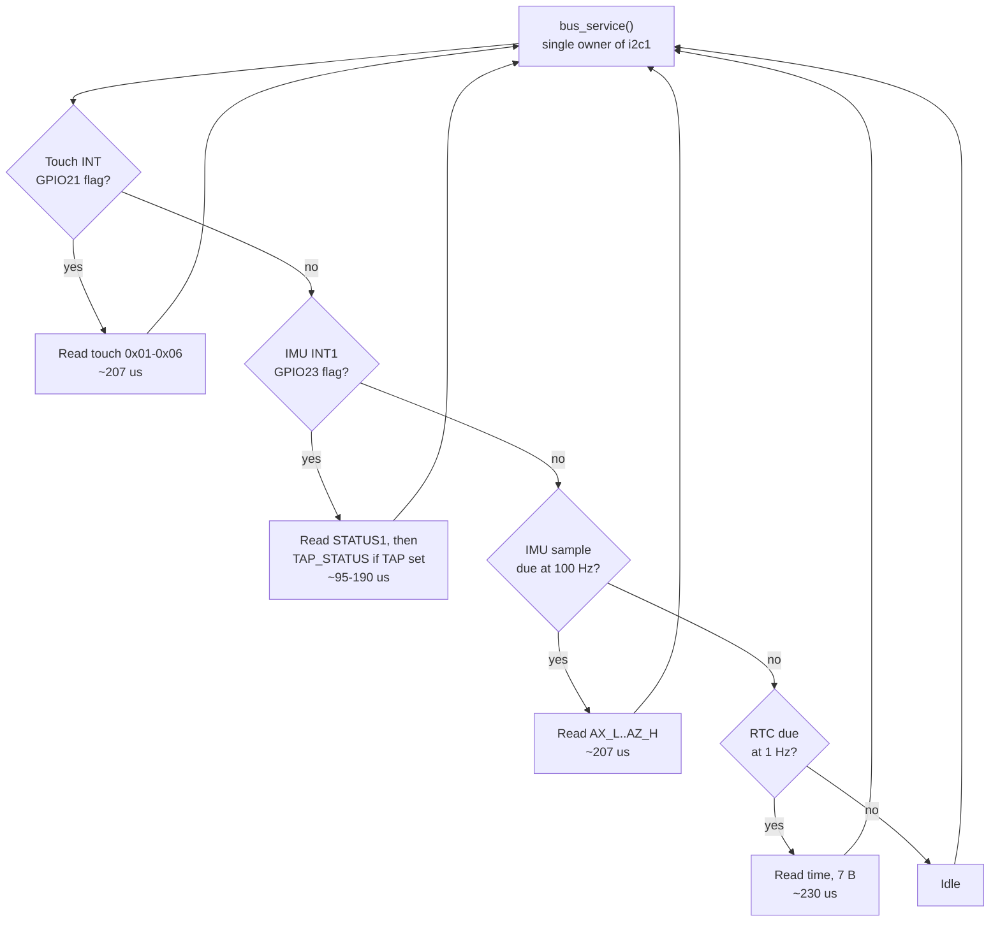

# Interaction

How the device is driven: motion as the primary control surface, touch for setting values.

**Target hardware:** Waveshare RP2350-Touch-LCD-1.69. QMI8658C IMU at I²C address `0x6A` on
`i2c1` (400 kHz, shared with a CST816-family touch controller at `0x15` and a PCF85063A RTC at
`0x51`), IMU `INT1` → GPIO23, `INT2` → GPIO24 [SCH][WIKI]. Display is a 240 × 280 IPS panel with
physically rounded corners.

**Verification status.** Everything below is derived from vendor datasheets and from published
driver source. None of it has been exercised on this board. Claims marked **⚠ UNVERIFIED** are
inference from documentation or gaps in the published sources; where two sources disagree, both
positions are stated rather than silently reconciled.

---

## Summary

1. The QMI8658C has **four** usable on-chip gesture engines — **Tap (single/double), Any-Motion,
   No-Motion, Significant-Motion** — plus **Pedometer** and **Wake-on-Motion**. It has **no
   orientation/6D engine, no free-fall detector, no activity classifier, and no AttitudeEngine**;
   the AttitudeEngine was deleted from the C variant at datasheet rev 0.94 [QMI8658C rev history].
2. **In normal mode, accelerometer ODR barely affects current** (132 µA @ 31 Hz → 182 µA @
   1000 Hz). The only power decisions that matter are normal vs. low-power vs. off, and *never
   turning the gyro on* (+~600 µA) [QMI8658C Tables 15–17].
3. **I²C bus contention is a non-issue at the bandwidth level** (~3 % of `i2c1` in the recommended
   design) but is a real risk at the *code structure* level. The two things that will genuinely
   starve touch are a large FIFO drain (128 × 12 B = **35 ms** of solid bus time) and a blocking
   CTRL9 handshake loop — and the vendor driver contains exactly such a loop, polling the wrong
   register.
4. The smallest vocabulary covering start/pause/resume/stop/reset is **two gestures**:
   `double-tap = run/pause toggle` and `shake = reset`. They are chosen because their signal
   signatures are provably disjoint.
5. **No motion gesture is discoverable by an untold user** except pick-up-to-wake. Plan to teach
   them, and keep a touch path to every command.

---

## Part 1 — The design premise

Motion is the primary control surface. Touch is the surface for *setting values* — choosing a
duration, picking a preset, entering a settings screen. The split follows from the physics of a
wrist-sized handheld: transport controls (start, pause, resume, stop, reset) are discrete,
infrequent and often issued while the user is not looking at the glass; value entry is continuous,
deliberate, and demands the user's eyes anyway.

Three constraints shape everything that follows.

- **Transport commands must be issuable without looking.** That is what motion buys. It is also
  what makes false positives expensive: an accidental reset on a running timer destroys the only
  state the product has.
- **Value entry must be precise.** That is what touch buys, and the CST816 reports **one contact
  only**, so the touch vocabulary is single-finger taps, drags and hardware-reported swipes — no
  pinch, no two-finger anything.
- **Motion detection must never delay touch.** Both live on the same 400 kHz `i2c1`. A finger on
  glass is the one input where the human is watching their own hand, so its latency budget is the
  tightest in the system, and it must win every arbitration.

---

## Part 2 — What the QMI8658C does in hardware

### 2.1 Register map (relevant subset)

| Addr | Name | Purpose |
|---|---|---|
| 0x00 | WHO_AM_I | 0x05 |
| 0x01 | REVISION_ID | see defect 6 below |
| 0x02 | CTRL1 | interface, `ADDR_AI` b6, `BE` b5, `FIFO_INT_SEL` b2, `SensorDisable` b0 |
| 0x03 | CTRL2 | accel `aFS[6:4]`, `aODR[3:0]`, `aST` b7 |
| 0x04 | CTRL3 | gyro `gFS[6:4]`, `gODR[3:0]` |
| 0x06 | CTRL5 | `gLPF_MODE[6:5]`, `gLPF_EN` b4, `aLPF_MODE[2:1]`, `aLPF_EN` b0 |
| 0x08 | CTRL7 | `SyncSample` b7, `DRDY_DIS` b5, `gSN` b4, `gEN` b1, `aEN` b0 |
| **0x09** | **CTRL8** | **Motion Detection Control — the feature-engine enable register** |
| **0x0A** | **CTRL9** | **Host command register** |
| 0x0B–0x12 | CAL1_L … CAL4_H | parameter transfer for CTRL9 commands |
| 0x13 | FIFO_WTM_TH | watermark, in samples |
| 0x14 | FIFO_CTRL | `FIFO_RD_MODE` b7, `FIFO_SIZE[3:2]`, `FIFO_MODE[1:0]` |
| 0x15 / 0x16 | FIFO_SMPL_CNT / FIFO_STATUS | count LSB / `FULL`, `WTM`, `OVFLOW`, `NOT_EMPTY`, count MSB |
| 0x17 | FIFO_DATA | |
| 0x2D | STATUSINT | **b7 = Ctrl9 CmdDone**; b1 mirrors INT1, b0 mirrors INT2 (non-sync mode) |
| 0x2E | STATUS0 | `gDA` b1, `aDA` b0 |
| **0x2F** | **STATUS1** | **b7 SigMotion, b6 NoMotion, b5 AnyMotion, b4 Pedometer, b2 WoM, b1 TAP** |
| 0x30–0x32 | TIMESTAMP L/M/H | 24-bit, increments per sample of the fastest-ODR sensor |
| 0x35–0x3A | AX_L … AZ_H | accel |
| 0x3B–0x40 | GX_L … GZ_H | gyro |
| **0x59** | **TAP_STATUS** | b7 `TAP_POLARITY`, [5:4] `TAP_AXIS` (1=X, 2=Y, 3=Z), **[1:0] `TAP_NUM` (1=single, 2=double)** |
| 0x5A–0x5C | STEP_CNT L/M/H | 24-bit step count |
| 0x60 | RESET | write **0xB0** |

Source: [QMI8658C] Table 19 (register overview), Table 22 (CTRL1/2/3/5/7/8), Table 23 (FIFO),
Table 24 (status), Table 26 (activity output), Table 27 (reset).

**CTRL8 (0x09) — the register that matters most:**

| Bit | Name | Meaning |
|---|---|---|
| 7 | `CTRL9_HandShake_Type` | 0 = use INT1 as CTRL9 handshake; **1 = use STATUSINT.bit7** |
| 6 | `ACTIVITY_INT_SEL` | 0 = activity events → **INT2**; 1 = activity events → **INT1** |
| 4 | `Pedo_EN` | pedometer engine |
| 3 | `Sig-Motion_EN` | significant-motion engine |
| 2 | `No-Motion_EN` | no-motion engine |
| 1 | `Any-Motion_EN` | any-motion engine |
| 0 | `Tap_EN` | tap engine |

Bit 6 routes **all five** activity sources to **one** pin, OR'd together; STATUS1 must be read to
demultiplex them. [QMI8658C §6: "If driven to one INT pin, the multiple sources act in LOGIC-OR"]

### 2.2 CTRL9 command protocol

All engine *configuration* goes through CTRL9, not through direct register writes
[QMI8658C §5.10].

```
1. write parameters into CAL1_L … CAL4_H
2. write the command byte to CTRL9 (0x0A)
3. wait for CmdDone:  STATUSINT(0x2D).bit7 == 1     (if CTRL8.bit7 == 1)
                      or INT1 goes high              (if CTRL8.bit7 == 0)
4. write CTRL_CMD_ACK (0x00) to CTRL9
5. wait for STATUSINT.bit7 == 0
```

Full command list [QMI8658C Table 28]:

| Command | Value | Type |
|---|---|---|
| `CTRL_CMD_ACK` | 0x00 | Ctrl9 |
| `CTRL_CMD_RST_FIFO` | 0x04 | Ctrl9 |
| `CTRL_CMD_REQ_FIFO` | 0x05 | Ctrl9R |
| `CTRL_CMD_WRITE_WOM_SETTING` | 0x08 | WCtrl9 |
| `CTRL_CMD_ACCEL_HOST_DELTA_OFFSET` | 0x09 | WCtrl9 |
| `CTRL_CMD_GYRO_HOST_DELTA_OFFSET` | 0x0A | WCtrl9 |
| **`CTRL_CMD_CONFIGURE_TAP`** | **0x0C** | WCtrl9 |
| **`CTRL_CMD_CONFIGURE_PEDOMETER`** | **0x0D** | WCtrl9 |
| **`CTRL_CMD_CONFIGURE_MOTION`** | **0x0E** | WCtrl9 |
| `CTRL_CMD_RESET_PEDOMETER` | 0x0F | WCtrl9 |
| `CTRL_CMD_COPY_USID` | 0x10 | Ctrl9R |
| `CTRL_CMD_SET_RPU` | 0x11 | WCtrl9 |
| `CTRL_CMD_AHB_CLOCK_GATING` | 0x12 | WCtrl9 |
| `CTRL_CMD_ON_DEMAND_CALIBRATION` | 0xA2 | WCtrl9 |
| `CTRL_CMD_APPLY_GYRO_GAINS` | 0xAA | WCtrl9 |

**Universal precondition:** tap, pedometer and motion configuration all carry the note
*"Configuration should be done when accelerometer and gyroscope are disabled
(CTRL7.aEN = CTRL7.gEN = 0)"*, and all three engines *"can only work in Non-SyncSample mode"*
(CTRL7.bit7 = 0). Re-enabling the accelerometer then costs `3 ms + 3/ODR` [QMI8658C Table 7].
**Enabling or disabling an already-configured engine via CTRL8 is safe with sensors running** —
the restriction applies to re-tuning parameters only [QMI8658C §9.5].

### 2.3 Tap detection

**Algorithm** [QMI8658C §10.1]: linear acceleration = raw − α-smoothed average. If the
sum-of-squares of linear acceleration across all three axes exceeds `PeakMagThr`, peak detection
starts. If the γ-smoothed *average movement magnitude* falls below `UDMThr` by the end of
`PeakWindow`, a valid peak is recorded. If nothing further happens during `TapWindow`, that is a
valid tap. A second tap **after** `TapWindow` and **before** `DTapWindow` yields a double-tap; a
second tap *inside* `TapWindow` is classed as undefined motion and **resets the whole process,
reporting nothing.**

| Parameter | Format | Resolution | Datasheet example | SensorLib example |
|---|---|---|---|---|
| `Priority` | u8 ([2:0]) | 0–5 = axis orderings | — | `Z > Y > X` |
| `PeakWindow` | u8 | samples | 20 @ 500 Hz | 20 |
| `TapWindow` | u16 | samples | 50 @ 500 Hz | 55 |
| `DTapWindow` | u16 | samples | 250 @ 500 Hz | 140 |
| `Alpha` | u8, 7-bit frac | 1/128 | 0.0625 | 0.0625 |
| `Gamma` | u8, 7-bit frac | 1/128 | 0.25 | 0.25 |
| `PeakMagThr` | u16, 10-bit frac | 0.001 g² | 0.8 g² | 0.3 |
| `UDMThr` | u16, 10-bit frac | 0.001 g² | 0.4 g² | 0.18 |

CAL register layout — two CTRL9 passes, `CAL4_H[7:4]` = 0x01 then 0x02 [QMI8658C Table 36]:

| Reg | Pass 1 | Pass 2 |
|---|---|---|
| CAL1_L | `PeakWindow` | `Alpha` |
| CAL1_H | `Priority` | `Gamma` |
| CAL2_L/H | `TapWindow[15:0]` | `PeakMagThr[15:0]` |
| CAL3_L/H | `DTapWindow[15:0]` | `UDMThr[15:0]` |
| CAL4_H | 0x01 | 0x02 |

**ODR requirement: "it is recommended to set accelerometer ODR to higher than 200 Hz"**
[QMI8658C §10.4]. This rules out every low-power ODR (128/21/11/3 Hz) — **hardware tap cannot run
in the low-power mode.** Enable with `CTRL8.bit0 = 1`. Read `STATUS1.bit1`, then
`TAP_STATUS (0x59)`.

**Latency, and why single-tap is unusable:** the engine cannot report a *single* tap until
`DTapWindow` expires — 280 ms with SensorLib's numbers, **500 ms with the datasheet's**. A
*double* tap fires roughly one `PeakWindow` (~40 ms) after the second impact. **Double-tap
therefore feels dramatically faster than single-tap.** This alone is sufficient reason to build on
double-tap and discard single-tap.

**⚠ UNVERIFIED:** whether the tap engine sees data before or after the CTRL5 accelerometer LPF.
SensorLib's tap example explicitly passes `LpfMode::OFF` [SensorLib `TapDetection.ino`:299-301],
which suggests it matters. Note the LPF bandwidth is a *fraction of ODR*: `aLPF_MODE=00` at 500 Hz
= **13.3 Hz**, which would annihilate tap impulses. If the LPF is enabled at all, use
`aLPF_MODE=11` (13.37 % = 66.9 Hz).

### 2.4 Any-Motion / No-Motion / Significant-Motion

All three work on the **slope** `Slope(n) = Acc(n) − Acc(n−1)` per enabled axis [QMI8658C §9.1].

- **Any-Motion**: |slope| > threshold for ≥ `AnyMotionWindow` consecutive samples. Self-clearing
  when the slope drops back inside the band.
- **No-Motion**: |slope| < threshold for ≥ `NoMotionWindow` consecutive samples. Self-clearing.
- **Significant-Motion**: requires Any-Motion *and* No-Motion both configured and enabled. After a
  valid Any-Motion, a *second* Any-Motion arriving after `SigMotionWaitWindow` and before
  `SigMotionConfirmWindow` raises the flag. **Cleared by No-Motion.**

| Parameter | Format | Resolution |
|---|---|---|
| `{Any,No}Motion{X,Y,Z}Thr` | u8, 5-bit frac | **0.03125 g (1/32) per LSB** |
| `AnyMotionWindow`, `NoMotionWindow` | u8 | samples |
| `SigMotionWaitWindow`, `SigMotionConfirmWindow` | u16 | samples |

`MOTION_MODE_CTRL` byte, placed in CAL4_L on pass 1 [QMI8658C Table 33]:

```
b7 NoMotionAxisLogic (1=AND)   b6 NoMotionEnZ  b5 NoMotionEnY  b4 NoMotionEnX
b3 AnyMotionAxisLogic (1=AND)  b2 AnyMotionEnZ b1 AnyMotionEnY b0 AnyMotionEnX
```

CAL layout [QMI8658C Table 34]: pass 1 = AnyX/AnyY/AnyZ/NoX/NoY/NoZ thresholds + mode byte;
pass 2 = AnyWindow/NoWindow/SigWait/SigConfirm.

Working values from SensorLib's examples: Any-Motion `125 mg, window 3` @ 224 Hz, ±8 g
[SensorLib `AnyMotion.ino`:70-71,116]; No-Motion `15.625 mg, window 30` with Any-Motion at
`62.5 mg, window 3` [SensorLib `NoMotion.ino`:70-73].

Enable via `CTRL8` bits 1/2/3. Status in `STATUS1` bits 5/6/7.

### 2.5 Pedometer

Fully documented [QMI8658C §11]: 24-bit step count at 0x5A–0x5C, parameters `ped_sample_cnt`,
`ped_fix_peak2peak` (mg), `ped_fix_peak` (mg), `ped_time_up`, `ped_time_low`,
`ped_time_cnt_entry`, `ped_fix_precision`, `ped_sig_count`. The interrupt fires every
`ped_sig_count` steps. Reset by `CTRL_CMD_RESET_PEDOMETER` (0x0F) *or* by toggling `CTRL8.bit4`
0→1.

**Irrelevant to a timer.** Recorded for completeness. The one idea worth borrowing:
`ped_time_cnt_entry` ("ignore steps until N consecutive ones are seen") is exactly the
"screen out fake events" pattern the software shake detector should copy.

### 2.6 Wake-on-Motion

The lowest-power detector [QMI8658C §12].

```
CTRL7 = 0x00                        // disable all sensors  (mandatory)
CTRL2 = (aFS << 4) | aODR           // aODR must be 11xx (low-power)
CAL1_L = threshold in mg            // 0x00 == "disable WoM"
CAL1_H = (initval << 7) | (pin << 6) | (blanking & 0x3F)
         //   bit6: 0 = INT1, 1 = INT2
         //   bit7: initial (idle) pin value
         //   blanking = accel samples ignored after enable
CTRL9 <- 0x08  (CTRL_CMD_WRITE_WOM_SETTING) + handshake
CTRL7 = 0x01                        // aEN = 1
```

The vendor driver and SensorLib agree exactly on this bit encoding [Waveshare `QMI8658.h`:454-466;
SensorLib `SensorQMI8658.hpp`:1498-1505], and both match [QMI8658C Table 39].

**Two traps:**

- **"For each WoM event, the state of the selected interrupt line is toggled."** It is not a pulse
  and not a level. Configure the RP2350 GPIO for **both edges**, or clear it by reading STATUS1
  (which resets the line to the configured initial value).
- **Exit requires `CTRL7[1:0] = 0` first, then threshold 0x00, then re-issuing the CTRL9 command.**
  Skipping the first step leaves the pins in WoM behaviour.

Blanking time is in *accelerometer samples*: SensorLib's default `0x20` = 32 samples = **1.5 s of
deafness at 21 Hz**. Use 4–8 (190–380 ms).

### 2.7 FIFO

16/32/64/128 samples; modes Bypass / FIFO (stop-on-full) / Stream (overwrite). 6 bytes per sample
per enabled sensor, 12 bytes with both. The watermark interrupt routes to INT1 (`CTRL1.bit2 = 1`)
or INT2 (`= 0`). Reading requires `CTRL_CMD_REQ_FIFO` (0x05), then a burst read of 0x17, then
clearing `FIFO_CTRL.FIFO_RD_MODE`. **Enabling any non-bypass FIFO mode disables DRDY.**
[QMI8658C §5.4, §6.2, §8]

**Recommendation: do not use it.** See Part 10.

### 2.8 Interrupt routing — the complete picture

| Source | Pin | Selector |
|---|---|---|
| Tap / Any / No / Sig-Motion / Pedometer | INT1 or INT2 (**all together**) | `CTRL8.bit6` |
| DRDY | **INT2 only, hard-wired** | `CTRL7.bit5` (DRDY_DIS) blocks it |
| FIFO watermark | INT1 or INT2 | `CTRL1.bit2` |
| CTRL9 handshake | INT1, or none | `CTRL8.bit7` |
| WoM | INT1 or INT2 | `CAL1_H.bit6` |

Both pins are **push-pull only, default output Low** [QMI8658C §6]. There is no open-drain option,
no configurable polarity outside WoM, and no pull resistors are needed. Because the pins are
always driven, **RP2350-E9 (pad leakage on floating inputs) [RP2350] does not apply to GPIO23/24**
— but do not add a pull-down "for safety" on an A2 part.

**Design consequence:** with only two pins, and DRDY nailed to INT2, the clean assignment for this
product is `INT1 (GPIO23) = all activity events` (`CTRL8.bit6 = 1`), `INT2 (GPIO24) = unused`
(`DRDY_DIS = 1`), and `CTRL8.bit7 = 1` so CTRL9 handshakes do not hijack INT1.

### 2.9 What the QMI8658C does NOT have

- **No orientation / 6D / portrait-landscape engine.** (Compare BMI270, LSM6DSx.) Section 2 "Chip
  Orientation Coordinate System" is an axis diagram, not a detector.
- **No free-fall detector.**
- **No activity classifier** (walking/running/still).
- **No wrist-tilt / raise-to-wake engine.**
- **No AttitudeEngine on the C part.** Rev 0.94 of the datasheet "removed AltitudeEngine relative
  information" and "remove CTRL4 & CTRL6" [QMI8658C rev history]. Table 20 still contains a stale
  sentence about "AttitudeEngine … using sEN", but CTRL7 bits [3:2] are Reserved and there is no
  `sEN` bit. **The vendor driver ships `QMI8658_config_ae()` plus quaternion and velocity readout
  code — that code is dead on this board** [Waveshare `QMI8658.c`:268-274].
- **No interrupt latching configuration and no configurable INT polarity** (except WoM's initial
  value).

### 2.10 Defects in the published driver code

| # | Finding | Source |
|---|---|---|
| 1 | **The vendor CTRL9 handshake is wrong.** `QMI8658_doCtrl9Command()` polls **STATUS1 (0x2F) for `val & 0x04`** — that is the **WoM** bit, not CmdDone. The correct bit is **STATUSINT (0x2D) bit 7**. It also never sends `CTRL_CMD_ACK`, contains `printf` inside the poll loop, and `DEV_Delay_ms(10)` per iteration. As written it spins until a WoM event physically occurs. | [Waveshare `QMI8658.c`:463-479] vs [QMI8658C §5.10.4] |
| 2 | **The vendor `disableWakeOnMotion()` never disables WoM** — the `QMI8658_doCtrl9Command()` call is commented out, so writing 0 to CAL1_L has no effect. | [Waveshare `QMI8658.c`:505-510] |
| 3 | **The vendor header carries the QMI8658*A* command set** (`GyroBias 0x01`, `Rqst_Sdi_Mod 0x03`) and **no** `CONFIGURE_TAP`/`CONFIGURE_PEDOMETER`/`CONFIGURE_MOTION` at all. Out of the box the vendor driver exposes exactly one engine: WoM. Everything else must be written from scratch. | [Waveshare `QMI8658.h`:222-230] |
| 4 | **`CTRL1` bits 3/4 are `INT1_EN`/`INT2_EN` on the QMI8658*A* but Reserved on the *C*.** SensorLib's `enableINT()` sets them unconditionally. Harmless (they default to 0 and are reserved), but do not assume the pins are high-Z until set — on the C part they are driven from POR. | [QMI8658A Table CTRL1 b3/b4] vs [QMI8658C Table 22 CTRL1 "4:3 Reserved"], [SensorLib:342-352] |
| 5 | **The datasheet contradicts itself on the soft-reset value.** Table 27 says write **0xB0** to 0x60; §7.4 says "writing the 0x0B". SensorLib uses **0xB0**. Use 0xB0. | [QMI8658C Table 27 / §7.4], [SensorLib:2297] |
| 6 | **`REVISION_ID` default is listed as `0x68` in Table 19 and `0x7C` in Table 21** of the same document. Do not gate init on it; gate on `WHO_AM_I == 0x05`. | [QMI8658C Tables 19, 21] |
| 7 | **Neither the ESPHome component nor esp-idf-lib's driver implements any hardware engine.** Among public drivers for this part, only `Djelibeybi/esphome-qmi8658` implements WoM properly (polling STATUSINT bit 7 correctly, then ACKing), and only SensorLib implements tap, pedometer and motion. | [ESPHome], [esp-idf-lib], [Djelibeybi], [SensorLib] |

**Practical conclusion: use `lewisxhe/SensorLib` (`src/SensorQMI8658.hpp`) as the reference
implementation, not the Waveshare driver.** It is the only public driver implementing all five
engines, and its CAL-register layouts match the datasheet tables exactly.

---

## Part 3 — What must be done in software on the RP2350

| Gesture | Hardware? | Software needed | ODR | RAM | CPU | Code |
|---|---|---|---|---|---|---|
| Orientation / which-way-is-up | ✗ | 1-pole IIR per axis (α≈0.2), 6-face classifier, 15° hysteresis, 300 ms dwell | 25 Hz | ~24 B | <0.1 % | ~50 lines |
| Flip face-down | ✗ | falls out of orientation (`az < −0.7 g` for 300 ms) | 25 Hz | 0 | ~0 | ~10 lines |
| Shake | ✗ | subtract IIR gravity estimate → linear accel; count sign-alternating threshold crossings with refractory; require ≥3 in an 800 ms window | 100 Hz | ~600 B ring | <1 % | ~80 lines |
| Single/double tap | **✓ engine** | read `STATUS1` + `TAP_STATUS` on INT1; filter `TAP_NUM == 2` | 250–500 Hz **internal** | ~0 | ~0 | ~20 lines |
| Software tap (fallback) | ✗ | jerk (first difference) + peak/quiet/double state machine mirroring §10.1 | **500 Hz over I²C** | ~1 KB | <2 % | ~150 lines |
| Wrist-twist | ✗ | gyro integration (drift, +600 µA) **or** accel roll `atan2(ax, az)` with singularity handling | 100 Hz | ~200 B | <1 % | ~200 lines, *still unreliable* |
| Tilt-and-hold | ✗ | on top of orientation: angle + 1 s dwell + release detection | 25 Hz | ~16 B | ~0 | ~30 lines |
| Set-down (no-motion) | **✓ engine** | read `STATUS1.bit6`; AND with "flat" from orientation | low-power | 0 | ~0 | ~15 lines |
| Pick-up (motion after stillness) | **✓ engine** | `STATUS1.bit5` (Any) or `.bit7` (Sig) | low-power | 0 | ~0 | ~15 lines |

**The real cost is not any individual detector — it is the arbitration layer.** Budget for it
explicitly; in practice it is larger than all the detectors combined:

- **Arming and gating**: gestures active only in specific UI states (no shake-to-reset while in the
  settings screen).
- **Cross-suppression**: a shake must suppress tap for ~1 s afterwards — the hand jerking to a stop
  at the end of a shake produces a convincing tap impulse.
- **Buzzer self-triggering blanking** (see Part 6 — easy to miss, and it will bite).
- **Global refractory** (~700 ms) after every accepted gesture, so one physical action cannot
  produce two commands.
- **Undo affordance** for reset, because gesture false-positives are inevitable and reset is
  destructive.

**The strongest argument for the hardware tap engine is bus load, not CPU.** Software tap needs
500 Hz × 207 µs = **10.4 % of `i2c1`**, permanently. The hardware engine samples at 500 Hz
internally and costs **two register reads per event**. It moves the whole high-rate problem off the
shared bus.

**Aliasing caveat (⚠ needs hardware validation):** if the accelerometer runs at 500 Hz for the tap
engine but is read at only 100 Hz for shake and orientation, content from 100–250 Hz folds into the
0–50 Hz band. Start with the LPF off and a slightly conservative shake threshold; if spurious
shakes appear, try `aLPF_MODE=11` (66.9 Hz at 500 Hz ODR) and re-check that tap still works.

**The accelerometer's blind spot, stated plainly:** rotation about the gravity vector is invisible
to an accelerometer. A device lying flat on a table and spun about the screen normal produces *no*
accelerometer change. Every "twist" gesture inherits this.

---

## Part 4 — Gesture-by-gesture ratings

Scale: ●●●●● best, ● worst. "Discoverability" means a user who was told nothing.

| Gesture | Reliability | False-positive risk in normal handling | Discoverability | Latency | Power | Verdict |
|---|---|---|---|---|---|---|
| **Double-tap on case** | ●●●○○ enclosure-dependent | ●●●●○ low — needs two impacts with a quiet gap | ●●●○○ people try tapping | **~190 ms** (≈40 ms after 2nd tap) | 155 µA (500 Hz normal) | **Use as primary.** Best latency/risk trade in the set. |
| **Shake** | ●●●●○ | ●●●●○ low if ≥3 reversals @ >1.8 g required | ●●●○○ people shake when frustrated | ~500–600 ms | 134 µA (125 Hz) | **Use for reset.** Effort matches destructiveness. |
| **Flip face-down** | ●●●●● near-deterministic | ●●●○○ moderate — people flip devices to stop looking at them | ●●○○○ | ~350 ms (dwell) | **42 µA** (LP 21 Hz) | **Good, but it is a *state* not an event.** Excellent for silence-alarm / DND. Risky as pause — face-down also means "I'm putting this away". |
| **Set-down on table (No-Motion)** | ●●●●● | ●●○○○ fires whenever still, including in a bag or a very steady hand | ●○○○○ as a command; ●●●●● as ambient behaviour | 1.2 s @ 25 Hz, window 30 | free | **Opt-in "focus mode" only.** AND it with "flat" (`\|az\| > 0.9 g`) or it fires in a pocket. Never a default. |
| **Pick-up (Any/Sig-Motion)** | ●●●●● | ●●○○○ a table bump triggers Any-Motion | ●●●●● universal phone idiom | ~50–150 ms | free | **Perfect for wake-the-screen. Terrible as a command.** Use Significant-Motion if filtering is needed. |
| **Orientation / auto-rotate** | ●●●●○ (undefined when flat) | n/a — not a command | ●●●●● | 300 ms | 42 µA | **Use for auto-rotate and for gating other gestures.** Freeze the classifier when `\|az\| > 0.85 g`. |
| **Single tap** | ●●●○○ | ●●○○○ **high** — bumps, setting the device down, a bag | ●●●●○ | **280–500 ms** — hard floor = `DTapWindow` | 155 µA | ✗ **Bad idea.** Highest false-positive rate *and* the worst latency in the set. Strictly dominated by double-tap. |
| **Tilt-and-hold** | ●●●●○ | ●●●○○ | ●○○○○ (●●●● with an on-screen meter) | **≥1 s by construction** | 42 µA | ✗ **Wrong tool for discrete commands.** Fine for scrubbing a value — but touch already owns time-setting, so it is redundant here. |
| **Wrist-twist** | ●●○○○ orientation-dependent; blind about the gravity axis | ●○○○○ **worst in the set** — normal handling is continuous reorientation | ●○○○○ nobody guesses this | 500–1000 ms | 134 µA accel-only, **754 µA with gyro** | ✗✗ **Do not build this.** Unreliable, undiscoverable, and the version that works needs the gyro, which is ~4× the entire rest of the IMU budget. |

**On discoverability:** apart from pick-up-to-wake, **none of these is discoverable.** A user handed
this device will not find double-tap or shake unaided. Therefore:

- ship a 3-frame animated hint on first run and after long idles;
- keep a **touch path to every command** — the gesture is an accelerator, not the only door;
- and remember the board has a **physical PWR button on GPIO14** [SCH][WIKI]. A timer with one
  button, touch and two gestures is a better product than one with four gestures. The design brief
  makes the IMU primary; the button should still be the canonical, zero-false-positive fallback.

**On tap reliability:** tap on a small handheld device is enclosure-dependent in a way that cannot
be predicted from a datasheet. On a hard table the impulse is sharp and the "return to quiet within
`PeakWindow`" test passes cleanly. In a soft grip the hand absorbs energy: lower peak, longer
ring-down, and the `UDMThr` test fails. **Mitigation — two tap profiles switched by context:** when
No-Motion reports the device resting, load a "table" profile (tight windows, low `PeakMagThr`);
when Any-Motion reports it held, load an "in-hand" profile (wider `PeakWindow`, higher `PeakMagThr`
and `UDMThr`). Each switch costs two CTRL9 commands with the accelerometer briefly disabled
(~20–30 ms), which is acceptable because rest/hold transitions are rare.

---

## Part 5 — Recommended gesture vocabulary

### The semantic reduction

Start, pause and resume are **one toggle**. Stop and reset are **one action** for a timer. The
irreducible set is therefore **two commands**, and so **two gestures**.

### Recommendation

| Command | Gesture | Mechanism |
|---|---|---|
| **start / pause / resume** | **double-tap on the case** | hardware Tap engine → INT1 (GPIO23), filter `TAP_NUM == 2` |
| **stop + reset** | **shake** (≥3 sign-alternating peaks > 1.8 g within 800 ms) | software, 100 Hz |

Plus three **non-command** behaviours that are free and improve everything:

| Behaviour | Mechanism |
|---|---|
| wake screen on pick-up | Any-Motion engine → INT1 |
| dim/sleep screen when set down | No-Motion engine → INT1 |
| auto-rotate | software orientation, 25 Hz |
| *(optional)* silence a ringing alarm | flip face-down |

### Why this pair

1. **Their signal signatures are provably disjoint.** A double-tap is two short high-frequency
   impulses separated by an *enforced quiet interval*; the tap engine's `UDMThr` test explicitly
   requires the device to return to quiet. A shake is sustained low-frequency oscillation that
   never goes quiet. **The tap engine structurally rejects shaking.** No other pair in the
   candidate set has this property.
2. **Neither needs the gyro.** Total IMU cost stays at ~155 µA.
3. **Both work in any orientation, held or resting.** Flip and set-down do not.
4. **Effort matches destructiveness.** Reset destroys state, so it should be hard to do by
   accident; shake is deliberate and effortful. Pause is benign and frequent, so it gets the cheap
   gesture.
5. **Double-tap is the fastest gesture available** (~190 ms), and it is the frequent one.

**Fallback if double-tap proves unreliable on the real enclosure:** promote **flip face-down =
pause / face-up = resume**. It is near-bulletproof and self-describing — it is a *state*, so turning
the device back over immediately shows what happened, which eliminates the whole "did it register?"
problem class. The cost is that it needs a surface or a deliberate hand motion, and it collides
with "I'm putting this away".

---

## Part 6 — Feedback for motion commands

Every gesture needs feedback within ~100 ms of *detection*, and it must distinguish three cases:
**committed**, **seen but rejected**, and **not armed**. The buzzer is on GPIO2 (PWM1 A) through
R22 4.7 kΩ into T2, an SS8050 NPN [SCH].

| Event | Buzzer | Screen |
|---|---|---|
| **Start / resume** | rising two-tone blip, ~1.5 → 2 kHz, 40 ms | digits snap to full opacity; progress ring wipes clockwise from 12 o'clock; colon starts blinking |
| **Pause** | falling two-tone blip, 2 → 1.5 kHz, 40 ms | digits to 60 % opacity, colon stops, ring freezes **and gains a visible gap**; add a static `‖` glyph — dimming alone is not readable at a glance |
| **Reset (shake)** | three descending clicks over 180 ms | digits mechanically roll back to the preset over 250 ms; ring empties counter-clockwise. **The rollback animation is what distinguishes "reset" from "stopped"** |
| **Seen but rejected** (tap while locked, tap during refractory) | one short low click, ~400 Hz, 15 ms | 4 px horizontal shake of the digits |
| **Wake (pick-up)** | *silent* | backlight ramps 0→100 % over 150 ms |

Two things that are easy to omit:

- **The "rejected" feedback is the most valuable row in this table.** Without it, a mis-tuned tap
  threshold is indistinguishable from a dead device, and the user's only recovery is to tap harder
  and harder. Ship it from day one; it doubles as the field-tuning instrument.
- **⚠ The buzzer will mechanically excite the accelerometer.** A 40 ms tone at 1–4 kHz is far above
  the 500 Hz Nyquist frequency and will alias straight into the accelerometer band — a real risk of
  buzz → false tap → buzz again. **Blank the tap and shake detectors for the buzzer duration +
  100 ms.** Unverified on hardware.

**Perceived-latency technique:** run a trivial software peak detector in parallel with the hardware
tap engine, purely to start the ring animation on the *first* impulse. Let the hardware engine
decide 150 ms later whether it was actually a double-tap. This costs nothing — the samples are
already being read — and makes the interaction feel instant.

---

## Part 7 — The touch model

Touch owns value entry. The controller constrains the vocabulary sharply, so design to the
constraint rather than around it.

### 7.1 Controller and wiring

- **Controller:** CST816 family (Hynitron). The board wiki spec table says **CST816T** [WIKI]; its
  own Datasheets section links files named `CST816S_Datasheet_EN.pdf` and
  `CST816S_register_declaration.pdf` while labelling them "CST816T"; the sibling module wiki says
  **CST816S** in its spec table and **CST816D** in prose [MODULE-WIKI]. **The exact die variant is
  unknown.** All variants share address, register map and chip ID, so it does not affect a driver.
- **Address:** 7-bit **0x15** (write 0x2A, read 0x2B), stated verbatim in the CST816S datasheet
  [CST816S-DS] and hardcoded in every vendor driver. Bus is `i2c1` @ 400 kHz, SDA GPIO6 / SCL
  GPIO7, with the RP2350's internal pull-ups enabled in software [WS-CODE][WS-LVGL].
- **INT = GPIO21**, active-low pulse, input with the **internal pull-up** enabled.
  **RST = GPIO22**, active-low push-pull output [SCH][WS-CODE].
- **Gate init on ChipID: register `0xA7` must read `0xB5`** [WS-CODE].

### 7.2 Single contact only

**Contact count is 1 — a hardware maximum, not a driver simplification.** The CST816S register
declaration defines `FingerNum @0x02` as "Finger Numbers 0: no finger 1: one finger"
[CST816S-REG]; there is no encoding for a second contact. Vendor drivers read exactly one
coordinate pair from registers 0x03–0x06, masking the high bytes with `0x0F` to give 12-bit X and
Y [WS-CODE]. Coordinates come back in native panel space, X 0–239 and Y 0–279 (⚠ inferred from the
vendor code mapping them straight onto a 240 × 280 framebuffer, not stated in the datasheet).

The CST816S datasheet prose mentions "single-point and real two-point gestures" [CST816S-DS], but
that refers to gesture *sensing*, not to two reported coordinates. **Model touch as one contact plus
a gesture enum, never as a multitouch array.** No pinch, no two-finger rotate, no two-finger scroll.

### 7.3 Hardware gesture codes

Register `0x01` is `GestureID`. Per the CST816S register declaration [CST816S-REG]:

| Code | Gesture |
|---|---|
| 0x00 | none |
| **0x01** | **slide up** |
| **0x02** | **slide down** |
| 0x03 | slide left |
| 0x04 | slide right |
| 0x05 | single click |
| 0x0B | double click |
| 0x0C | long press |

**⚠ Conflicting sources — do not assume either is correct.** The vendor header `Touch_1in69.h`
defines `Down 0x01` and `UP 0x02` [WS-CODE], which is the exact opposite of codes 0x01 and 0x02 in
the register declaration [CST816S-REG]. One of the two is wrong, and nothing in the available
documentation resolves it. The left/right codes (0x03, 0x04) and the click/long-press codes are not
in dispute.

**Resolve this on hardware before shipping any vertical swipe.** Log `GestureID` for a deliberate
swipe up and a deliberate swipe down, and record the answer. Until it is resolved, either avoid
vertical swipes entirely or derive vertical direction from successive coordinate reads rather than
from `GestureID`.

### 7.4 Configuration registers

| Reg | Name | Notes |
|---|---|---|
| 0xEC | `MotionMask` | `EnConLR 0x04` / `EnConUD 0x02` / `EnDClick 0x01` |
| 0xFA | `IrqCtl` | `EnTest 0x80` / `EnTouch 0x40` / `EnChange 0x20` / `EnMotion 0x10`; the vendor writes 0x60, 0x71 or 0x11 depending on mode |
| 0xED | `IrqPluseWidth` | 0.1 ms units |
| 0xEE | `NorScanPer` | 10 ms units |
| 0xF9 | `AutoSleepTime` | default **2 s** |
| 0xFE | `DisAutoSleep` | the vendor writes **0x07** to keep the chip awake |

**Auto-sleep after 2 s of no contact is on by default** [WS-CODE]. This matters more than it looks:
the first touch after an idle period is *late*, and that lateness will be indistinguishable from IMU
traffic starving the touch path. Either write `DisAutoSleep (0xFE) = 0x07` and accept the extra
scan current, or explicitly account for the first-touch delay in the latency budget — but do not
leave it undecided, because it will be misdiagnosed as a bus problem.

### 7.5 Touch vocabulary for this product

Given one contact, hardware gestures and a 2 s sleep, the usable set is:

- **single click** — commit a value, select a preset, press an on-screen control;
- **long press** — enter or leave the settings screen (unambiguous, and hard to trigger
  accidentally);
- **vertical drag on the digits** — scrub minutes or seconds, tracked from raw coordinates rather
  than `GestureID` so it is immune to the 0x01/0x02 conflict;
- **slide left / right** (0x03 / 0x04) — move between fields or presets; these two codes are
  unambiguous in both sources.

Double click (0x0B) is available in hardware but should be left unused on the glass: it duplicates
the double-tap motion gesture semantically and creates two mental models for one idea.

---

## Part 8 — Touch target sizing on a 240 × 280 rounded panel

The panel is 240 × 280 at 0.11655 mm pitch. The sibling module's 2D drawing gives the viewing area
as 28.27 × 32.93 mm with an **R5.15 mm** corner radius [MODULE-2D]; at that pitch the radius is
`5.15 / 0.11655 ≈ 44 pixels`. The sibling wiki states the consequence plainly: *"due to the four
round corners, some parts of the input images may not be displayed"* [MODULE-WIKI]. **⚠ The radius
is arithmetic inferred from the module drawing, not measured on this board's glass** — confirm it by
drawing a 1 px full-perimeter border and photographing the result.

**The clip mask.** With the top-left pixel at (0,0), the arc centre sits at (44, 44) in continuous
coordinates. A pixel is off-glass iff, folding to the nearest corner:

```
u = 44 - min(x, 239 - x) - 0.5     v = 44 - min(y, 279 - y) - 0.5
hidden  ⇔  u > 0 and v > 0 and u² + v² > 44²
```

That hides **≈ 416 pixels per corner** (`44² − π·44²/4 = 415.5`), **≈ 1,662 px total = 2.5 %** of
the 67,200-pixel panel. A corner mask costs under 1 KB via
`third_party/1bit-display/include/1bit/render/mask_buffer.hpp`, or can be generated procedurally.

### Minimum target dimensions

| Rule | Value | Rationale |
|---|---|---|
| **Minimum touch target** | **40 × 40 px** | 40 px × 0.11655 mm = **4.66 mm**, at the low end of the usual finger-target range and about as small as a 913 mm² display can afford |
| **Minimum separation between adjacent targets** | **8 px** (0.93 mm) | one 8×12 terminal cell width; keeps a 12-bit coordinate jitter of a few LSBs from crossing a boundary |
| **Preferred target for primary controls** | **56 × 56 px** (6.53 mm) | transport and commit controls, where a mis-hit is expensive |
| **Full-width row target** | **240 × 44 px** inside the band `(0, 44, 240, 192)` | list rows and preset rows may run edge-to-edge horizontally, but only between y = 44 and y = 236 |

### Where targets must not go

| Shape | Rect (x, y, w, h) | Corner clearance | Use for |
|---|---|---|---|
| **Mathematical minimum uniform inset** | (13, 13, 214, 254) | 0.16 px — knife-edge | Nothing. `44 × (1 − 1/√2) = 12.89`; a 12 px inset *is* clipped |
| **Recommended UI safe area** | **(16, 16, 208, 248)** | 4.4 px | All chrome, text and hit targets. 16 and 208 are **multiples of 8**, so the byte-packed framebuffer needs no partial-byte handling and region snapping is a no-op |
| Full-width band | (0, 44, 240, 192) | edge-to-edge | Anything that must span the full width — status bars, list rows, terminal lines |
| Full-height column | (44, 0, 152, 280) | edge-to-edge | Vertical rules, side rails |

Hard prohibitions:

- **No touch target may intersect the four 44 × 44 corner boxes.** A target there is *partially*
  clipped, which is worse than fully hidden: the user sees half a control and cannot tell whether
  the missing half is tappable.
- **No text, glyph, status icon, clock or battery indicator inside the corner boxes** either, for
  the same reason — a half-visible character reads as a rendering bug.
- **Progress bars, sliders and scroll tracks must not run edge-to-edge across the top or bottom 44
  rows.** Their ends will be eaten.
- **Backgrounds and fills should still bleed to the full 240 × 280** so the physical corners read as
  a deliberate bezel rather than a clipping accident. Only *content* respects the safe box.

Within the recommended safe area, an 8 × 12 terminal font yields **26 columns × 20 rows**
(208/8 = 26; 248/12 = 20.67 → 20). Use that as the renderer's inset rather than the raw 240 × 280.

The practical consequence for layout: the 208 × 248 safe area holds a **5 × 6 grid of 40 px targets**
with 2 px of slack, or a **3 × 4 grid of 56 px targets**. That is the entire touch budget. Any design
needing more simultaneous targets than that needs a different screen, not smaller targets.

---

## Part 9 — Power

All datasheet figures are **at VDD = VDDIO = 1.8 V, 25 °C** [QMI8658C §3.8]. **⚠ This board is
assumed to run the part at 3.3 V — the schematic does not label the IMU supply net**; the
permitted VDD range is 1.71–3.6 V [QMI8658C Table 6]. **⚠ UNVERIFIED: actual current at 3.3 V.**
Expect somewhat higher; the vendor publishes no 3.3 V table.

### Accelerometer-only, gyro disabled [QMI8658C Table 15]

| Mode | ODR (Hz) | Duty | Typ IDD |
|---|---|---|---|
| High-resolution | 1000 | 100 % | 182 µA |
| | 500 | 100 % | **155 µA** |
| | 250 | 100 % | 142 µA |
| | 125 | 100 % | 134 µA |
| | 62.5 | 100 % | 133 µA |
| | 31.25 | 100 % | 132 µA |
| Low-power | 128 | 100 % | 55 µA |
| | 21 | 58 % | **42 µA** |
| | 11 | 31 % | 35 µA |
| | 3 | 8.5 % | 30 µA |

### Gyro and 6DOF [QMI8658C Tables 16, 17]

Gyro-only 224 Hz: **656 µA**. 6DOF 224 Hz: **754 µA**. 6DOF 7174 Hz: 1004–1031 µA.

### Idle states [QMI8658C Table 31]

| Mode | Current | How |
|---|---|---|
| Power-On Default (clock on, sensors off) | 15 µA | `CTRL7 = 0` |
| Low Power idle (250 kHz clock) | 8 µA | `CTRL7 = 0`, `CTRL2.aODR = 11xx` |
| Power-Down | **6 µA** | `CTRL1.SensorDisable = 1` |

### Three findings that should drive the design

1. **In normal mode, ODR is nearly free.** 31 Hz → 1000 Hz is a 32× rate increase for a **38 %
   current increase** (132 → 182 µA). Once normal mode is committed to, run fast. **Run the
   accelerometer at 500 Hz whenever the screen is on** — it costs 23 µA over the slowest normal ODR
   and it is what unlocks hardware tap.
2. **The IMU is irrelevant while the screen is on.** The LCD module draws up to 41.3 mA @ 3.3 V
   [MODULE-WIKI] and the RP2350 at 150 MHz is tens of mA. 155 µA is **<0.5 %** of the awake budget.
   There is no power argument for crippling the IMU during interaction.
3. **Never enable the gyro.** 656 µA is ~4× the entire rest of the IMU budget, and the only gesture
   it buys is wrist-twist — which Part 4 rejects on independent grounds.

### Wake-on-motion with the MCU asleep

WoM is Low-Power Accel Only, so **30–55 µA** depending on ODR. **21 Hz / 42 µA is the sweet spot**:
~48 ms detection granularity, with a blanking of 8 samples ≈ 380 ms. Against a 300–500 mAh cell,
42 µA alone is over a year. In practice the IMU will sit **below** the LDO quiescent current
(RT9193-33PB) and the RP2350 sleep current — **⚠ neither figure verified.** Treat WoM as free.

Wake latency after WoM fires: `Accel Turn On Time = 3 ms + 3/ODR` [QMI8658C Table 7], so ~9 ms at
500 Hz to return to full-rate gesture sensing. `System Turn On Time` after a reset is 15 ms.

### Realistic operating points

| State | Config | IMU current |
|---|---|---|
| Interactive (screen on, tap + shake + orientation) | 500 Hz normal, ±2 g, LPF off, Tap+Any+No engines | ~155 µA |
| Screen off, still armed | 128 Hz LP, Any/No-Motion only | ~55 µA |
| Deep sleep, WoM | 21 Hz LP, ±8 g, WoM 60 mg, blanking 8 | ~42 µA |
| Fully off | `SensorDisable = 1` | ~6 µA |

### No RTC backup battery is fitted

BAT1 (SH1.0 2-pin) is unpopulated [SCH]. Consequences for a *timer* specifically:

- **The PCF85063A keeps time only while the 3V3 rail is up.** If the SYS_EN latch (GPIO15) drops,
  the cell dies, or USB is unplugged with no cell fitted, wall-clock time and any RTC-held state are
  **lost**.
- **Therefore "sleep" must mean MCU-sleep with the rail up, not power-off.** A timer that forgets it
  was counting is worthless.
- **Use the RP2350's POWMAN Always-On Timer as the timekeeping source across sleep.** The RP2040 RTC
  block is gone on RP2350; POWMAN contains the LPOSC, the AON timer (a 64-bit millisecond counter)
  and power control, and supports **up to four GPIO or AON-timer wake sources** — which fits GPIO23
  (IMU INT1), GPIO14 (PWR) and GPIO21 (touch) exactly. Writes need the `0x5afe` key in the top 16
  bits. **⚠ These POWMAN details come from secondary references rather than a direct reading of the
  RP2350 datasheet §POWMAN [RP2350]; verify before relying on them.**
- **Persist the countdown target plus a monotonic timestamp to flash on every state change.** The
  16 MB W25Q128 [SCH] makes wear a non-issue with a simple append log.
- On boot, if the PCF85063A reports oscillator-stop, treat wall-clock as invalid and fall back to
  pure elapsed-time mode — which a timer can do perfectly well.
- **⚠ Speculative, but worth checking:** the ETA6096 is a *switching* charger [SCH]. Its switching
  node may inject vibration or noise that raises the no-motion floor **only while charging** —
  exactly the kind of thing that makes set-down detection mysteriously flaky on the bench and fine
  in the field.

---

## Part 10 — Sharing `i2c1` without starving touch

### Bus arithmetic (400 kHz, 9 bit-times per byte = 22.5 µs)

A register read of N bytes ≈ `(3 + N) × 22.5 µs` + ~5 µs framing.

| Transaction | Bytes | Time |
|---|---|---|
| IMU `STATUS1` (1 B) | 4 | ~95 µs |
| IMU `TAP_STATUS` (1 B) | 4 | ~95 µs |
| IMU accel burst `AX_L`…`AZ_H` (6 B) | 9 | ~207 µs |
| IMU accel + gyro (12 B) | 15 | ~342 µs |
| Touch `0x01`–`0x06` (6 B) | 9 | ~207 µs |
| RTC time (7 B) | 10 | ~230 µs |
| **FIFO drain, 32 accel samples (192 B)** | 195 | **~4.4 ms** |
| **FIFO drain, 128 6DOF samples (1536 B)** | 1539 | **~34.6 ms** |

### Budget for the recommended design

| Consumer | Rate | Bus share |
|---|---|---|
| Touch (interrupt-driven, ≤100 Hz) | 207 µs × 100 | 2.1 % |
| IMU orientation/shake poll | 207 µs × 50 Hz | 1.0 % |
| IMU activity events (INT1) | ~190 µs, rare | <0.1 % |
| RTC | 230 µs × 1 Hz | 0.02 % |
| **Total** | | **≈ 3.2 %** |

**Bandwidth is not the problem. Code structure is.** The worst-case touch delay behind one in-flight
IMU transaction is ~350 µs — about 2 % of a 20 ms frame, invisible to a human. What *will* hurt is a
35 ms FIFO drain or a blocking handshake loop.

### Scheduling strategy



1. **One owner.** A single `bus_service()`, called from the main loop or pinned to core 1, is the
   *only* code that touches `i2c1`. Everything else posts requests and reads snapshots.
2. **No I²C from interrupt handlers.** GPIO IRQs set flags and return.
3. **Strict service priority: touch → IMU event (INT1) → IMU sample → RTC.** Touch is the only input
   where the human is watching their own finger.
4. **Cap every transaction at ~400 µs (≈16 bytes).** This bounds touch's worst-case wait below half
   a millisecond.
5. **Do not use the IMU FIFO.** Direct polling at 100 Hz costs 2.1 % of the bus, and the RP2350 is
   never too busy to keep up. The FIFO buys nothing here and its drain is the single largest
   starvation risk on this bus. If it must be used, set `FIFO_WTM_TH` to 16 accel-only samples
   (96 B ≈ 2.2 ms) and chunk the read.
6. **Let the engines absorb the high rate.** The tap engine samples at 500 Hz internally; the host
   reads two bytes per event. That is the architectural point of on-chip engines on a shared bus:
   **500 Hz of detection for ~0 Hz of traffic.**
7. **Timeouts everywhere.** Use `i2c_write_timeout_us` / `i2c_read_timeout_us` with a ~2 ms budget,
   plus a bus-recovery routine (drive SCL as GPIO for 9 pulses, then STOP). A wedged bus takes down
   touch, IMU and RTC together.
8. **Never spin on the bus for CTRL9.** Set `CTRL8.bit7 = 1` and poll `STATUSINT` at most once per
   millisecond, with yields. **Do all CTRL9 configuration once at boot, before touch is live.** Do
   not replicate the vendor driver's loop.
9. **Decide the CST816 auto-sleep question explicitly** (register `0xF9`; write `0xFE = 0x07` to
   disable). The 2 s auto-sleep makes the first touch after an idle late — which will look exactly
   like IMU polling starving touch when it is not [WS-CODE].
10. **Keep the bus at 400 kHz.** ⚠ The PCF85063A's maximum I²C rate is not established in the
    available sources; do not raise the clock without checking it.

### Concrete interrupt assignment

| GPIO | Signal | Edge | Notes |
|---|---|---|---|
| 21 | Touch INT (CST816) | falling | active-low, internal pull-up [SCH][WS-CODE] |
| **23** | **IMU INT1 — all activity events** | **rising** | `CTRL8.bit6 = 1`. Push-pull, idle low → **no pull resistor**, and do not add a pull-down on an A2 part (RP2350-E9) |
| 24 | IMU INT2 | — | keep quiet: `CTRL7.DRDY_DIS = 1`. Reserve for WoM in sleep |
| 18 | RTC INT | falling | 1 Hz tick or alarm |
| 14 | PWR button | — | also a POWMAN wake source |

**Any-Motion holds INT1 high continuously while the device is in motion** — it is level-like and
self-clearing, not a pulse. A rising-edge IRQ fires once and then goes quiet until motion stops.
Either use both-edge detection, or simply poll `STATUS1` at the normal cadence — one byte, 95 µs.

### Boot sequence sketch

```c
i2c_init(i2c1, 400*1000);
write8(0x60, 0xB0);                    // RESET (0xB0 — §7.4's "0x0B" is a typo)
sleep_ms(20);                          // System Turn On Time = 15 ms max
assert(read8(0x00) == 0x05);           // WHO_AM_I. Do NOT gate on REVISION_ID.

write8(0x02, 0x60);                    // CTRL1: ADDR_AI=1, BE=1
write8(0x08, 0x00);                    // CTRL7: sensors off, SyncSample off (required for CTRL9 cfg)
write8(0x09, 0x80 | 0x40);             // CTRL8: b7=STATUSINT handshake, b6=activity->INT1, engines off

ctrl9_tap_pass1(  peakWindow=20, priority=Z_Y_X, tapWindow=55, dTapWindow=140 );
ctrl9_tap_pass2(  alpha=0.0625, gamma=0.25, peakMagThr=0.30f, udmThr=0.18f    );
ctrl9_motion_p1(  anyThr=125mg xyz, noThr=15.6mg xyz, mode=ANY_OR_XYZ|NO_AND_XYZ );
ctrl9_motion_p2(  anyWindow=3, noWindow=30, sigWait=0, sigConfirm=0            );

write8(0x03, (AFS_2G << 4) | AODR_500HZ);   // CTRL2
write8(0x06, 0x00);                          // CTRL5: LPF OFF — see §2.3, a 13 Hz LPF kills tap
write8(0x08, 0x20 | 0x01);                   // CTRL7: DRDY_DIS=1, aEN=1, gEN=0
write8(0x09, 0xC0 | 0x07);                   // CTRL8: + Tap_EN | Any_EN | No_EN
```

---

## Open questions and hardware validation checklist

1. **IMU supply voltage on this board** (assumed 3.3 V) and therefore **all current figures**, which
   are datasheet-typical at 1.8 V.
2. **Whether the CTRL5 accelerometer LPF sits before or after the tap engine.** SensorLib's example
   disables it, which is suggestive but not proof.
3. **Tap tuning on the actual enclosure**, held versus resting on a table. This is the largest single
   risk in the recommended design and cannot be resolved from documentation.
4. **Buzzer → accelerometer mechanical coupling**, and whether buzz-duration + 100 ms blanking is
   sufficient.
5. **Aliasing** from reading a 500 Hz stream at 100 Hz into the shake detector — and whether
   `aLPF_MODE=11` (66.9 Hz) is needed and still permits reliable tap.
6. **CST816 gesture codes 0x01 / 0x02.** The vendor header says `Down`/`UP`; the CST816S register
   document says slide up / slide down. Log both on hardware and record the answer.
7. **Whether `DisAutoSleep` should be written at boot**, or the 2 s first-touch delay accepted.
8. **RP2350 POWMAN AON timer** details — 64-bit ms counter, LPOSC source, four GPIO/timer wake
   sources, `0x5afe` write key — sourced from secondary references rather than the datasheet.
9. **RT9193-33PB LDO and ETA6096 charger quiescent currents**, needed to know whether 42 µA of WoM
   is material to battery life at all.
10. **PCF85063A maximum I²C clock** — assumed 400 kHz.
11. **Whether the ETA6096 switching node disturbs no-motion detection while charging.**
12. **The ~44 px corner radius**, which is arithmetic inferred from the sibling module's R5.15 mm
    drawing rather than measured on this board's glass.
13. **Whether to ship the two-tap-profile scheme** (rest vs. hold) from day one, or whether a single
    compromise profile is good enough. Needs measurement.
14. Datasheet self-contradictions noted above — reset value 0xB0 vs. 0x0B, `REVISION_ID` 0x68 vs.
    0x7C, and the stale AttitudeEngine sentence in Table 20 — are resolved here by driver consensus,
    not by silicon testing.

---

## References

| Tag | Source |
|---|---|
| **[QMI8658C]** | QST, *QMI8658C Datasheet Rev A*, Doc# 13-52-27, 88 pp — https://www.qstcorp.com/upload/pdf/202210/13-52-27%20QMI8658C%20Datasheet%20Rev%20A%20(1).pdf. Sections used: §3.4 Table 7 (turn-on times, sensitivity), §3.8 Tables 15–17 (current), §5.3 Table 22 (CTRL1/2/3/5/7/8), §5.4 Table 23 (FIFO), §5.5 Table 24 (STATUSINT/STATUS0/STATUS1), §5.8 Table 26 (TAP_STATUS, STEP_COUNT), §5.10 Tables 28–29 (CTRL9), §6 (interrupt maps), §7 Table 31 (operating modes), §9 Tables 32–34 (motion detection), §10 Tables 35–36 (tap), §11 Tables 37–38 (pedometer), §12 Table 39 (WoM), revision history p.87 |
| **[QMI8658C-0.9]** | QST, *QMI8658C datasheet rev 0.9* — https://files.waveshare.com/wiki/common/QMI8658C_datasheet_rev_0.9.pdf. Confirms CTRL1 bits 4:1 are Reserved on the C part in that revision too |
| **[QMI8658A]** | QST, *QMI8658A Datasheet Rev A*, Doc# 13-52-25 — https://www.qstcorp.com/upload/pdf/202301/13-52-25%20QMI8658A%20Datasheet%20Rev%20A.pdf. Confirms `INT1_EN`/`INT2_EN` at CTRL1 b3/b4 exist on the **A** part only |
| **[SensorLib]** | lewisxhe/SensorLib, `src/SensorQMI8658.hpp` (master, 2404 lines) and `examples/Sensors/IMU/QMI8658/{TapDetection,AnyMotion,NoMotion,WakeOnMotion}/*.ino` — https://github.com/lewisxhe/SensorLib. The only public driver implementing all five engines. Lines cited: 256–259 (reset), 342–354 (`enableINT`), 1016–1020 (`configActivityInterruptMap`), 1130–1143 (`enablePedometer`), 1185–1230 (`configTap`), 1259–1272 (`enableTap`), 1415–1429 (`enableMotionDetect`), 1465–1519 (`configWakeOnMotion`), 2297 (`RESET_DEFAULT = 0xB0`) |
| **[WS-LVGL]** | Waveshare LVGL demo, `RP2350-Touch-LCD-1.69-LVGL.zip` → `C/lib/QMI8658/QMI8658.c` and `QMI8658.h` — https://files.waveshare.com/wiki/RP2350-Touch-LCD-1.69/RP2350-Touch-LCD-1.69-LVGL.zip. Lines cited: `.c` 5–6 (addresses), 268–274 (dead AttitudeEngine config), 291–297 (`readStatus1`), 463–479 (broken CTRL9 handshake), 480–510 (WoM enable/disable); `.h` 222–230 (stale A-part command enum), 454–471 (INT/state/threshold enums) |
| **[WS-CODE]** | Waveshare basic/GUI demo, `RP2350-Touch-LCD-1.69-Code.zip` — https://files.waveshare.com/wiki/RP2350-Touch-LCD-1.69/RP2350-Touch-LCD-1.69-Code.zip. `C/lib/LCD/Touch_1in69.h/.c` (touch register map, address 0x15, ChipID 0xA7 == 0xB5, one contact, gesture enum), `C/lib/Config/DEV_Config.h` (pin map) |
| **[SCH]** | Waveshare, *RP2350-Touch-LCD-1.69 schematic* — https://files.waveshare.com/wiki/RP2350-Touch-LCD-1.69/RP2350-Touch-LCD-1.69.pdf. IMU SDO/SA0 to GND and CS to 3V3 (address 0x6A), INT1 → GPIO23 / INT2 → GPIO24, buzzer GPIO2 via R22 4.7 kΩ into T2 (SS8050), unpopulated BAT1, ETA6096 switching charger, W25Q128 flash |
| **[WIKI]** | Waveshare board wiki — https://www.waveshare.com/wiki/RP2350-Touch-LCD-1.69 (raw wikitext: https://www.waveshare.com/w/index.php?title=RP2350-Touch-LCD-1.69&action=raw). Spec table: touch chip CST816T, display chip ST7789V2 |
| **[MODULE-WIKI]** | Waveshare, *1.69inch Touch LCD Module* wiki — https://www.waveshare.com/w/index.php?title=1.69inch_Touch_LCD_Module&action=raw. Spec table says CST816S, prose says CST816D; FAQ gives max 41.3 mA @ 3.3 V; states that the four round corners clip part of the image |
| **[MODULE-2D]** | Waveshare, *1.69inch Touch LCD Module 2D drawing V2* — https://files.waveshare.com/wiki/1.69inch-Touch-LCD-Module/1.69inch_Touch_LCD_Module_2D_Drawing_V2.pdf. Viewing area 28.27 × 32.93 mm, corner radius R5.15 mm |
| **[CST816S-DS]** | Hynitron, *CST816S datasheet (EN)* — https://files.waveshare.com/wiki/common/CST816S_Datasheet_EN.pdf. 7-bit address 0x15 (write 0x2A, read 0x2B); "single-point and real two-point gestures" |
| **[CST816S-REG]** | Hynitron, *CST816S register declaration* — https://files.waveshare.com/wiki/common/CST816S_register_declaration.pdf. `FingerNum @0x02` = "0: no finger 1: one finger"; `GestureID @0x01` codes; configuration registers 0xEC/0xED/0xEE/0xF9/0xFA/0xFE |
| **[ST7789V2]** | Sitronix, *ST7789V2 datasheet* — https://files.waveshare.com/wiki/common/ST7789V2.pdf |
| **[RP2350]** | Raspberry Pi, *RP2350 datasheet* — https://datasheets.raspberrypi.com/rp2350/rp2350-datasheet.pdf. Used for the RP2350-E9 pad-leakage erratum and for POWMAN / AON timer (the POWMAN details here are from secondary references and are flagged unverified) |
| **[ESPHome]** | ESPHome QMI8658 platform docs — https://esphome.io/components/motion/qmi8658/. Confirms no hardware-engine exposure |
| **[Djelibeybi]** | Djelibeybi/esphome-qmi8658, `components/qmi8658/qmi8658.cpp` — https://github.com/Djelibeybi/esphome-qmi8658. Correct WoM implementation: polls `STATUSINT` bit 7, then ACKs; no tap or pedometer |
| **[esp-idf-lib]** | esp-idf-lib/qmi8658c — https://github.com/esp-idf-lib/qmi8658c. Raw data only, no CTRL8/CTRL9 handling |
