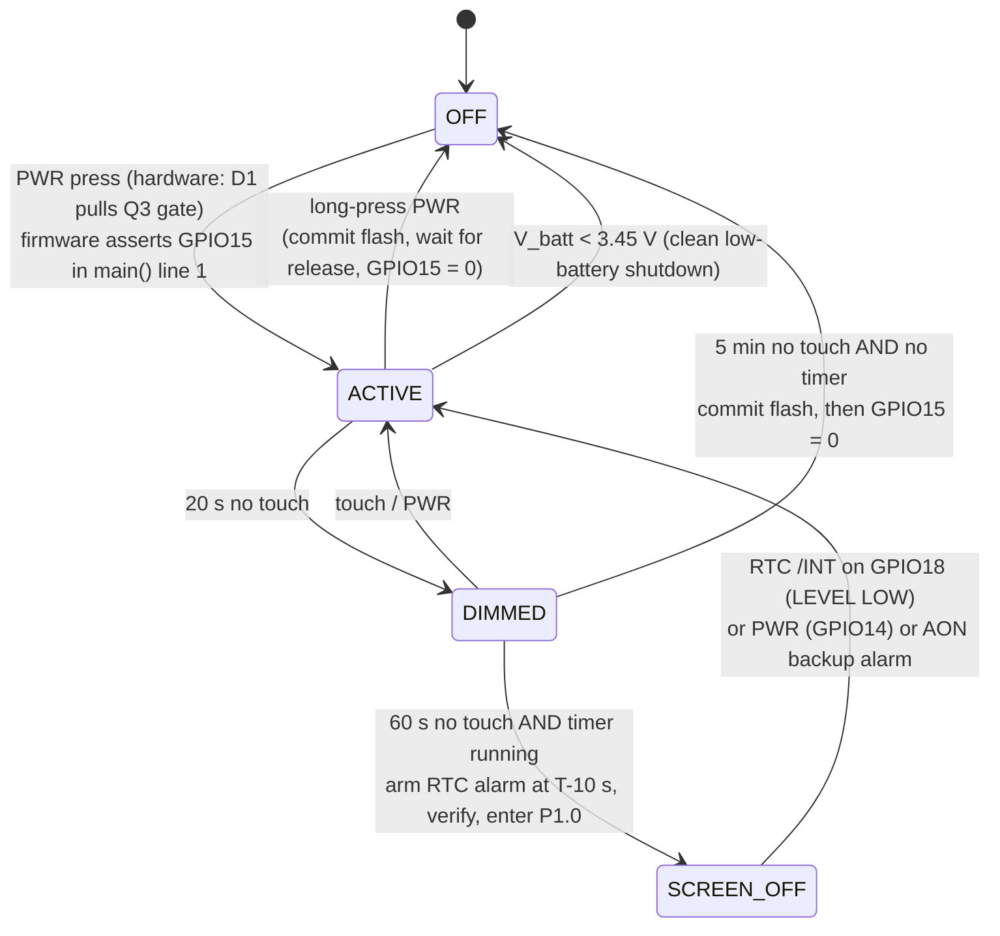

# Power and timekeeping

**Target:** a battery-powered handheld countdown/stopwatch timer on the **Waveshare
RP2350-Touch-LCD-1.69**.

**Defining constraint:** the PCF85063A RTC has a dedicated SH1.0 backup header (BAT1), but
**no cell is fitted**. Wall-clock time dies with the 3V3 rail. Every decision in this
document is designed around that, not around a cell that is not there.

Siblings: [hardware.md](hardware.md) for the pin map, bring-up order and board traps;
[interaction.md](interaction.md) for the gesture and touch model.

---

## 0. Source conventions

Every figure below is tagged with where it comes from.

| Tag | Meaning |
|---|---|
| `[SCH]` | The board schematic, `RP2350-Touch-LCD-1.69.pdf`, md5 `905f980ed9df9692c25f705c49573984`, [published by Waveshare](https://files.waveshare.com/wiki/RP2350-Touch-LCD-1.69/RP2350-Touch-LCD-1.69.pdf). All `[SCH]` figures are taken from the drawing itself — symbols, net labels, reference designators and BOM annotations — not from vendor prose about the board. |
| `[RP]` | [RP2350 datasheet](https://datasheets.raspberrypi.com/rp2350/rp2350-datasheet.pdf), section or table cited inline. |
| `[PCF]` | [PCF85063A datasheet rev 7](https://files.waveshare.com/wiki/common/PCF85063A.pdf), 30 March 2018. |
| `[W25]` | [W25Q128JV datasheet](https://cdn.sparkfun.com/assets/5/b/2/a/6/W25Q128JV_Datasheet.pdf). |
| `[RT]` | [RT9193 datasheet](https://www1.futureelectronics.com/doc/RICHTEK/RT9193-33PB.pdf). |
| `[ETA]` | [ETA6096 datasheet v1.4](http://www.eta-semi.com/wp-content/uploads/2022/03/ETA6096_V1.4.pdf). |
| `[QMI]` | [QMI8658C datasheet rev 0.6](https://files.waveshare.com/upload/5/5f/QMI8658C.pdf). |
| `[ST]` | ST7789V2 controller datasheet, section cited inline. |
| `[WS]` | [Waveshare board wiki](https://www.waveshare.com/wiki/RP2350-Touch-LCD-1.69) and the [1.69inch Touch LCD Module wiki](https://www.waveshare.com/wiki/1.69inch_Touch_LCD_Module). |
| `[SDK]` | [pico-sdk](https://github.com/raspberrypi/pico-sdk) 2.x source, file cited inline. |
| *(est.)* | Arithmetic or an engineering estimate derived from the cited figures. Assumptions are stated at the point of use. |

---

## 1. The power path as drawn versus as described

> **Status: settled — reading B is correct.** Three facts about this board's power path are
> described one way in widely-repeated summaries and drawn a different way in the schematic.
> On 2026-07-29 the schematic PDF (md5 `905f980ed9df9692c25f705c49573984`) was rendered at
> 600 dpi and each block read directly. **Every reading-B claim is confirmed; reading A is
> wrong on all three points.** Both are kept below because reading A circulates widely, and
> knowing which claim is the wrong one beats silently deleting it.
>
> The decisive evidence: U1 pin 3 (EN) visibly ties back to the VIN/VSYS node; the sheet's
> own net-alias table reads `SYS_OUT = GPIO14, SYS_EN = GPIO15`, with SYS_EN running through
> R3 1 kΩ into T1's base and T1's collector on Q3's gate; the R11/R12 divider runs B+ to GND
> with no series device; and D4 is drawn anode-on-VBUS, cathode-on-VSYS.
>
> A bench result corroborates it independently. The C10/C12 100 nF on the divider tap, against
> the divider's 67 kΩ, predicts an RC of ~6.7 ms — so ~45 ms should be ~99.9% settled. The
> measured curve reads 3.997 V of a settled 4.001 V at ~45 ms (§7). The topology predicts the
> number the hardware produces.
>
> **The two current figures below (~12.3 µA divider, ~32 µA total "off") remain calculated,
> not metered.** They follow from the now-confirmed topology, but no one has yet put a meter
> across `B+`.

### 1.1 The three points

| # | Reading A — the widely-repeated description. **Incorrect.** | Reading B — as the schematic draws it `[SCH]`. **Confirmed.** | Why it matters |
|---|---|---|---|
| **D1** | "RT9193-33PB 3.3 V LDO (U1) with **EN on net SYS_EN**", i.e. GPIO15 gates the regulator directly. | **U1 pin 3 (EN) is wired directly to VSYS/VIN.** The LDO self-enables the instant VSYS appears; `SYS_EN` (GPIO15) never touches it. The latch is not the LDO — it is Q3, the battery pass FET. | Under reading A the board could never cold-boot on battery, because GPIO15 is an output of a chip that the LDO itself powers. That internal inconsistency is an argument for reading B, not a proof of it. |
| **D2** | "Battery voltage sense … **gated by Q3 (AO3401 P-FET)** so the divider does not drain the cell continuously." | **Q3 is the battery pass FET**, in the KEY block: source = `B+`, drain = `VBAT`, gate held by R9 10 kΩ to `B+`. The **R11 200 kΩ / R12 100 kΩ divider is hard-wired straight across `B+` to GND**, with C10 and C12 (100 nF each) on the tap. Nothing gates it. | Under reading B the divider drains **~12.3 µA continuously**, even with the board "off", and "off" is ~32 µA rather than ~20 µA. Under reading A the divider contributes nothing when off. This changes the shelf-life figure in §9, nothing else. |
| **D3** | Not mentioned at all. | **VBUS → D4 (MBR230LSFT1G, 2 A / 30 V Schottky) → VSYS.** | Under reading B the board **physically cannot power itself off while USB is plugged in**, so every "off" test performed on a USB-connected bench is misleading. Under reading A (no such diode) the off path would be testable at the desk. |

### 1.2 The firmware consequence is the same either way

All three readings converge on one rule: **assert GPIO15 as the literal first statement of
`main()`** (§6.2).

- Under **D1 reading A**, GPIO15 is the LDO enable. If firmware does not assert it before
  the user lets go of the button, the regulator shuts down and the rail collapses.
- Under **D1 reading B**, GPIO15 drives T1, which holds Q3's gate. If firmware does not
  assert it before the user lets go, Q3 opens and the rail collapses.

Same instruction, same deadline, same failure mode, different transistor. There is no
version of this board where a slow `main()` prologue is safe on battery.

Similarly, **D2** changes only a current figure, not any code: under either reading the
divider is not switchable from firmware, GPIO29 is still ADC channel 3, and the one-point
gain calibration in §7.2 is still mandatory. **D3** changes only where the off path can be
tested: under either reading, the correct discipline is to test power-down on battery,
unplugged, every build (§6.4).

### 1.3 Bench measurements that would settle it

Each of these is a few minutes with a DMM and resolves one point outright.

| For | Measurement | Reading A predicts | Reading B predicts |
|---|---|---|---|
| **D1** | Continuity, board unpowered: U1 pin 3 (EN) to the VSYS net. | open / high resistance | near 0 Ω |
| **D1** | Continuity, board unpowered: U1 pin 3 (EN) to the GPIO15 pad. | near 0 Ω (possibly through a series resistor) | open |
| **D1** | On battery, board running, drive GPIO15 low in firmware and probe U1 pin 3. | pin 3 follows GPIO15 to 0 V | pin 3 stays at VSYS until the rail itself collapses |
| **D2** | On battery, board "off", measure DC current into J1 pin 1. | ≈20 µA (charger quiescent only) | ≈32 µA (charger + divider) |
| **D2** | On battery, board "off", measure the BAT_ADC tap (GPIO29 pad) to GND. | ≈0 V | ≈B+/3, i.e. ≈1.23 V at a 3.7 V cell |
| **D3** | Battery disconnected, USB plugged in, no button press. | board does not power up | board powers up and enumerates |
| **D3** | USB connected, battery connected, firmware drives GPIO15 low. | 3V3 collapses | 3V3 stays up; only the battery path opens |
| **D3** | Continuity/diode-test from the USB-C VBUS pad to VSYS. | open both ways | one diode drop in the VBUS→VSYS direction |

Until at least the D1 and D3 rows are taken, treat §6 as *the schematic reading*, not as
established fact. The rest of this document is written against reading B and flags the
places where reading A would change a number.

### 1.4 Further schematic details absent from the circulated description

These are read from the drawing and are not disputed by any other account — they are simply
not mentioned anywhere else, so they are recorded here.

- **X1 is specified `12MHz (2520) 12pF ±10ppm`** — the crystal tolerance is printed in the
  schematic BOM annotation. Loading caps C27/C29 = 15 pF ±5 %.
- **PCF85063A CLKOUT (pin 9) is explicitly marked no-connect** (struck through), as is pin
  8 (n.c.). CLKOE (pin 3) terminates in a bare stub — apparently **floating**.
- **RTC backup topology:** `3V3 → D3 (B5819WS Schottky) → VDD_RTC`, with BAT1 pin 1 on the
  same node and C15 1 µF. No series resistor in the charge path. VDD_RTC ≈ 3.3 − 0.25 ≈
  **3.05 V** when the board is on.
- **ADC_AVDD (U5 pin 44) is tied straight to the 3V3 rail** — no separate filter, no
  external reference. VREG_AVDD (pin 46) *does* get an R16 33 Ω + C30 4.7 µF filter; the
  ADC does not.
- **ETA6096 STAT (pin 9) is an unterminated stub.** There is **no charge-status signal
  available to firmware**, and no VBUS-sense GPIO either.
- **R7 = 160 kΩ on ISET.** The `[ETA]` table gives 82 kΩ → 2 A and 150 kΩ → 1.2 A, i.e.
  I ≈ 164/R(kΩ) A → **1.03 A at 160 kΩ**. This puts the commonly quoted "1 A" charge
  current on the datasheet's own ISET relation rather than on a silkscreen annotation.
- **Backlight ballast is R1 = 10 Ω** from LEDK to Q1's drain. Q1's gate has both R2 100 kΩ
  to 3V3 *and* R6 10 kΩ to GND, so an undriven GPIO25 puts 0.30 V on the gate — below the
  DMG1012T-7's threshold, backlight off. **Screen-dark is the power-on default.** That is
  the desirable default and should not be changed.

---

## 2. Timekeeping without a backup cell

### 2.1 What still works

| Clock | Runs when | Source of truth | Accuracy |
|---|---|---|---|
| **PCF85063A** (I²C 0x51, /INT → GPIO18) | Whenever VDD_RTC is present, i.e. whenever the 3V3 rail is up. Its 220 nA `[PCF]` draw is irrelevant. Keeps counting through RP2350 `DORMANT` and through POWMAN P1.x states, because those only power down the MCU, not the rail. | Y1, 32.768 kHz quartz | crystal-class, tens of ppm |
| **RP2350 Timer0 / `time_us_64()`** | Whenever the switched core is powered. Ticked from `clk_ref`, which runs from XOSC after boot. | X1, 12 MHz, **±10 ppm** `[SCH]` | crystal-class, ±10 ppm + tempco |
| **POWMAN AON timer** (64-bit ms counter) | *All* power states including P1.x/DORMANT — the only timer that does. `[RP §12.10.1]` | **XOSC while the core is powered; LPOSC the moment it is not.** The power-down sequencer forces the switchover: *"When the chip core is powered down the XOSC will stop. If TIMER.USING_XOSC is set, the power-down sequencer automatically reverts to TIMER.USING_LPOSC before the XOSC stops."* `[RP §12.10.5.3]` | **Whatever the LPOSC is doing.** See below. |
| **LPOSC** (on-chip RC, nominal 32.768 kHz) | Always, once the AON domain has power. | RC oscillator | **±20 % untrimmed, ±1.5 % trimmed; ±14 % over temperature; ±20 % over supply.** `[RP §8.4.1, Table 616]` |

That LPOSC line is the single most important number in this document. Over a 25-minute
countdown:

| LPOSC condition | Error over 25 min |
|---|---|
| Untrimmed (±20 %) | **±5 minutes** |
| Trimmed to ±1.5 % | ±22.5 s |
| Plus temperature drift (±14 %) | ±3.5 min |

An "always-on" timer that can be five minutes wrong is not a timer.

### 2.2 What does not work

**Wall-clock time across a power cycle. Full stop.**

When Q3 opens, VDD_RTC collapses. On the next power-up:

- The PCF85063A comes back at its reset values: `00:00:00`, and the date registers at their
  defaults.
- **`Seconds` bit 7 (`OS`, oscillator stop) reads 1** — *"clock integrity is not
  guaranteed; oscillator has stopped or has been interrupted"* `[PCF §8.3.1.1]`.
- **`RAM_byte` (0x03) reads 0x00** `[PCF §8.2.4]` — its documented reset value.
- The crystal takes **200 ms to 2 s** to reach stable resonance `[PCF §8.3.1.1]`, and `OS`
  cannot be cleared until it does. *If the flag cannot be cleared, then the oscillator is
  not running.*

The RP2350's own clocks obviously do not survive either — the chip loses power entirely.

This gives two independent, free, hardware-backed "was power lost?" detectors: the `OS`
flag, and a magic cookie written into `RAM_byte`. Use both (see §5.4).

> **Boot ordering note.** [hardware.md](hardware.md) mandates a 3–5 s idle at the top of
> `main()`. That happens to be exactly the window the RTC crystal needs. Do not read or
> write the PCF85063A before that delay expires. Do, however, assert GPIO15 *before* it
> (§6.2).

### 2.3 Is the RTC worth using at all?

**Yes. Use the PCF85063A, and use it as the countdown/alarm authority whenever the MCU is
going to be powered down. Do not use it as a clock.**

| | PCF85063A | RP2350 Timer0 (`time_us_64`) | POWMAN AON timer |
|---|---|---|---|
| Timebase | Y1 32.768 kHz quartz | X1 12 MHz quartz, ±10 ppm `[SCH]` | XOSC awake, **LPOSC asleep** |
| Resolution | 1 s (clock), 244 µs (countdown timer) `[PCF Table 36]` | 1 µs | 1 ms `[RP §12.10.1]` |
| Survives MCU power-down | **Yes** | No | Yes |
| Can wake the MCU from P1.x | **Yes** — /INT → GPIO18, any GPIO 0-47 is a valid `PWRUP` source (`SOURCE` is a 6-bit field) `[RP Table 513]` | n/a | Yes (alarm wakeup) |
| Accuracy over 25 min | ~45 ms *(est.)* | 15 ms | **±22 s at best** |
| Costs a bus transaction | Yes, shares i2c1 with touch (0x15) and IMU (0x6A) | No | No |

The reasoning:

1. **While awake, `time_us_64()` wins outright.** Microsecond resolution, ±10 ppm, zero bus
   traffic, no I²C serialisation against the touch controller. Run the UI countdown off it.
2. **While asleep, the AON timer is the *only* MCU-side option and it is unfit for
   purpose**, because the hardware forcibly moves it to the LPOSC. There is no way around
   this on this board — the external-clock inputs that could replace LPOSC are **GPIO12,
   GPIO20, GPIO14 or GPIO22** `[RP §12.10.7]`, and on this board GPIO12 is unrouted, GPIO14
   is the PWR button, GPIO22 is TP_RST. Only GPIO20 (test point TP8) is free, and the one
   thing that could feed it — the PCF85063A's CLKOUT — is **explicitly no-connect** `[SCH]`.
3. **The PCF85063A therefore has a job nothing else can do:** be a crystal-accurate alarm
   that fires while the RP2350 is in a ~166 µA power state, and pull GPIO18 low to wake it.
4. Its /INT is **level-held, not pulsed** (with `TI_TP = 0`): *"If bit AIE is enabled, the
   INT pin follows the condition of bit AF. AF remains set until cleared by command"*
   `[PCF §8.5.6]`. Combined with a **LEVEL-LOW** POWMAN wakeup (`PWRUPn.MODE = LEVEL`,
   `DIRECTION = LOW_FALLING`), an alarm that fires *during* the sleep-entry sequence cannot
   be lost — the pin is already low when the wakeup arms, and the chip wakes immediately.
   This is the property that makes the design race-free. **Never use edge-triggered wakeup
   here.**

So: **`time_us_64()` for display and short intervals; PCF85063A for the sleep-through
alarm; AON timer only as a redundant belt-and-braces backup wake.** Never as the authority.

### 2.4 A countdown/stopwatch that is fully correct with no wall clock

The insight: a countdown timer needs a **monotonic elapsed-time source**, not an absolute
one. Three are available. They must never be mixed mid-session.

**The model.** A timer session is `(anchor, duration)` where `anchor` is a reading from
*one nominated clock* and `duration` is a scalar. `remaining = duration − (now − anchor)`,
`now` read from the *same* clock. Everything else is presentation.

**The classic bug this prevents:** start on `time_us_64()`, sleep, finish on the AON timer,
and LPOSC's 1 % error is silently spliced into the join. A 25-minute timer arrives 22 s
late and nobody can explain why.

**Recommended concrete scheme — "sleep on the crystal, finish on the crystal":**

1. **Zero the RTC at timer start.** Write `Seconds/Minutes/Hours = 00:00:00`. This is not
   setting a clock, it is resetting an up-counter. It also clears `OS`.
2. **Anchor on a second boundary.** Poll the seconds register until it ticks; record
   `t0 = time_us_64()` at that instant. Now the RTC's integer seconds and the microsecond
   timer share a known origin, and the RTC's 1 s quantisation is eliminated — an alarm at
   RTC `00:24:50` fires exactly 1490 s after `t0`.
3. **Arm the alarm 10 s early.** Clear `Control_2.AF` (write 0 to bit 6), set
   `Second_alarm / Minute_alarm / Hour_alarm` for `duration − 10 s` with each `AEN_x = 0`
   (0 enables `[PCF Table 29]`), set `Control_2.AIE = 1`, leave Day/Weekday alarms disabled.
4. **Verify before sleeping.** Re-read the RTC time and confirm it is still earlier than
   the alarm. If not, do not sleep. Also read `Control_2.AF` — if already set, do not sleep.
5. Arm the AON timer alarm at `duration − 30 s` as a **redundant** wake, and `PWRUP0` on
   GPIO18 as LEVEL-LOW. Both are already-running counters; the redundancy is free.
6. Enter the low-power state (§8).
7. On wake: clear pad isolation, restore clocks, read the RTC. Whichever source woke the
   chip, the RTC is the authority for how much is left.
8. **Finish the last 10 s awake on `time_us_64()`**, re-anchored by the alarm edge.

Total error budget for a 25-minute countdown *(est., using the specified crystal
tolerances)*: RTC crystal over 1490 s (±30 ppm → ±45 ms) + wake latency (XOSC restart +
PLL relock + code, budget 10–30 ms, measurable once and subtractable) + `time_us_64()` over
the last 10 s (±0.1 ms). **Under 100 ms.** For a kitchen timer that is indistinguishable
from perfect.

Also available and not used above: the PCF85063A's dedicated **8-bit countdown timer**
(`Timer_value` 0x10, `Timer_mode` 0x11) with source clocks of 4.096 kHz / 64 Hz / 1 Hz /
1⁄60 Hz, spanning **244 µs to 4 h 15 min** `[PCF Table 36]`. It is simpler than the alarm
for short intervals but has 1 s granularity at ≤255 s and 60 s granularity beyond. The
alarm approach is strictly better and covers a full day; use the alarm.

### 2.5 Features to scope out or gate

**Fully correct with no wall clock — build these freely:**

- Countdown of any duration, with pause/resume
- Stopwatch, laps, split times
- Interval / Pomodoro / HIIT sequences (a list of relative durations)
- Presets and "last used duration"
- "Time remaining", "time elapsed", progress rings
- A within-session history ("this session: 3 timers, 47 min total")

**Require wall clock — cut, or gate behind "time was set this power session":**

| Feature | Why it breaks | Verdict |
|---|---|---|
| Alarm at a time of day ("beep at 07:00") | Needs absolute time that dies with the rail; would also need the device to be *on* at 07:00 | **Cut.** A handheld timer that must stay powered overnight to be an alarm clock is a bad alarm clock. |
| A clock face | Would show `00:14:22` since boot, presented as the time. Actively misleading. | **Cut**, or gate (§3). |
| "How long since yesterday", date-stamped logs | No calendar survives | **Cut.** Session-relative history only. |
| Recurring / scheduled timers | Needs absolute time | **Cut.** |
| Cumulative usage stats across days | Needs a date | **Cut**, or count power-on sessions instead ("47 timers since new"), which is monotonic and needs no clock. |

**Gate rule:** expose wall-clock features **only** when `Seconds.OS == 0` **and** the
session cookie in `RAM_byte` matches. On a fresh power-up both fail, the features vanish,
and no stale time is ever displayed. This is a two-register check, executed once at boot.

---

## 3. Setting the time (if a clock face is wanted at all)

### 3.1 The three options

| Option | Cost | UX on the *next* power-up |
|---|---|---|
| **(a) USB CDC on connect.** Host opens the CDC port, sends `T<unix_seconds>\n`. Firmware sets the RTC, clears `OS`, writes the cookie. ~30 lines of firmware, plus a 5-line host script. | Nearly free. | Time is lost. If the host reconnects, it is silently reset. If not, wall-clock features stay hidden. |
| **(b) Touch UI.** A set-time screen with hour/minute steppers. | Real work: a 240×280 panel with a **44 px rounded-corner radius** to design around (see [interaction.md](interaction.md)), plus a keypad or stepper widget, plus persistence of the 12/24 h preference. | **The user must redo it after every single power-down.** This is the killer. |
| **(c) Don't.** Never display a wall clock. | Zero. | Nothing to lose. |

### 3.2 Recommendation: (c), with (a) as an opportunistic extra

**Do not build a touch time-setting UI on this board.** With no backup cell, a manual
time-set is a chore the user must repeat every time they turn the device on. That converts
a nice feature into a recurring irritation and, worse, trains users to ignore it — at which
point the clock face is showing time-since-boot dressed up as the time, which is the
failure mode most worth avoiding.

Do implement (a), because it costs almost nothing and it is genuinely useful on the bench:

- The device is a plain USB CDC device already (`pico_stdio_usb`). Add a one-character
  command.
- **Do not use 1200 baud for the protocol** — `pico_stdio_usb` reboots into BOOTSEL when the
  host opens the port at 1200 baud `[SDK]`, which is the flashing path documented in
  [hardware.md](hardware.md).
- On a successful set: write the time, clear `OS` (write the seconds register), write a
  nonzero cookie to `RAM_byte`, and set an in-RAM `wall_clock_valid` flag.
- Only then unlock the optional clock face and any time-of-day features, **for this power
  session only.**

**What happens on the next power-up, precisely:**

1. Cold boot → 3–5 s idle → RTC crystal has restarted.
2. Read `Seconds`. Bit 7 (`OS`) = 1. Read `RAM_byte`. It is `0x00`.
3. Firmware concludes: power was lost, wall clock invalid.
4. Clear `OS` by writing the seconds register, zero the whole time block, write the
   "elapsed-counter mode" cookie to `RAM_byte`.
5. The clock face and time-of-day features are not offered. No stale time is ever shown.
6. The countdown/stopwatch features are 100 % available, because they never needed a clock.

> **If a cell is later fitted to BAT1:** `[SCH]` shows `3V3 → D3 (B5819WS) → VDD_RTC` with
> **no series current-limiting resistor** and BAT1 directly on that node, so the cell floats
> at ≈3.05 V. That suits a 3.1 V-charge **ML-series** rechargeable (ML614/ML1220) well; it
> under-charges a LIR2032 to roughly half capacity (harmless); and it is a **charging path
> into a primary cell — never fit a CR2032**. This matches the product page's "only supports
> rechargeable RTC batteries" `[WS]`. Even with a cell, note that an RTC alarm still cannot
> *turn the board on*: /INT goes to GPIO18, not to Q3's gate.

---

## 4. Long-interval accuracy — quantified

### 4.1 The numbers

| Oscillator | Spec | Source |
|---|---|---|
| **X1, RP2350 12 MHz** | **±10 ppm** (schematic BOM note: `贴片无源晶振 12MHz (2520) 12pF ±10ppm`). Load caps C27/C29 = 15 pF ±5 %. | `[SCH]` |
| *For comparison* — the crystal Raspberry Pi actually recommends (Abracon ABM8-272-T3) | ±30 ppm tolerance @25 °C, ±30 ppm stability, ±5 ppm/yr ageing | `[RP Table 597]` |
| RP2350 tolerance budget | "Appropriate margin is built into the design to tolerate up to **1000 ppm** variation in the XOSC frequency" | `[RP §8.1.2.3]` |
| **Y1, PCF85063A 32.768 kHz** | **Not specified on the schematic.** Typical watch tuning fork: ±20 ppm @25 °C, parabolic tempco k ≈ −0.034 ppm/°C² about a 25 °C turnover | *(est.)*, industry-standard part behaviour |
| PCF85063A supply sensitivity | 0.075 ppm per 200 mV of VDD | `[PCF Table 41]` |
| PCF85063A trim | Offset register 0x02: **4.34 ppm/LSB** (MODE=0) or 4.069 ppm/LSB (MODE=1), two's complement | `[PCF §8.2.3]` |
| **RP2350 LPOSC** | ±20 % initial, **±1.5 % trimmed**, **±14 % over temperature, ±20 % over supply** | `[RP §8.4.1, Table 616]` |

### 4.2 Drift, tabulated

| Timebase | 25 min | 1 hour | 1 day | 1 week |
|---|---|---|---|---|
| X1 @ ±10 ppm (spec) | **15 ms** | 36 ms | 0.86 s | 6.0 s |
| X1 @ ±40 ppm (realistic with tempco) | 60 ms | 144 ms | 3.5 s | 24 s |
| Y1 @ ±20 ppm | 30 ms | 72 ms | 1.7 s | 12 s |
| Y1 @ ±50 ppm (with the loading error below) | 75 ms | 180 ms | 4.3 s | 30 s |
| LPOSC trimmed to ±1.5 % | **22.5 s** | 54 s | **21.6 min** | 2.5 h |
| LPOSC ±14 % (temperature) | **3.5 min** | 8.4 min | 3.4 h | 23.5 h |

### 4.3 Does the crystal difference matter for a kitchen/work timer?

**No. Not remotely.** Over a 25-minute Pomodoro the two crystals differ by tens of
milliseconds. Human reaction time to a buzzer is 200–500 ms. The difference between the
RP2350's 12 MHz crystal and the RTC's 32.768 kHz crystal is **two to three orders of
magnitude below the perceptual floor.**

Over a *day* both are in the same "a few seconds" bucket. A clock face on either crystal
would drift 1–5 s/day, which is normal for an unsynchronised consumer clock — and
irrelevant here, because the clock is wiped every power cycle anyway.

**The only oscillator on this board whose accuracy matters is the LPOSC**, and the only
reason it matters is that the POWMAN sequencer will silently switch the AON timer onto it
the moment the core powers down. Choose the timebase, not the crystal.

### 4.4 A board-specific quirk worth knowing: Y1 is over-loaded

The PCF85063A has **integrated oscillator load capacitors, selectable 7 pF or 12.5 pF** via
`Control_1.CAP_SEL` `[PCF Table 41, §8.2.1]` — they cannot be switched off. `[SCH]` shows
that C13 = C16 = 22 pF are **also** fitted externally on OSCI/OSCO.

- With `CAP_SEL = 0` (7 pF, the reset default): each side sees ≈14 pF internal + 22 pF
  external ≈ 36 pF, giving CL ≈ **18 pF**.
- If Y1 is a common 12.5 pF part, that is ~6 pF of over-load → the crystal runs **slow**.
- *(est., assuming C1 ≈ 2 fF, C0 ≈ 1.3 pF)*: Δf/f ≈ **−20 ppm ≈ 1.7 s/day slow**.
- With `CAP_SEL = 1` it gets worse (~−30 ppm).

**Actions:** leave `CAP_SEL = 0`. If a clock face ever ships, trim it out with the offset
register — 5 LSB ≈ 21.7 ppm; the method is described in
[NXP AN11247](https://www.nxp.com/docs/en/application-note/AN11247.pdf). For a countdown
timer, ignore it entirely (20 ppm over 25 min is 30 ms).

Note that Y1's specified load capacitance is **not on the schematic**, so the −20 ppm figure
rests on an assumed 12.5 pF part. Measure before trimming (§4.5, §10).

### 4.5 Calibration procedures that need no instruments

**Trim the RTC against the XOSC.** CLKOUT is no-connect `[SCH]`, so it cannot be scoped.
Instead, in firmware: anchor on an RTC second boundary, record `time_us_64()`; wait 3600 RTC
seconds; record again. The ratio gives the RTC's error against X1's ±10 ppm to well under
1 ppm of measurement noise. Store the resulting offset-register value in flash (§5).

**Calibrate the LPOSC at runtime — mandatory if the AON timer is used at all.**
`powman_timer_get_lposc_calib_freq()` reads a calibration value from OTP `[SDK]`; on a
Waveshare board that row is almost certainly unprogrammed and it returns 0, so the SDK falls
back to a nominal 32.768 kHz — i.e. the raw **±20 %** part. Do this instead:

```c
// Measure the LPOSC against the XOSC-derived reference, then tell the AON
// timer what it actually is. CLOCKS_FC0_SRC_VALUE_LPOSC_CLKSRC == 0x0e.
uint32_t lposc_khz = frequency_count_khz(CLOCKS_FC0_SRC_VALUE_LPOSC_CLKSRC);
powman_timer_set_1khz_tick_source_lposc_with_hz(lposc_khz * 1000);
```

This removes the static error. It does **not** remove the ±14 % temperature and ±20 %
supply drift `[RP Table 616]`, and the datasheet is explicit: *"fine-tuning is only useful
in systems with stable voltage and temperature."* In a handheld at 20–30 °C on a regulated
rail, budget **~±1 % residual** *(est.)* — 15 s over 25 minutes. Still not an alarm
authority.

---

## 5. Persistence across power loss

### 5.1 What must survive, and what cannot

| State | Survive a power-down? | Where |
|---|---|---|
| Presets (favourite durations) | **Yes** | Flash |
| Settings: backlight level, beep on/off, buzzer volume, 12/24 h | **Yes** | Flash |
| Per-unit calibration: ADC gain correction, RTC offset value, measured wake latency | **Yes** | Flash |
| Last-used duration | **Yes** | Flash |
| Lifetime counters ("timers completed") | Yes, but rate-limit the writes | Flash |
| Wall-clock time | **Impossible** | — |
| **A running timer, across a full power-down** | **Impossible** — see below | — |
| A running timer, across a *warm* fault (watchdog / crash) where 3V3 never dropped | **Yes, and it is worth doing** | Flash target + RTC `RAM_byte` cookie |

**Why a running timer cannot survive a full power-down:** resuming requires knowing how long
the power was off, which is exactly the quantity no clock on this board can measure once
VDD_RTC is gone. Any "resume" that guesses is wrong, and wrong in the direction that fires
the alarm late. Do not offer it. Offer instead: on boot after an unclean shutdown, show
*"Timer interrupted — 12:30 was set. Restart it?"* — honest, useful, and correct.

There is no EEPROM and no FRAM. The RP2350 has no internal flash `[RP]`. The 16 MB
W25Q128JVSIQ is all there is — plus the **one byte of RTC scratch RAM** at `RAM_byte` 0x03,
which is the key to §5.4.

### 5.2 The flash mechanics that constrain the design

| Parameter | Value | Source |
|---|---|---|
| Endurance | **min 100,000 P/E cycles per sector** | `[W25]` |
| Retention | >20 years | `[W25]` |
| Smallest erase unit | **4 kB sector** | `[W25]` |
| Program unit | 256-byte page | `[W25]` |
| Page program time | 0.7 ms typ / **3 ms max** | `[W25]` |
| 4 kB sector erase time | 45 ms typ / **400 ms max** | `[W25]` |
| Standby current (CS high) | 10 µA typ / 60 µA max | `[W25]` |
| Deep power-down (0xB9) | 1 µA typ / 20 µA max | `[W25]` |

**The XIP hazard is the real constraint, not wear.** The RP2350 executes from this flash.
During an erase or program the flash cannot serve reads, so:

- The erasing/programming code must not itself be in flash. pico-sdk's
  `flash_range_erase()` / `flash_range_program()` are `__no_inline_not_in_flash_func`
  `[SDK]`, so they are fine — but **any interrupt handler that lives in flash and fires
  during the operation will hard-fault.**
- Both cores must be parked. Use `flash_safe_execute()` from `pico_flash`, or handle the
  lockout manually.
- **A worst-case sector erase blocks everything for 400 ms.** For a timer that is a visible
  UI freeze, a dropped touch, and — with bad luck — a missed alarm deadline. This, not
  endurance, is the reason not to erase casually.

`pico2.h` defaults `PICO_FLASH_SIZE_BYTES` to 4 MB, not 16 MB `[SDK]` — override it or the
settings region lands in the wrong place.

### 5.3 Wear arithmetic

| Scheme | Erases per write | Writes before wear-out | At 100 setting-changes/day |
|---|---|---|---|
| Naive: erase + rewrite one sector on every change | 1 | 100,000 | 2.7 years |
| **Append a 256-byte page per record, 16 records/sector, 2 sectors alternating** | 1 per 32 writes | **3.2 million** | **87 years** |
| 32-byte records, 128/sector *(riskier — see note)* | 1 per 256 writes | 25.6 million | 700 years |

*Note on sub-page records:* the W25Q allows programming at any byte offset, but repeatedly
partial-programming within the same already-programmed page is a grey area across NOR
vendors (no NOP limit is stated in `[W25]`). **Align each record to a 256-byte page
boundary.** 3.2 M writes is already absurdly ample, and alignment buys back certainty.

The real conclusion: **flash wear is a non-issue as long as there is never an erase per
write.** The naive scheme's problem is the 400 ms stall, not the endurance.

### 5.4 Concrete approach

**Layout.** Reserve the top 8 kB of the 16 MB device — sectors at `0xFFE000` and `0xFFF000`.
Nothing else in the design comes near it, and placing it at the top keeps the firmware image
contiguous from zero.

**Record format**, one per 256-byte page:

```
offset  size  field
  0      4    magic        'H','G','0','1'
  4      4    seq          uint32, monotonically increasing, never reused
  8      2    len          payload bytes actually used
 10      2    crc16        CCITT over bytes 12..12+len-1
 12    244    payload      the whole settings blob (presets, calibration, counters)
```

**Read (boot).** Scan all 32 pages of both sectors. Keep the record with the highest `seq`
that has a valid magic and CRC. Cost: 8 kB of XIP reads, sub-millisecond. If no valid record
exists, use compiled-in defaults and write record `seq = 1`.

**Write (commit).** Append to the next erased page in the *current* sector with
`seq = last + 1`. That is one 256-byte page program: **0.7 ms typ, 3 ms max.** Invisible.

**Roll.** When the current sector is full, write the first record of the *other* sector,
then — and only then — erase the sector just left. That ordering means there is never an
instant where no valid record exists, so a power cut mid-roll is harmless. Do the erase
asynchronously at a chosen moment (screen off, no timer running, not mid-animation), never
in response to a user action.

**Write policy — this is where the discipline lives:**

- **Never write on a slider drag.** Mark the blob dirty; commit after **2 s of no further
  change**, or on screen-off, or on shutdown. A user dragging a brightness slider generates
  one write, not two hundred.
- Batch everything into the single 244-byte blob. There is no reason to have more than one
  record type.
- Rate-limit lifetime counters to at most one commit per minute.
- On the shutdown path, commit **before** dropping GPIO15 (§6.3). The 3V3 bulk capacitance
  is ~10 µF; at 60 mA that holds the rail for roughly **50 µs** *(est.)* — nowhere near a
  3 ms page program. There is no "save on power-fail" window. Everything must already be on
  disk.

**Warm-fault resume — the `RAM_byte` trick.** This is the one place the RTC earns its keep
for persistence:

1. When a timer starts, write a nonzero session cookie (say `0xA5`) to `RAM_byte` (0x03),
   and commit the timer's *RTC-relative* target (`hh:mm:ss` on the zeroed RTC) into the
   flash blob.
2. If firmware crashes and the watchdog reboots it **without dropping the rail**, then at
   boot: `Seconds.OS == 0` **and** `RAM_byte == 0xA5`. Both conditions hold ⇒ the RTC never
   lost power ⇒ its count is continuous with the pre-crash session ⇒ **the running timer can
   be restored exactly**, including a re-armed alarm.
3. If the rail *did* drop, `OS == 1` and `RAM_byte == 0x00` — the two flags fail together,
   and the resume is correctly refused.
4. Clear the cookie on a clean shutdown, so a clean power-off never looks like a crash.

One byte of RTC RAM plus one flag bit gives a power-loss detector that cannot be spoofed,
and it costs nothing.

---

## 6. The power path

This section is written against **reading B** of §1 — the topology as the schematic appears
to draw it. Where reading A would change the analysis, it is flagged inline. None of it has
been confirmed on hardware.

### 6.1 Topology as drawn

```
                    ┌──────────────────────────────────────────────┐
   USB-C VBUS ──────┤ D4  MBR230LSFT1G  (2A/30V Schottky)          ├──┐
        │           └──────────────────────────────────────────────┘  │
        │                                                             │
        └──► ETA6096 (U2)  VIN … SW ─ L1 2.2µH ─ BATS ──► B+          │
             ISET ─ R7 160k ─ GND  →  ≈1.03 A charge                  │
             STAT (pin 9) = NOT CONNECTED                             │
                                                                      ▼
   J1 PH1.25 pin1 ── B+ ──┬── R11 200k ──┬── R12 100k ── GND      ┌─ VSYS ─┐
                          │   (always connected!)  │              │        │
                          │                    BAT_ADC ─► GPIO29  │        │
                          │                                       │        │
                          │  ┌─────────────────────────────┐      │        │
                          └──┤ Q3  AO3401  P-FET           ├─ VBAT ┘        │
                             │  S=B+  D=VBAT  G=node N     │  │             │
                             └─────────────┬───────────────┘  │             │
                                     R9 10k│ (gate → B+, default OFF)       │
                                           │                  │             │
   GPIO15 ─ R3 1k ─┬─ base T1 (SS8050) ────┤ collector        │             │
       (SYS_EN)    └─ R4 10k ─ GND         │                  │             │
                                           │              ┌───▼──────────┐  │
   Key1 (PWR) ─┬─ D1 RB521S-30 ────────────┘              │ Q2 AO3401    │  │
               │                                          │ G ← R10 100k │  │
               └─ D2 RB521S-30 ─ node M ─ R8 10k ─ 3V3    │   ← VBUS     │  │
                                    │                     └───┬──────────┘  │
                                 GPIO14 (SYS_OUT, reads LOW when pressed)   │
                                                                 VSYS ◄─────┘
                                            │
                                  ┌─────────▼──────────┐
                                  │ U1 RT9193-33PB     │
                                  │ EN ── tied to VIN  │   ← disputed, see §1 (D1)
                                  └─────────┬──────────┘
                                           3V3  →  RP2350, LCD, touch, IMU, RTC, flash
```

Component figures: RT9193 — 300 mA, **Iq 90 µA typ / 130 µA max** at zero load, output
accuracy **±2 %**, dropout 220 mV @300 mA, shutdown <0.01 µA `[RT]`. ETA6096 — CV 4.21 V
typ, **quiescent at BAT 20 µA** @3.6 V, termination 130 mA, recharge threshold −160 mV,
pre-condition below 2.9 V at 200 mA `[ETA]`.

### 6.2 Boot sequence

**On battery, from fully off:**

| Step | What happens | Timing |
|---|---|---|
| 0 | Q3's gate is held at `B+` by R9 → Vgs = 0 → Q3 **off**. VBAT = 0, VSYS = 0, 3V3 = 0. | steady state |
| 1 | User presses Key1. Node K → GND. Current flows `B+ → R9 → gate → D1 → K → GND`. Gate lands at ≈0.25 V, Vgs ≈ −3.45 V → **Q3 on**. | instant |
| 2 | `B+ → VBAT`. Q2's gate sits low (R10 to a dead VBUS) → **Q2 on** → `VSYS = VBAT`. | µs |
| 3 | VSYS reaches U1's VIN **and EN simultaneously** → LDO enables → 3V3 up. *(Under reading A this step instead requires GPIO15, which is not yet driveable — see §1.)* | <50 µs `[RT]` |
| 4 | RP2350 POR releases, boot ROM runs, XIP comes up, `runtime_init` runs, `main()` is entered. | ~10–20 ms *(est.)* |
| 5 | **`main()` line 1: assert GPIO15.** | must be < the button hold time |
| 6 | T1 conducts, node N is pinned at Vce(sat) ≈ 0.1 V regardless of the button. **The latch is closed.** | — |
| 7 | *Now* do the [hardware.md](hardware.md) 3–5 s idle, `stdio_init_all()`, and hardware bring-up. | — |
| 8 | User releases Key1. R8 pulls GPIO14 to 3V3. Firmware sees the release edge — that is the "boot complete, button available" signal. | — |

**The mandatory first three lines of `main()`:**

```c
int main(void) {
    // MUST be first. Nothing before this — not stdio_init_all(), not the
    // documented startup idle, not a printf. On battery the board is alive
    // only because a finger is on the button, and fingers leave.
    gpio_init(15);                 // SYS_EN / BAT_PWR
    gpio_set_dir(15, GPIO_OUT);
    gpio_put(15, 1);               // latch closed

    sleep_ms(4000);                // now the documented startup idle is safe
    stdio_init_all();
    ...
}
```

There is real margin here (10–20 ms of boot versus a 100–300 ms human press *(est.)*), but
the margin evaporates the moment someone adds a slow init before the latch, and the failure
is silent on USB.

**On USB:** VBUS → D4 → VSYS → LDO. The board boots with no button press at all, and GPIO15
is irrelevant. This is why the bug in §6.4 is invisible on the bench.

### 6.3 Shutdown sequence

```c
void power_off(void) {
    timer_cancel_and_disarm();      // clear PCF85063A AIE/AF; disarm AON alarm
    buzzer_off();
    settings_commit_blocking();     // <-- flash MUST be finished; see below
    rtc_clear_session_cookie();     // RAM_byte = 0x00, so this reads as clean
    lcd_sleep_in();                 // ST7789 SLPIN (0x10)
    backlight_set(0);               // GPIO25 low
    touch_sleep(); imu_power_down();

    ui_show("Release to power off");
    while (!gpio_get(14)) tight_loop_contents();   // wait for button release
    sleep_ms(50);                                   // debounce

    gpio_put(15, 0);                // T1 off → R9 pulls Q3 gate to B+ → Q3 off
    while (true) tight_loop_contents();             // never reached on battery
}
```

Two subtleties:

1. **Wait for the button release before dropping GPIO15.** While Key1 is held, D1 pulls the
   gate low independently of the latch — so dropping GPIO15 while the finger is down does
   nothing, and the board dies later, at release, apparently at random. Either wait (shown
   above) or drop GPIO15 immediately and accept "dies on release" as the documented
   behaviour. Waiting gives a place to show confirmation.
2. **There is no power-fail window.** ~10 µF of bulk on 3V3 at 60 mA holds the rail ≈50 µs
   *(est.)* — three orders of magnitude short of a 3 ms flash page program. All persistence
   must be complete *before* the line `gpio_put(15, 0)`.

**On USB, `gpio_put(15, 0)` does nothing** — VSYS still comes through D4 (reading B; under
reading A the off path would work on USB too, which is exactly why D3 in §1 needs settling).
Implement "off" while charging as a deep-sleep-with-dark-screen state instead, and label the
UI accordingly ("Sleeping — unplug to power off").

### 6.4 What happens if firmware forgets GPIO15

| Environment | Symptom |
|---|---|
| **USB connected** | **Everything works perfectly.** VSYS comes from D4 regardless. |
| **On battery** | The board runs only while a finger is on the button. Release → instant, unclean power loss, possibly mid-flash-write. To an observer: "it resets when I let go", or "it won't turn on." |
| **Recovery** | Because the board dies before USB enumerates on a fresh press, the 1200-baud CDC BOOTSEL touch documented in [hardware.md](hardware.md) is unavailable. Recovery needs a physical BOOT+RESET, which is precisely the human-in-the-loop cost the documented flashing workflow exists to avoid. |

This is a bug that is 100 % reproducible in the field and 0 % reproducible at the desk.
**Test on battery, unplugged, every single build.**

### 6.5 The one that will actually bite: any reset releases the latch

This is the most consequential finding in this section, and it is **derived from SDK source
plus the schematic — it is not yet tested on hardware.**

pico-sdk's `runtime_init_early_resets()` executes `reset_block_mask(~(...))` with an
exclusion list of `IO_QSPI, PADS_QSPI, PLL_USB, USBCTRL, SYSCFG, PLL_SYS`
`[SDK, pico_runtime_init/runtime_init.c]`. **`IO_BANK0` and `PADS_BANK0` are not excluded —
they are reset on every boot, warm or cold.** That returns GPIO15's FUNCSEL to NULL, the pad
stops driving, R4 pulls T1's base down, and Q3 opens.

The timing is not survivable: Q3's gate rises with τ ≈ R9 × Ciss ≈ 10 kΩ × 1 nF = 10 µs
*(est.)*, so the FET is off within ~30 µs, and 3V3 collapses ~50 µs later. Re-entering
`main()` takes milliseconds.

**Consequence: on battery, every reset is a power-off.** Watchdog reset, RUN-button reset,
`watchdog_reboot()` — all of them turn the device off rather than restarting it. For a
timer, that is the worst possible failure: a firmware glitch at minute 23 of 25 silently
switches the device off, the alarm never fires, and the user never learns why.

**Proposed mitigation (derived from source and schematic; unverified on hardware):**

```c
#include "hardware/structs/psm.h"
#include "hardware/resets.h"

// 1. Keep IO_BANK0 / PADS_BANK0 out of the SDK's early reset sweep, so a warm
//    boot does not release the GPIO15 battery latch. Overrides a __weak symbol.
void runtime_init_early_resets(void) {
    reset_block_mask(~(
        (1u << RESET_IO_QSPI)   | (1u << RESET_PADS_QSPI) |
        (1u << RESET_PLL_USB)   | (1u << RESET_USBCTRL)   |
        (1u << RESET_SYSCFG)    | (1u << RESET_PLL_SYS)   |
        (1u << RESET_IO_BANK0)  | (1u << RESET_PADS_BANK0)   // <-- added
    ));
    unreset_block_mask_wait_blocking(RESETS_RESET_BITS & ~(
        (1u << RESET_HSTX) | (1u << RESET_ADC)  |
        (1u << RESET_SPI0) | (1u << RESET_SPI1) |
        (1u << RESET_UART0)| (1u << RESET_UART1)| (1u << RESET_USBCTRL)
    ));
}

// 2. Keep the watchdog itself from resetting RESETS and SIO. watchdog_enable()
//    sets PSM_WDSEL to "everything except ROSC and XOSC" [SDK], which includes
//    both, so narrow it AFTER the call.
watchdog_enable(4000, true);
hw_clear_bits(&psm_hw->wdsel, PSM_WDSEL_RESETS_BITS | PSM_WDSEL_SIO_BITS);
```

Caveats to verify on hardware: peripherals now survive the warm reset with state intact, so
re-initialise deliberately; and `watchdog_reboot()` (used by `reset_usb_boot` and by the
1200-baud BOOTSEL touch) re-widens `PSM_WDSEL`, so a software reboot on battery will still
power off — acceptable, since that path is only used while on USB.

**Simpler alternative, if the SDK override is unwanted:** run *no* watchdog, or run one only
while the screen is on. Accept that a crash powers the device off, and make the boot-time
"timer interrupted" prompt (§5.4) the recovery UX. Choose deliberately — but do not ship a
default `watchdog_enable()` on the assumption that it reboots the device.

---

## 7. Battery monitoring

### 7.1 The divider and the conversion

`[SCH]`: `B+ → R11 200 kΩ (±5 %, 0201) → BAT_ADC → R12 100 kΩ (±5 %, 0201) → GND`, with
C10 + C12 = 200 nF total on the tap. `BAT_ADC` = GPIO29 = **ADC channel 3**.

```
V_batt = V_adc × (R11 + R12) / R12 = V_adc × 3          (nominal)
V_adc  = raw × VREF / 4096
VREF   = ADC_AVDD = the 3V3 rail  (RT9193, ±2 %)        [SCH][RT]
```

```
V_batt(mV) = raw × 3300 × 3 / 4096 = raw × 2.4170 mV
```

| Battery | V_adc | Nominal raw code |
|---|---|---|
| 4.20 V (full) | 1.400 V | 1738 |
| 3.70 V (nominal) | 1.233 V | 1531 |
| 3.40 V (practical cutoff) | 1.133 V | 1407 |
| 3.00 V (cell floor) | 1.000 V | 1241 |

Resolution at the battery: **2.417 mV/LSB**. The useful 3.40–4.20 V span is 331 codes.
Resolution is not the problem.

### 7.2 The error budget — why calibration is mandatory

| Error source | Magnitude | At 3.7 V |
|---|---|---|
| **R11 and R12 both ±5 %** `[SCH]` | ratio ranges 2.81 … 3.21, i.e. **−6.3 % / +7.0 %** | **±0.26 V** |
| VREF = 3V3 rail, RT9193 ±2 % `[RT]` | ±2 % | ±0.074 V |
| ADC noise: ENOB 9 min / 9.5 typ `[RP Table 1438]` | ±4–6 LSB | ±10–15 mV |
| Residual INL/DNL | **unpublished** — see §7.3 | unknown |
| **Worst case combined** | **≈ ±9 %** | **≈ ±0.33 V** |

±0.33 V spans the entire useful discharge curve. **An uncalibrated reading is not a fuel
gauge, it is a rumour.**

The dominant term is a *gain* error (the resistor ratio), so **a single-point calibration
fixes it.** At manufacture or first boot: measure `B+` at J1 with a DMM, enter it over USB
CDC, store `cal_num / cal_den` in the settings blob (§5). One number, one measurement, and
the error drops to the ±2 % reference term.

### 7.3 RP2350 ADC quirks — what is real

- **RP2040-E11 is fixed.** *"Removed spikes in differential nonlinearity at codes 0x200,
  0x600, 0xa00 and 0xe00, as documented by erratum RP2040-E11, improving the ADC's precision
  by around 0.5 ENOB"* `[RP §12.4]`. The infamous RP2040 missing-codes problem does **not**
  apply here.
- **But RP2350's own INL/DNL are undocumented.** `[RP §12.4.5]` reads, in full:
  *"12.4.5. INL and DNL — Details to follow."* Raspberry Pi has not published numbers.
  Community measurement reports residual jumps at multiples of 512 (1536, 2048, 2560) —
  better than RP2040, not linear
  ([arduino-pico issue #2534](https://github.com/earlephilhower/arduino-pico/issues/2534),
  [rp2040adc_correction](https://github.com/kitanokitsune/rp2040adc_correction)). These are
  third-party measurements, not vendor data: *treat as real but unquantified.* For a
  5-bucket fuel gauge it does not matter; do not build anything precise on this ADC.
- **ENOB 9 min / 9.5 typ, 12 bits resolved, 500 kS/s** `[RP Table 1438]`.
- **ADC input impedance: min 100 kΩ** `[RP Table 1438]`. The divider's Thévenin source
  impedance is R11∥R12 = **66.7 kΩ** — the *same order*. Expect a systematic under-read;
  this is exactly what the one-point calibration absorbs. (The 200 nF on the tap fully
  solves the sampling-cap settling question: τ = 66.7 kΩ × 200 nF = **13.3 ms**, and since
  the divider is never disconnected it is always settled. The flip side is that the reading
  lags the battery by ~65 ms, so load transients are never visible — which is fine, they are
  not wanted.)
- **No external reference exists on this board.** `ADC_AVDD` is the same 3V3 rail that
  carries the **PWM-chopped backlight** (up to ~40 mA at ~29.7 kHz, or ~39.6 kHz at the
  200 MHz overclock). Sample across an integer number of PWM periods.
- **RP2350-E9 does not apply to GPIO29 here.** E9 needs the pad input buffer enabled;
  `adc_gpio_init(29)` disables it along with the pulls. (E9 also does not apply to GPIO14 or
  GPIO18, both of which are pulled *up*.)
- **Check `clk_adc`.** The ADC needs 48 MHz. `set_sys_clock_khz()` does not disturb it, but
  this is the same class of bug as the `clk_peri` trap documented in
  [hardware.md](hardware.md) — print `clock_get_hz(clk_adc)` at boot rather than guessing.

### 7.4 Sampling strategy

```c
void bat_init(void) {
    adc_init();
    adc_gpio_init(29);          // disables digital input buffer and pulls
}

uint16_t bat_read_raw(void) {
    adc_select_input(3);
    (void)adc_read(); (void)adc_read();        // discard 2 after channel select
    uint32_t acc = 0;
    for (int i = 0; i < 256; i++) acc += adc_read();   // 256 @ 500 kS/s = 512 µs
    return (uint16_t)(acc / 256);              // spans ~15 backlight PWM periods
}
```

- **256 samples in 512 µs** naturally averages ≥15 backlight PWM cycles, killing the rail
  ripple without any synchronisation logic.
- Sample **once per second** while the screen is on; once per wake while it is off. There is
  nothing to gain from faster.
- Feed an **IIR filter with α = 1/16** across those one-per-second readings. The cell voltage
  moves in minutes; the display should too. Never let the gauge flicker.
- **Only update the displayed level when the backlight duty has been steady for ≥2 s**, so
  feeding the reading into a fading animation does not make the battery icon dance.

### 7.5 Voltage → rough percentage

*(est. — a standard 4.2 V graphite/LCO OCV curve at light load, 25 °C. Not a datasheet
figure; no cell chemistry is specified for this board.)*

| V_batt | Rough SoC | Suggested UI |
|---|---|---|
| ≥ 4.15 V | 100 % | Full |
| 4.06 V | 90 % | Full |
| 3.98 V | 80 % | Good |
| 3.92 V | 70 % | Good |
| 3.87 V | 60 % | Good |
| 3.82 V | 50 % | Half |
| 3.79 V | 40 % | Half |
| 3.77 V | 30 % | Half |
| 3.74 V | 20 % | **Low** |
| 3.68 V | 10 % | **Low** |
| 3.55 V | 5 % | **Critical** — warn, force screen dim |
| ≤ 3.45 V | ~0 % usable | **Shut down cleanly** |

Two honest caveats:

1. **The curve is flat where it matters.** 3.74 V to 3.87 V covers 20 % to 60 % SoC — 130 mV
   across 40 % of the charge. With even a calibrated ±2 % reference that is ±74 mV, i.e.
   ±20 % SoC. **Display five buckets, not a percentage.** A number implies a precision this
   hardware does not have.
2. **Cut off at 3.45–3.50 V, not at 3.0 V.** The reason is the LDO, not the cell. RT9193
   dropout is 220 mV @300 mA `[RT]`, so roughly 45 mV at a 60 mA load *(est.)* — the 3.3 V
   rail starts sagging below VBAT ≈ 3.35 V. And because `ADC_AVDD` *is* that rail, **a
   sagging reference makes the battery read artificially high exactly when it is nearly
   flat.** Stay out of the dropout region entirely and this failure mode never occurs.

**Charging detection: there is none.** ETA6096 STAT is unconnected and VBUS is not routed to
any GPIO `[SCH]`. The options are: (a) infer USB from CDC enumeration
(`stdio_usb_connected()`) — detects a host, not a dumb charger; (b) bodge TP1 (VBUS) through
a 100 k/100 k divider to TP4 (GPIO0) for a real 5 V-safe VBUS sense; (c) suppress the SoC
display whenever `V_batt > 4.22 V`, which can only happen under charge. Recommendation:
**(a) plus (c)**, and show "Charging" rather than a percentage — the terminal voltage during
CC charge tells nothing about SoC.

---

## 8. Sleep and power budget

### 8.1 What the RP2350 offers

| Mechanism | What it does | Wake sources | Cost |
|---|---|---|---|
| **Clock gating** (`WAKE_ENx` / `SLEEP_ENx`) | Prunes the clock tree per peripheral; `SLEEP_ENx` applies whenever both cores are in WFI/WFE and DMA is idle `[RP §6.5.2]` | Any IRQ | ~0 latency. Free. Use always. |
| **SLEEP** (WFI/WFE) | Cores gate their own clocks | Any IRQ | ~0 latency |
| **DORMANT** | All clocks and oscillators stopped; state retained; *"true zero-dynamic-power"* `[RP §6.5.3]` | GPIO event, or AON timer alarm. **The AON timer must be on LPOSC or an external clock.** Software must power down the PLLs first or they burn power and can go erratic. | XOSC restart, ms |
| **POWMAN P1.m** (the RP2350 addition) | Powers off SWCORE entirely; AON + selected memory domains stay up. GPIO pads are **latched and isolated**, holding their output values `[RP §6.2.3.5]` | Up to 4 GPIO wakeups (any of GPIO0-47) + 1 alarm `[RP §6.2.3.2]` | Full re-init on wake; clear pad `ISO` bits |

**Critical for this board:** the pad latch-and-isolate behaviour means **GPIO15 stays high
through a P1.x state** — the battery latch survives the sleep. On wake, the `ISO` field of
each pad control register must be cleared after reconfiguring the IO `[RP §6.2.3.5]`.

Measured low-power state figures `[RP Table 1445]`, all rails at 3.3 V, room temperature,
with a W25Q flash attached:

| State | Retained | Total current | Total power |
|---|---|---|---|
| **P1.0** | XIP + SRAM0 + SRAM1 | **166 µA** | 548 µW |
| P1.3 | XIP only | **62 µA** | 204 µW |
| **P1.7** | nothing | **57 µA** | 188 µW |
| RUN held low | (not a real LP state) | 354 µA | 1170 µW |

Retaining all 520 kB of SRAM costs ~110 µA. For a timer that keeps a framebuffer and UI
state, P1.0 is worth every microamp of that.

### 8.2 Component budget

All at the 3.3 V rail unless marked. Because the regulator is an **LDO**, rail current ≈
battery current, one for one — which makes the arithmetic pleasantly simple and also means
there is no efficiency win from lowering the rail.

| Load | Condition | Current | Source |
|---|---|---|---|
| **Backlight** | 100 % duty | **~40 mA** | *(est.* from R1 = 10 Ω ballast, Vf ≈ 2.9 V `[SCH]`*)*; corroborated by the sibling module's "max 41.3 mA @3.3 V" `[WS]` |
| Backlight | duty *d* | ~40·*d* mA | *(est.)* |
| RP2350 @150 MHz, CoreMark, 1 core | | 11.7 mA | `[RP Table 1446]`, 38.7 mW / 3.3 V |
| RP2350, USB active (`hello_usb`) | | 16.0 mA | `[RP Table 1446]`, 52.7 mW / 3.3 V |
| RP2350 P1.0 (incl. flash standby) | asleep | 166 µA | `[RP Table 1445]` |
| W25Q128JV | reading @104 MHz | 20 mA max | `[W25]` |
| W25Q128JV | standby / deep power-down | 10 µA / 1 µA typ | `[W25]` |
| **RT9193 quiescent** | always, unavoidable | **90 µA typ** | `[RT]` |
| PCF85063A | CLKOUT off, bus idle | **220 nA** | `[PCF]` |
| QMI8658C | accel-only LP @3 Hz | 30 µA *(at VDD 1.8 V; higher at 3.3 V)* | `[QMI Table 14]` |
| QMI8658C | 6DOF @250 Hz | 754 µA | `[QMI Table 16]` |
| CST816 touch | active / auto-sleep | **unpublished** — assume 1.5 mA / 30 µA | *(est.)* |
| **BAT_ADC divider** | battery side, always | **12.3 µA** @3.7 V | calc from 300 kΩ `[SCH]`; **zero under reading A of §1 (D2)** |
| **ETA6096 quiescent at BAT** | battery side, always | **20 µA** @3.6 V | `[ETA]` |

### 8.3 The backlight dominates everything

At 100 % the backlight draws **~2.5× the entire rest of the system**, and roughly **125× the
whole board asleep**. Concretely, for one 25-minute Pomodoro:

| Behaviour | Draw | Energy for 25 min | % of a 500 mAh cell |
|---|---|---|---|
| Screen on at 100 % | ~58 mA | **24 mAh** | **4.8 %** |
| Screen on at 15 % | ~14 mA | 5.8 mAh | 1.2 % |
| Screen off, counting | ~0.32 mA | **0.13 mAh** | **0.03 %** |

**A 180× difference.** The entire power design of this product is one decision: *how long
does the screen stay on?* Everything else is noise. Do not spend a week shaving 10 µA off
the flash standby current (§8.5); spend it on an auto-dim timeout that feels good.

The ST7789V2 also offers **IDMON (0x39)** — 8-colour idle mode, lower panel power, no change
to SPI traffic — and true partial mode via PTLAR + PTLON, which together are the
controller's lowest active state `[ST §8.17.1]`. For a big-digit countdown these are
genuinely applicable: an idle-mode, partial-window, dim-backlight "glance" display costs a
fraction of a full-brightness UI.

### 8.4 A strategy that reliably fires after 25 minutes while looking asleep

**The risk, named plainly: sleeping through your own alarm.** Three ways it happens on this
board.

1. **Sleeping on the LPOSC.** The AON timer looks like the obvious choice, and the hardware
   silently moves it to a ±1.5 %-at-best RC oscillator the moment the core powers down
   `[RP §12.10.5.3]`. A 25-minute timer then fires anywhere from 22 s to 3.5 min late.
2. **Losing the wake edge.** The alarm fires *during* the sleep-entry sequence, after the
   wakeup is armed but before the power sequencer completes. With edge-triggered wakeup the
   edge is gone and the device sleeps until the battery dies.
3. **Resetting instead of waking.** A watchdog fires during the sleep, GPIO15 drops, and the
   device powers off (§6.5). The alarm never happens and there is no evidence it was ever
   set.

**The protocol that closes all three:**

```
ARM (must be done in this order):
  1. Clear PCF85063A Control_2.AF  (write bit6 = 0)
  2. Write Second/Minute/Hour_alarm for (T − 10 s), each AEN_x = 0
     Disable Day_alarm and Weekday_alarm (AEN = 1)
  3. Set Control_2.AIE = 1, and TI_TP = 0 so /INT is a HELD LEVEL, not a pulse
  4. Configure POWMAN PWRUP0: SOURCE = 18, MODE = LEVEL, DIRECTION = LOW
  5. Belt and braces: powman_enable_alarm_wakeup_at_ms(now + duration − 30 s)
  6. VERIFY: re-read the RTC time and Control_2.AF.
     If AF is already set, or now >= alarm, ABORT THE SLEEP and handle it awake.
  7. Panel: SLPIN. Backlight: 0. Touch: auto-sleep (or DisAutoSleep cleared).
     IMU: power down, or accel-only LP if you want shake-to-wake.
  8. Watchdog: disable it, or narrow PSM_WDSEL first (§6.5).
  9. Enter P1.0 (retain all SRAM — you want your UI state back instantly).

WAKE:
 10. Clear pad ISO bits, restore clk_sys/clk_peri (mind the clk_peri trap),
     re-init SPI1 and i2c1.
 11. Read the RTC. It — not the AON timer, not your assumptions — says
     how much time is left.
 12. Clear Control_2.AF and PWRUP0.STATUS.
 13. Finish the last 10 s awake on time_us_64(), anchored to the wake instant.
 14. Fire: buzzer on GPIO2 (PWM1 A), backlight up, panel SLPOUT.
```

Why each of the three risks is closed: (1) the authority is Y1's crystal, not the LPOSC —
the AON alarm is only a redundant early wake; (2) `/INT` is a level held until `AF` is
cleared `[PCF §8.5.6]`, so a level-triggered wakeup cannot miss it, and step 6 catches the
remaining case where it fired before arming; (3) the watchdog is explicitly handled.

**Do not poll-wake every minute to "check".** Each wake costs a full XOSC restart, PLL
relock and re-init. One armed alarm and one sleep is both simpler and cheaper.

### 8.5 What is *not* worth doing

- **Flash deep power-down (0xB9).** Saves ~9 µA out of ~320 µA — under 3 % — and requires
  suspending XIP, issuing the command over `flash_do_cmd()`, and issuing 0xAB plus a 3 µs
  release delay on every wake. The complexity-to-benefit ratio is terrible. Leave the flash
  in standby.
- **Dropping to P1.7 to save 109 µA.** All SRAM is lost, so the whole boot re-runs on wake —
  slower, more energy in the transition, and a visibly laggy wake. P1.0 is right.
- **Chasing the ETA6096's 20 µA or the divider's 12.3 µA.** Under reading B of §1 they sit
  on the battery side of Q3 and cannot be switched off without cutting a trace. They set the
  floor for "off", and that floor (~32 µA ⇒ ~1.8 years on a 500 mAh cell) is already below
  self-discharge.

---

## 9. Recommended power state machine

*Battery-side current. Runtime assumes a 500 mAh cell — a typical companion for this board's
1.25 mm 2-pin header; scale linearly. All state totals are (est.) sums of the sourced
component figures in §8.2.*

| State | Screen | CPU | Draw | Runtime | Enter when | Exit when |
|---|---|---|---|---|---|---|
| **ACTIVE** | on, 60–100 % BL | 150 MHz | **~58 mA** | ~8.6 h | Touch, PWR press, alarm firing, or wake from any state | 20 s with no touch → DIMMED |
| **DIMMED** | on, 10–15 % BL, ST7789 IDMON + partial updates | 48 MHz, WFI between frames | **~14 mA** | ~36 h | 20 s idle in ACTIVE | Touch/PWR → ACTIVE; 60 s more idle → SCREEN_OFF |
| **SCREEN_OFF (counting)** | off (SLPIN, BL 0) | POWMAN **P1.0**, all SRAM retained | **~0.32 mA** | ~65 days | 60 s idle in DIMMED **while a timer is running** | RTC /INT (GPIO18, level-low) → ACTIVE; PWR (GPIO14) → ACTIVE; AON backup alarm; IMU wake-on-motion if enabled |
| **OFF** | off | unpowered | **~32 µA** | ~1.8 yr *(self-discharge dominates)* | Long-press PWR, **or** 5 min idle with **no** timer running, **or** V_batt < 3.45 V | PWR press (hardware, via D1 → Q3) |

Draw breakdowns: ACTIVE = 40 (backlight) + 16 (MCU/SPI/DMA) + 1.5 (touch) + 0.09 (LDO Iq) +
0.032 (battery-side). DIMMED = 6 + 6 + 1.5 + 0.09 + 0.032. SCREEN_OFF = 0.166 (P1.0,
includes flash) + 0.090 (LDO) + 0.030 (touch asleep, est.) + 0.005 (IMU down, est.) + 0.032
(ETA6096 + divider). OFF = 0.020 (ETA6096 `[ETA]`) + 0.0123 (divider, calc) + ~0.001 (FET
leakage, est.).

> Under **reading A** of §1 (D2) the divider is gated, so the OFF figure would be ~20 µA and
> the shelf life correspondingly longer. The 12.3 µA divider term also drops out of the
> SCREEN_OFF and battery-side sums. Nothing else in this table changes.



**Rules that make the machine correct rather than merely plausible:**

- **Never enter OFF with a timer running.** The RTC loses VDD, the alarm is gone, and the
  user's timer silently never fires. Only the idle path and the explicit long-press may
  reach OFF, and the long-press must confirm ("Timer running — power off anyway?").
- **SCREEN_OFF requires a running timer.** Otherwise there is nothing to wake for and OFF is
  strictly better.
- **On USB, OFF is unreachable** (D4 keeps VSYS alive, under reading B of §1). Redirect the
  OFF transition to SCREEN_OFF and say so in the UI.
- **DIMMED, not straight to off.** A single dim step costs almost nothing and prevents the
  "did it hear me?" ambiguity that makes handhelds feel broken.
- **Low-battery shutdown at 3.45 V, not 3.0 V** — the reason is LDO dropout corrupting the
  reference, not the cell (§7.5).
- **Every transition into OFF or SCREEN_OFF commits the flash blob first** (§5.4). There is
  no 50 µs power-fail window worth using.

---

## 10. Open questions and things to verify on hardware

1. **The three disputed power-path readings in §1.** The bench measurements in §1.3 settle
   D1, D2 and D3 in a few minutes each. Until then §6 is the schematic reading, not
   established fact.
2. **Y1's specified load capacitance is not on the schematic.** The "~20 ppm slow" figure in
   §4.4 is arithmetic on an assumed 12.5 pF crystal. Measure it against X1 with the one-hour
   procedure in §4.5 before trimming anything.
3. **PCF85063A CLKOE (pin 3) appears to be an unterminated stub** `[SCH]`. `[PCF Table 4]`
   says input pins must always be at a defined level. Confirm on the board; a floating input
   can cost quiescent current.
4. **Does narrowing `PSM_WDSEL` plus overriding `runtime_init_early_resets()` actually
   preserve the GPIO15 latch across a watchdog reset?** Reasoned from SDK source and the
   schematic; **untested**. This is the single highest-value thing to try on first power-up.
5. **Measured wake latency from P1.0** (POWMAN sequence + XOSC restart + PLL relock +
   re-init). Budgeted at 10–30 ms; measure it once and subtract it from the alarm.
6. **Actual runtimes**, and the actual battery capacity fitted. All §9 figures are a sum of
   datasheet typicals against an assumed 500 mAh cell.
7. **CST816 auto-sleep current is unpublished.** The 30 µA in the SCREEN_OFF budget is a
   guess. It is ~10 % of that state's total, so it is worth a measurement.
8. **The charger's VIN net is labelled `VSYS1`**, a net label that occurs exactly once in the
   schematic's text layer, drawn on the wire into U2 pin 1 alongside C3. Almost certainly
   `VSYS` (i.e. VBUS through D4), but unresolved from the PDF. Verify with a meter if charge
   behaviour looks odd.
9. **Silicon stepping (A2 vs A3)** — unknown. Read `SYSINFO->CHIP_ID.REVISION` or run
   `picotool info`. E9 does not bite as this design is configured (§7.3), but confirm before
   adding any pull-down input.
10. **BAT1 behaviour if a cell is ever fitted.** `3V3 → D3 → VDD_RTC` with no series resistor
    gives ~3.05 V float `[SCH]`. Suits an ML-series cell; under-charges a LIR2032; **never
    fit a primary CR2032.**
11. **Speculative rework, recorded for completeness.** The PCF85063A's `/INT` is open-drain
    and sinks 6 mA `[PCF Table 41]`. Wiring it (through a diode) to node K — the same node
    Key1 pulls down — would let an RTC alarm switch the board **on** from full OFF, exactly
    like a button press. That would need a backup cell on BAT1 to keep the RTC alive, plus
    one wire. Untested, unbuilt, and it reintroduces every wall-clock question this document
    exists to avoid.

---

## Summary of binding constraints

1. **No RTC backup cell is fitted**, so wall-clock time dies with the 3V3 rail. On every
   power-up the PCF85063A reads `Seconds.OS = 1` ("clock integrity is not guaranteed") and
   `RAM_byte = 0x00` `[PCF]`. Design the product with no wall clock; gate any clock feature
   on both flags.
2. **Disputed (§1, D1):** the RT9193's EN (pin 3) appears on the schematic to be tied
   directly to VSYS/VIN, not to SYS_EN/GPIO15 as commonly described. Under the schematic
   reading, GPIO15 drives T1 (SS8050), whose collector holds the gate of Q3 (AO3401) — the
   battery pass FET — and the LDO self-enables. Unconfirmed on hardware; the firmware rule
   is the same either way.
3. **Disputed (§1, D2):** the schematic shows Q3 as the battery pass FET, not an ADC-divider
   gate, with the R11 200 kΩ / R12 100 kΩ divider hard-wired across B+ and nothing gating
   it, drawing ~12.3 µA continuously. With the ETA6096's 20 µA quiescent at BAT `[ETA]`,
   "off" would be ~32 µA, never zero. Unconfirmed.
4. **Disputed (§1, D3):** the schematic shows VBUS reaching VSYS through D4
   (MBR230LSFT1G), which would mean the board cannot power itself off while USB is
   connected — making every bench test of the off path misleading. Unconfirmed.
5. **Firmware MUST assert GPIO15 as the literal first statement of `main()`**, before
   `stdio_init_all()` and before the 3–5 s startup idle. On battery the board is alive only
   while a finger holds Key1. Forgetting this works perfectly over USB and fails 100 % in
   the field.
6. **Any reset releases the latch.** pico-sdk's `runtime_init_early_resets()` resets
   IO_BANK0 and PADS_BANK0 on every boot `[SDK]`, and `watchdog_enable()` sets `PSM_WDSEL`
   to reset everything but ROSC/XOSC. On battery every reset is therefore a power-off, not a
   reboot — fatal for a running timer. The proposed fix requires overriding the `__weak`
   `runtime_init_early_resets` **and** clearing `PSM_WDSEL_RESETS_BITS | PSM_WDSEL_SIO_BITS`
   (§6.5), and is untested.
7. **The POWMAN sequencer forcibly moves the AON timer from XOSC to LPOSC** when the core
   powers down `[RP §12.10.5.3]`, and the LPOSC is ±20 % untrimmed, ±1.5 % trimmed, ±14 %
   over temperature `[RP Table 616]` — 22 s to 3.5 min of error over 25 minutes. Never use
   the AON timer as the alarm authority.
8. **Use the PCF85063A alarm on /INT → GPIO18 as the sleep-through alarm**, with LEVEL-LOW
   POWMAN wakeup. /INT is a held level, not a pulse (`TI_TP = 0`), so an alarm that fires
   mid-sleep-entry cannot be lost `[PCF §8.5.6]`. Always re-read the RTC and `Control_2.AF`
   after arming, and abort the sleep if already expired.
9. **X1 is a ±10 ppm 12 MHz part** (printed on the schematic) = 15 ms of drift over 25
   minutes. Crystal accuracy is irrelevant for a kitchen timer; the only oscillator whose
   accuracy matters on this board is the LPOSC.
10. **ADC_AVDD is the plain 3V3 rail** (no filter, no external reference), and R11/R12 are
    ±5 % each — up to ±7 % ratio error, ~±9 % total, ~±0.33 V at 3.7 V. A per-unit
    one-point gain calibration is mandatory. RP2350's INL/DNL are literally "Details to
    follow" in the datasheet `[RP §12.4.5]`; RP2040-E11 is fixed.
11. **The backlight** (~40 mA at 100 %, from R1 = 10 Ω; corroborated by the module wiki's
    41.3 mA) is ~70 % of active draw. A 25-minute timer costs 24 mAh screen-on versus
    0.13 mAh screen-off-counting — a 180× difference. Screen-on time is the entire power
    design.
12. **Flash:** 4 kB sectors, min 100 k P/E cycles, and a 400 ms worst-case erase with XIP
    stalled `[W25]`. The stall, not the wear, is the constraint. Use one 256-byte record per
    page, 16 per sector, two sectors alternating (3.2 M writes), commit only after 2 s of
    settled input, and never erase in response to a user action.

---

*Sources:* [RP2350 datasheet](https://datasheets.raspberrypi.com/rp2350/rp2350-datasheet.pdf) ·
[PCF85063A datasheet rev 7](https://files.waveshare.com/wiki/common/PCF85063A.pdf) ·
[W25Q128JV datasheet](https://cdn.sparkfun.com/assets/5/b/2/a/6/W25Q128JV_Datasheet.pdf) ·
[RT9193 datasheet](https://www1.futureelectronics.com/doc/RICHTEK/RT9193-33PB.pdf) ·
[ETA6096 datasheet v1.4](http://www.eta-semi.com/wp-content/uploads/2022/03/ETA6096_V1.4.pdf) ·
[QMI8658C datasheet rev 0.6](https://files.waveshare.com/upload/5/5f/QMI8658C.pdf) ·
ST7789V2 controller datasheet ·
[Board schematic](https://files.waveshare.com/wiki/RP2350-Touch-LCD-1.69/RP2350-Touch-LCD-1.69.pdf) ·
[Board wiki](https://www.waveshare.com/wiki/RP2350-Touch-LCD-1.69) ·
[1.69inch Touch LCD Module wiki](https://www.waveshare.com/wiki/1.69inch_Touch_LCD_Module) ·
[arduino-pico #2534 (RP2350 ADC INL/DNL)](https://github.com/earlephilhower/arduino-pico/issues/2534) ·
[rp2040adc_correction](https://github.com/kitanokitsune/rp2040adc_correction) ·
[NXP AN11247, improved timekeeping accuracy](https://www.nxp.com/docs/en/application-note/AN11247.pdf) ·
[pico-sdk](https://github.com/raspberrypi/pico-sdk)
